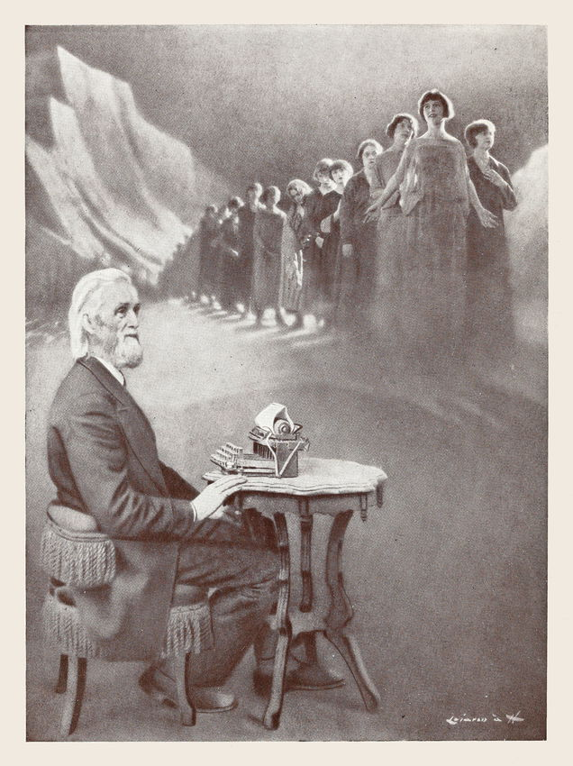
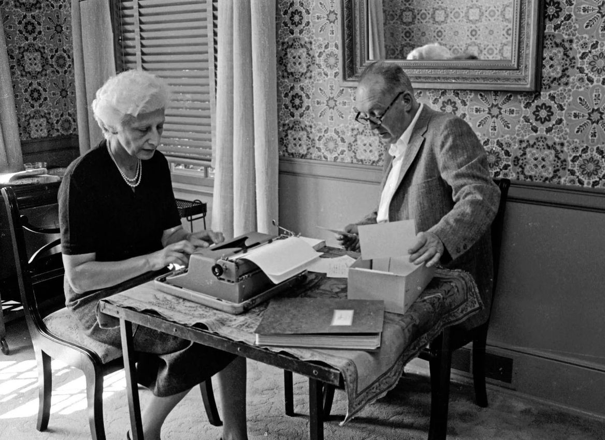
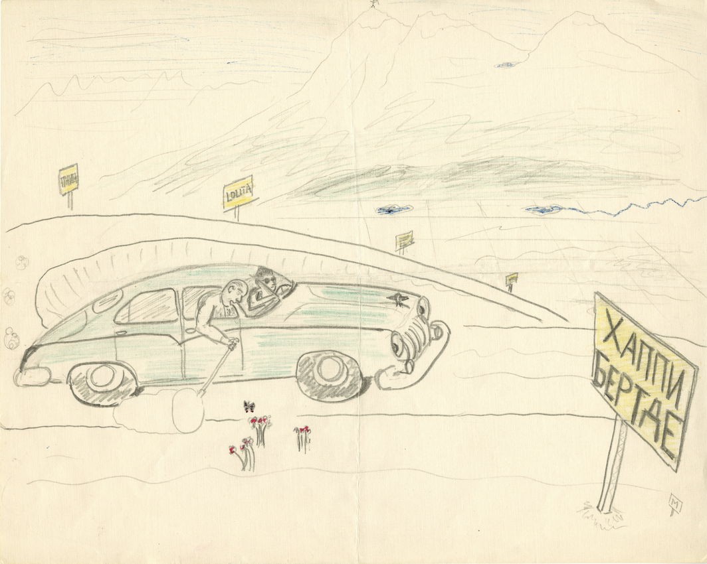
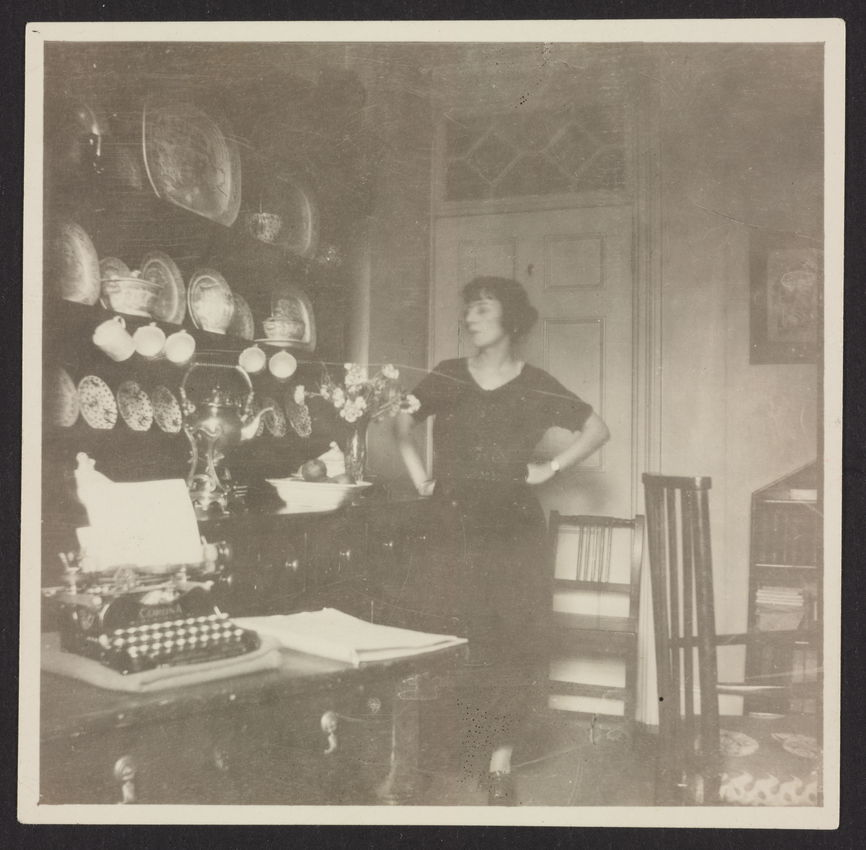

# Typing for Love or Money: The Hidden Women’s Labor behind Modern Literary Masterpieces

Taking dictation, revising manuscripts, typing copies, literary amanuenses often labour for little compensation and even less recognition. Christine Jacobson explores the neglected efforts of women like Theodora Bosanquet, Véra Nabokov, and Valerie Eliot, who — through their work as typists, editors, and champions — had a profound impact on modern literature.

Published

February 4, 2026

Scroll through the whole page to download all images before printing.

Lillian Sholes demonstrating a prototype typewriter invented by her father, Christopher Latham Sholes, 1872 — [Source](https://archive.org/details/storyoftypewrite00unse/page/52/mode/2up).

When inventor Christopher Latham Sholes debuted the typewriter in 1872, he declined to pose with his machine for press photographs. Instead, the first images of his invention depict his daughter, Lillian, operating an early prototype of the Remington No. 1 in a velvet bodice and full-skirted dress, her right hand hovering over the keys while her left hand grasps the carriage release lever. For the photograph’s nineteenth-century audience, the message would have likely been clear: this machine is so easy to operate, a woman can do it.

The typewriter, from its birth, has been tied to a set of assumptions about gender and skill. These assumptions persist to the present and color our cultural understanding of typists’ labor. Take the pilot episode of _Mad Men_ for instance, in which office manager Joan Holloway shows new secretary Peggy Olson to her assigned typewriter and tells her not to be overwhelmed: “It looks complicated, but the men who designed it made it simple enough for a woman to use.” And many women did: while they made up only four percent of clerical workers before 1880 (before the widespread adoption of the typewriter), women represented half by 1920, with the majority employed as stenographers or typists.[1](#fn1) Sholes was later celebrated for paving a path to the white-collar workforce for women and liberating them from meager economic opportunity. The frontispiece of _The Story of the Typewriter_, a 1923 account of the machine’s invention, renders this idea in a literal fashion.

Scroll through the whole page to download all images before printing.

Cover of _The Story of the Typewriter, 1873–1923_, a book published by the Herkimer County Historical Society in celebration of the machine’s fiftieth anniversary. Source: Houghton Library, Harvard University.

Scroll through the whole page to download all images before printing.

Frontispiece from _The Story of the Typewriter, 1873–1923_ depicting Christopher Latham Sholes. The image is accompanied by a quotation from the typewriter’s inventor: “I feel that I have done something for the women who have always had to work so hard. This will enable them more easily to earn a living” — [Source](https://archive.org/details/storyoftypewrite00unse/page/n5/mode/2up).

But contrary to assumptions, typists’ labor required advanced technical skills. Most women in the workforce were trained at secretary or typing schools, a considerable investment of time and money. Office secretaries were also often required to move beyond the skills they were trained in — touch-typing, taking dictation — to other areas such as graphic design, research, and editing. Secretarial manuals from the first half of the twentieth century like John Gregg and Rupert SoRelle’s widely used _Applied Secretarial Practice_ (1934) evince the immense range of duties demanded of the average secretary, with chapters covering the US tax code for handling payroll contrasting sharply with chapters on personal grooming and cultivating a cheerful telephone persona.[2](#fn2)

As typing became professionalized, opportunities for typists proliferated outside of the traditional office. Articles in _The Gregg Writer_, an early trade magazine for secretaries and stenographers, urged women to apply their skills in aiding “that romantic being, the author”.[3](#fn3) In magazines like _The Author, Playwright and Composer_, women such as “Mrs. A. M. Gill” and “Miss M. Fuller” advertised their services for “typing, preparation of MSS \[manuscripts\] … indexing and proofing”.[4](#fn4) For those interested, a position as an amanuensis — that is, one who copies or takes dictation of literary work — afforded more intellectually satisfying labor and a supporting role in producing literary culture.

Though their names and contributions are not often recognized, amanuenses had profound impacts on the careers and legacies of modern writers. Skilled typists could create manuscripts from dictation or clean up messy handwritten drafts, freeing authors to focus on the development of a work rather than its production. But like office secretaries, they did much more than just type. Amanuenses served as important first reаders, helpful editors, and champions of a writer’s work. While some women took on this labor in exchange for a salary, many others offered their hard-won typing skills at no cost, but rather, in their capacity as wives, mothers, or daughters. These women did their typing work in the home, often while juggling domestic and childcare duties.

Scholars and biographers have been slow to examine how these collaborations functioned. This is not surprising: as secretarial work became feminized, “type labor” became undervalued and misunderstood. Popular portrayals of typists have contributed to the lack of understanding.[5](#fn5) Adding to these hurdles, typists’ labor has not traditionally been credited in library catalogs or archives, making it more difficult for scholars to surface their contributions. But if one knows where to look, literary archives _do_ contain paper trails of amanuenses and can reveal the depth of their impact on writers’ legacies.

In her memoir about her time working with Henry James, Theodora Bosanquet writes, “the business of acting as a medium between the spoken and the typewritten word was at first as alarming as it was fascinating.”[6](#fn6) Alarming, she explains, because James kept a new and rather complicated Remington model typewriter at his home in Rye, East Sussex, which she quickly had to master. But accounts from diaries, letters, and other archival materials kept by Bosanquet and her predecessor Mary Weld suggest the work of taking dictation from “the master”, as James was referred to in his time, could also make alarming demands.

Scroll through the whole page to download all images before printing.

Mary Weld in the Watchbell Street Studio bookbindery, Rye, ca. 1901–1904. Source: MS Eng 1579 (36), Mary Kathleed Weld Kingdon Papers, Houghton Library, Harvard University.

In 1897, Henry James found himself in need of an amanuensis after he began to suffer from a debilitating rheumatism in his right wrist, telling a friend that “all writing is the crazy pain you see proof of. I shall soon take to dictating to a typist.”[7](#fn7) He found Mary Weld by writing to a local secretarial college, and after settling on what she would wear — dark coat, skirt, sailor hat — the two settled down to work. Soon after Weld started, James wrote to his brother William, comparing her with a former male secretary: “MacAlpine’s lady successor is an improvement on him! And an economy!”[8](#fn8) In other words, Weld was much better at her job than her predecessor but was likely paid less.

The two worked each morning at James’ home — writing time that Weld would later call the “sacred hours”. Using the new Remington Standard 8, she typed _The Wings of the Dove_, _The Ambassadors_, and _The Golden Bowl_, noting in her calendar diaries the start and end dates of each. (_The Wings of the Dove_, for example, took 194 days to complete.)[9](#fn9) In a handwritten recollection titled “The Master, or a Glimpse of Henry James”, Weld detailed the exactness required for her work, recalling that, for James, there was “not a word, not a comma, in his writing that has not its own just right place in the picture”.[10](#fn10)

That Weld understood and admired James’ boundary-pushing syntax underscores how in sync she was with her employer as both amanuensis and reader. Significantly, the three novels she typed are the masterpieces of James’ late period, exploring the minute workings of consciousness in dense, ornate prose that is famously difficult to read. James’ biographer Leon Edel and others have argued that the changes in James’ style during this period were, in part, a product of his shift to dictation. No longer confined by his rheumatic wrist, James could unspool his sentences to Weld with complete freedom. While he had always exhibited a fondness for long sentences with loose conjunctions, his style became even more baroque.[11](#fn11) One may argue that this change would have happened with or without Weld, but he is fortunate to have found someone who understood his aims so entirely. When _The Wings of the Dove_ was published, James inscribed a copy to Weld: “To Miss Weld, her collaborator, Henry James”.[12](#fn12)

James seemed to perfect this manner of writing with his final amanuensis, the “slim, boyish” Theodora Bosanquet, whom he hired after Weld left her employment to start a family.[13](#fn13) Bored with indexing a report on coastal erosion, Bosanquet jumped at the opportunity to take diction from James, whose work she admired, even if it required moving from London to remote East Sussex. Bosanquet typed what became known as the New York Edition of his works, an ambitious project James undertook to revise his early novels and stories and translate their simpler prose into his later, more convoluted style. To create these new versions, James started from the proofs of the first editions, scribbling minor corrections in the margins. Pages that needed more extensive revisions (mostly additions) were dictated to Bosanquet, who would number each additional page with a letter (i.e., 8a, 8b, 8c). The revised manuscript for _The Portrait of a Lady_ held at Houghton Library shows how dramatically a novel could be expanded through dictation; a single scene could be lengthened so much that Bosanquet’s labeling system sometimes reached the middle of the alphabet.[14](#fn14)

Scroll through the whole page to download all images before printing.

Manuscript of Henry James’ _Portrait of a Lady_ annotated by Theodora Bosanquet, ca. 1906. Source: MS Am 1237.17, Henry James Papers, Houghton Library, Harvard University.

Scroll through the whole page to download all images before printing.

Portrait of Theodora Bosanquet. MS Eng 1213.8. Theodora Bosanquet Papers, Houghton Library, Harvard University — [Source](https://iiif.lib.harvard.edu/manifests/view/ids:17925162$1i).

Scroll through the whole page to download all images before printing.

Cover of Theodora Bosanquet. Henry James at Work (The Hogarth Press, 1924). Source: Houghton Library, Harvard University.

In 1924, Virginia and Leonard Woolf solicited and published a small print run of Bosanquet’s memoir, _Henry James at Work_, in which Bosanquet recounts the writer telling her “I know I’m too diffuse when I’m dictating”, adding, “It all seems to be so much more effectively and unceasingly pulled out of me in speech than in writing.”[15](#fn15) Bosanquet and her machine were essential to the process. James nicknamed her his “Remington priestess” and when the priestess’ machine broke down and was temporarily replaced with a newer, silent model, James found it nearly impossible to continue working.

James and Bosanquet became deeply attached, working closely together until the end of his life. Bosanquet even took dictation while James was on his deathbed, and, curiously, after his death too. Scholar Pamela Thurschwell has surfaced notes from seances and automatic writings (written words produced by someone in a trance-like state) that Bosanquet made throughout the 1930s, now held in the Society for Psychical Research archive at Cambridge University Library.[16](#fn16) Among them, Thurschwell found requests from the ghost of Henry James to resume their dictation sessions in hopes of producing the first literary work from the spiritual realm, “to add to the evidence you have of our world”. The archives suggest that she sat down for chats with James three to four times a day. While the automatic writings are illegible, Bosanquet, ever the good typist, kept typed transcriptions of everything.

\*\*\*

Neither Weld nor Bosanquet recorded what they were paid by James, though we can deduce from James’ letter to his brother that he paid them less than men he had employed. But Weld and Bosanquet describe their dictation sessions as enthralling, enjoyable work, and taking place mainly in the morning, with their afternoons free to pursue other interests. In Weld’s case, James paid for her to be trained in the art of bookbinding, while Bosanquet worked on her own writing. Noticing Weld’s fondness for flowers, James took care to gather fresh bouquets from his garden to adorn her desk. In other words, he appears to have been a decent employer. It is harder to pin down the working conditions and remuneration for wives who typed their husbands’ work.

Vladimir Nabokov — the novelist, poet, translator, entomologist, lepidopterist, and chess master, fluent in English, French, and Russian — never learned to do two things: drive or type. These duties were handled by his wife Véra. Described by Nabokov as his “first and best reader”, Véra took on the work of typing his manuscripts from the start of their marriage in 1920s Berlin. “She presided as adviser and judge over the making of my first fiction”, Nabokov told an interviewer, indicating that her role was more significant than simply making clean copies.[17](#fn17) Véra often demurred when asked to elaborate on her contributions, admitting only to correcting his spelling and usage of idioms. But Stacy Schiff and other biographers have noted her role in saving the manuscript of _Lolita_ from destruction on more than one occasion, reasserting Véra’s important role as arbiter and champion of Nabokov’s work.

Throughout the 1930s, Véra supported the couple as the sole breadwinner by working in an office as a stenographer. At home, she typed for Nabokov late into the night, effectively consigned to the typewriter for much of her waking hours. She continued typing for him after the birth of their son Dmitri in 1936, juggling feedings with taking dictation for _Invitation to a Beheading_. Seemingly the only time she slowed down was after a bout of pneumonia in 1942 during which, as Nabokov wrote apologetically to his publisher, she “still could not manage more than five pages a day.”[18](#fn18)

Scroll through the whole page to download all images before printing.

Vera and Vladimir Nabokov at their living room table, photographed by Carl Mydans, 1958. Source: Carl Mydans/Time & Life Pictures (not public domain).

A photograph from 1958 taken by Carl Mydans illuminates the workflow the couple eventually honed. The two sit together at a small table; Nabokov holds an index card aloft a stack of more index cards housed in a small box and Vera sits at a typewriter. The writer drafted scenes, details, and plot points on cards which he could reshuffle endlessly until he was satisfied with a novel’s progression. Depending on how fleshed out they were, Nabokov would either use them to dictate to Véra or hand them over to her for typing in triplicate (always in triplicate).

Véra also handled her husband’s correspondence, negotiated his publishing contracts, submitted his short stories to magazines, and even filled out and submitted his Guggenheim Fellowship application. Though discreet, she left a paper trail by identifying herself as the correspondent or disclosing that the missive came “on behalf of Vladimir Nabokov”. The most obvious tell of whether something was prepared by Mr. or Mrs. Nabokov is the quality of the typing. Nabokov hardly typed, and when he did, did it badly.

The Nabokov family papers at Houghton Library illuminate other important aspects of Véra’s contributions. During academic appointments at Cornell and Wellesley, Vladimir had Véra prepare notes for his lectures and asked her to deliver them when he was ill. Typed lecture notes on the novel _Doctor Zhivago_ from this period survive and include a rare mark of authorship at the top: “For VN by VE’ N”. A birthday card drawn by Vladimir for their son Dmitri cheekily references her status as the family’s chauffeur: she drives down a highway dotted with billboards advertising Vladimir’s novels while he catches butterflies from the passenger seat.

Scroll through the whole page to download all images before printing.

Vladimir Nabokov’s “Happy Birthday” pencil sketch, ca. 1960–77. Source: MS Russ 140. Nabokov Family Papers, Houghton Library, Harvard University (not public domain).

As far as the archival records show, Véra took great pleasure in performing these duties, and the Nabokovs’ marriage was a happy one. Unhappy marriages, however, can also be productive literary partnerships. T. S. Eliot once said that his troubled marriage to first wife Vivienne Haigh-Wood brought about “the state of mind out of which came _The Waste Land_”.[19](#fn19) But Vivienne played other roles in the poem’s composition. “I have done a rough draft of part III”, Eliot wrote in a letter, “but I do not know whether it will do, and must wait for Vivienne’s opinion as to whether it is printable.”[20](#fn20) Like Véra Nabokov, Vivienne was an essential first reader for her husband. An important early draft of _The Waste Land_ is covered in notes by Ezra Pound which, thanks to his own notoriety and role in helping the poem find a publisher, have been the subject of much scholarship. However, Vivienne also left significant notes on the poem. Scholar Arwa Al-Mubaddel argues that Vivienne’s impact is most substantial in the second section, originally titled “In the Cage”, and Vivienne supplied the title of the final section, “A Game of Chess”, which includes a dialogue between a man and woman who resemble the couple.

Many of Vivienne’s changes make the dialogue sharper and more conversational, such as revising “it’s the medicine I took in order to bring it off” to “it’s the _pills_ I took to bring it off”. Vivienne wrote new lines, including the pointed “What you get married for if you don’t want to have children.” All her additions and changes appear in later typescript drafts and in the published version of the poem. Both husband and wife were skilled typists, so it is not known for certain who may have typed copies of _The Waste Land_ for publication, but on the copy Vivienne marked up, she wrote, “Make any of these alterations – or none if you prefer. Send me back this copy and let me have it”.[21](#fn21) It seems likely Vivienne was offering to type a clean draft with the accepted changes. Whether she acted as a typist for Eliot or not, Vivienne played a key role in the poem’s production. Yet despite the fruit their tumultuous partnership yielded, it was not enough to save the marriage. The couple separated in 1933 and after years of struggles with mental health, Vivienne was committed by her brother to the Northumberland House Insane Asylum where she remained until her death.[22](#fn22)

Scroll through the whole page to download all images before printing.

Vivienne Eliot posing with her typewriter at 9 Clarence Gate Gardens, ca. 1921–22. MS Am 2560, Henry Ware Eliot T. S. Eliot collection, Houghton Library, Harvard University — [Source](https://iiif.lib.harvard.edu/manifests/view/ids:46911110$1i).

Eliot’s second wife Valerie was forty years his junior and his secretary at Faber and Faber; the poet proposed to her at the office by slipping a handwritten note among the other letters he wanted her to type for the day. British newspapers printed announcements about their marriage with jocose allusions to their age difference and their workplace romance. “Here we go again”, Valerie wrote at the top of one clipping which heralded her as “good news for secretaries everywhere in love with the boss”.[23](#fn23)

Valerie’s papers in the T. S. Eliot collection at Harvard reveal a woman content in her hybrid role of secretary-wife; many letters to friends detail a happy marriage in which she continued doing his typing after giving up her job at Faber and Faber. In addition to handling much of his correspondence, her private letters reveal she helped him with his last play, _The Elder Statesman_, while managing the emotional highs and lows Eliot experienced over the play’s successes and setbacks. “I seem to be perpetually on the go. . . typing and retyping THE ELDER STATESMAN, attending all the rehearsals, and trying to prevent Tom from getting over-strained from alternate exultation and depression.”[24](#fn24) After Eliot’s death, Valerie mounted an ambitious campaign to compile and edit his complete letters, which has yielded ten volumes to date. Valerie was also the first to bring greater attention to Vivienne’s editorial work on _The Waste Land_; in 1971, she published a facsimile of the typescript with Vivienne and Pound’s notes, which she had printed in two different colors so they could be distinguished from each other.

Scroll through the whole page to download all images before printing.

“Count Tolstoi giving direct dictation to his daughter on the typewriter”, photograph from _The Story of the Typewriter, 1873-1923_ — [Source](https://archive.org/details/storyoftypewrite00unse/page/95/mode/1up).

The typewriter era — from its popular uptake in the 1880s to the rise of personal computing in the late 1900s — paralleled a remarkable period of literary development, spanning realism, the rise of modernism, postmodernism, and on. But amanuenses performed their labors long before the machine became the dictationist’s tool of choice. Consider a circa 1909 photograph of Alexandra Tolstoy at a typewriter taking dictation from her father, the Russian novelist Lev Tolstoy. This image (a version of which later ran as an ad for [Remington](https://www.bridgemanimages.com/en/noartistknown/leo-tolstoy-his-wife-and-daughter-alexander-in-front-of-the-typewriter-represented-in-an/etching/asset/5459584)) acknowledges Alexandra’s role in Tolstoy’s work but elides another important amanuensis in the family. Tolstoy’s wife, Sophia, is believed to have hand-copied the manuscript for _War and Peace_ seven times from beginning to end, often working at night by candlelight after her children had gone to bed, using an inkwell pen and sometimes requiring a magnifying glass to read her husband's notes.[25](#fn25) The typewriter was patented the year after the novel’s publication.

This mother and daughter pair underscore the relatively short period in which amanuenses used typewriters to do their work. Bookended by centuries of copying by hand, on one end, and desktop computing, on the other, amanuenses who typed represent roughly a century of literary labor. Their efforts deserve to be better understood. Notes, letters, diaries, and manuscripts show these women’s impact extended far beyond the act of simple recording; their labor liberated authors (men and women alike) from drudgery, produced legible texts quickly that could be read by publishers and printers, required great mental agility and literary fluency, and often entailed crucial secondary roles as reader, editor, responder, and secretary. As more is learned about the works of other literary typists, the list of their contributions is sure to grow.

The text of this essay is published under a [CC BY-SA](https://creativecommons.org/licenses/by-sa/4.0/) license, see [here](https://publicdomainreview.org/legal#reusing-our-articles) for details.
