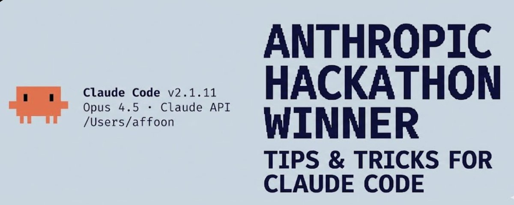

# The Shorthand Guide to Everything Claude Code

Here's my complete setup after 10 months of daily use: skills, hooks, subagents, MCPs, plugins, and what actually works.

Been an avid Claude Code user since the experimental rollout in Feb, and won the Anthropic x Forum Ventures hackathon with Zenith alongside @DRodriguezFX completely using Claude Code.

Skills and Commands

Skills operate like rules, constricted to certain scopes and workflows. They're shorthand to prompts when you need to execute a particular workflow.

After a long session of coding with Opus 4.5, you want to clean out dead code and loose .md files?

Run /refactor-clean. Need testing? /tdd, /e2e, /test-coverage. Skills and commands can be chained together in a single prompt

I can make a skill that updates codemaps at checkpoints - a way for Claude to quickly navigate your codebase without burning context on exploration.

~/.claude/skills/codemap-updater.md

Commands are skills executed via slash commands. They overlap but are stored differently:

Skills: ~/.claude/skills - broader workflow definitions

Commands: ~/.claude/commands - quick executable prompts

Hooks

Hooks are trigger-based automations that fire on specific events. Unlike skills, they're constricted to tool calls and lifecycle events.

Hook Types

PreToolUse  - Before a tool executes (validation, reminders)

PostToolUse - After a tool finishes (formatting, feedback loops)

UserPromptSubmit - When you send a message

Stop - When Claude finishes responding

PreCompact - Before context compaction

Notification - Permission requests

Example: tmux reminder before long-running commands

Pro tip: Use the `hookify` plugin to create hooks conversationally instead of writing JSON manually. Run /hookify and describe what you want.

Subagents

Subagents are processes your orchestrator (main Claude) can delegate tasks to with limited scopes. They can run in background or foreground, freeing up context for the main agent.

Subagents work nicely with skills - a subagent capable of executing a subset of your skills can be delegated tasks and use those skills autonomously. They can also be sandboxed with specific tool permissions.

Configure allowed tools, MCPs, and permissions per subagent for proper scoping.

Rules and Memory

Your `.rules` folder holds `.md` files with best practices Claude should ALWAYS follow. Two approaches:

Single CLAUDE.md - Everything in one file (user or project level)

Rules folder - Modular `.md` files grouped by concern

Example rules:

No emojis in codebase

Refrain from purple hues in frontend

Always test code before deployment

Prioritize modular code over mega-files

Never commit console.logs

MCPs (Model Context Protocol)

MCPs connect Claude to external services directly. Not a replacement for APIs - it's a prompt-driven wrapper around them, allowing more flexibility in navigating information.

Example: Supabase MCP lets Claude pull specific data, run SQL directly upstream without copy-paste. Same for databases, deployment platforms, etc.

Chrome in Claude: is a built-in plugin MCP that lets Claude autonomously control your browser - clicking around to see how things work.

CRITICAL: Context Window Management

Be picky with MCPs. I keep all MCPs in user config but disable everything unused. Navigate to /plugins and scroll down or run /mcp.

Your 200k context window before compacting might only be 70k with too many tools enabled. Performance degrades significantly.

Rule of thumb: Have 20-30 MCPs in config, but keep under 10 enabled / under 80 tools active.

Plugins

Plugins package tools for easy installation instead of tedious manual setup. A plugin can be a skill + MCP combined, or hooks/tools bundled together.

Installing plugins:

LSP Plugins: are particularly useful if you run Claude Code outside editors frequently. Language Server Protocol gives Claude real-time type checking, go-to-definition, and intelligent completions without needing an IDE open.

Same warning as MCPs - watch your context window.

Tips and Tricks

Keyboard Shortcuts

Ctrl+U - Delete entire line (faster than backspace spam)

! - Quick bash command prefix

@ - Search for files

/ - Initiate slash commands

Shift+Enter - Multi-line input

Tab - Toggle thinking display

Esc Esc - Interrupt Claude / restore code

Parallel Workflows

/fork - Fork conversations to do non-overlapping tasks in parallel instead of spamming queued messages

Git Worktrees - For overlapping parallel Claudes without conflicts. Each worktree is an independent checkout

tmux for Long-Running Commands: Stream and watch logs/bash processes Claude runs.

mgrep > grep: `mgrep` is a significant improvement from ripgrep/grep. Install via plugin marketplace, then use the /mgrep skill. Works with both local search and web search.

Other Useful Commands

/rewind - Go back to a previous state

/statusline - Customize with branch, context %, todos

/checkpoints - File-level undo points

/compact - Manually trigger context compaction

GitHub Actions CI/CD

Set up code review on your PRs with GitHub Actions. Claude can review PRs automatically when configured.

Sandboxing

Use sandbox mode for risky operations - Claude runs in restricted environment without affecting your actual system. (Use --dangerously-skip-permissions - to do the opposite of this and let claude roam free, this can be destructive if not careful.)

On Editors

While an editor isn't needed it can positively or negatively impact your Claude Code workflow. While Claude Code works from any terminal, pairing it with a capable editor unlocks real-time file tracking, quick navigation, and integrated command execution.

Zed (My Preference)

I use Zed - a Rust-based editor that's lightweight, fast, and highly customizable.

Why Zed works well with Claude Code:

Agent Panel Integration - Zed's Claude integration lets you track file changes in real-time as Claude edits. Jump between files Claude references without leaving the editor

Performance - Written in Rust, opens instantly and handles large codebases without lag

CMD+Shift+R Command Palette - Quick access to all your custom slash commands, debuggers, and tools in a searchable UI. Even if you just want to run a quick command without switching to terminal

Minimal Resource Usage - Won't compete with Claude for system resources during heavy operations

Vim Mode - Full vim keybindings if that's your thing

Split your screen - Terminal with Claude Code on one side, editor on the other using

Ctrl + G  - quickly open the file Claude is currently working on in Zed

Auto-save - Enable autosave so Claude's file reads are always current

Git integration - Use editor's git features to review Claude's changes before committing

File watchers - Most editors auto-reload changed files, verify this is enabled

VSCode / Cursor

This is also a viable choice and works well with Claude Code. You can use it in either terminal format, with automatic sync with your editor using \ide enabling LSP functionality (somewhat redundant with plugins now). Or you can opt for the extension which is more integrated with the Editor and has a matching UI.

My Setup

Plugins

Installed: (I usually only have 4-5 of these enabled at a time)

MCP Servers

Configured (User Level):

Disabled per project (context window management):

This is the key - I have 14 MCPs configured but only ~ 5-6 enabled per project. Keeps context window healthy.

Key Hooks

Custom Status Line

Shows user, directory, git branch with dirty indicator, context remaining %, model, time, and todo count:

Rules Structure

Subagents

Key Takeaways

Don't overcomplicate - treat configuration like fine-tuning, not architecture

Context window is precious - disable unused MCPs and plugins

Parallel execution - fork conversations, use git worktrees

Automate the repetitive - hooks for formatting, linting, reminders

Scope your subagents - limited tools = focused execution

References

- Plugins Reference

- Hooks Documentation

- Checkpointing

- Interactive Mode

- Memory System

- [Subagents]

- [MCP Overview]

Note: This is a subset of detail. I might make more posts on specifics if people are interested.
