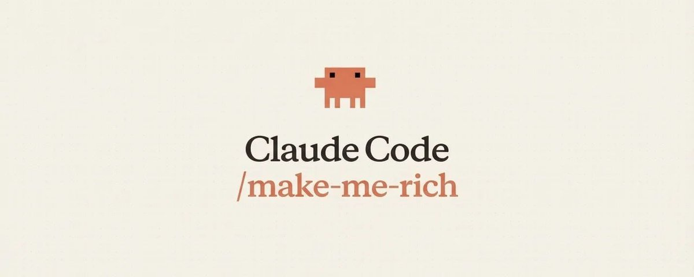

# I turned my client into a millionaire using Claude Code

One of my clients drove over 3 million in revenue... all from a script we generated by our army of 20 agents.

Here’s exactly how it works:

(and yes, this is a real tool and real use case)

Myself, @Oasiszn, and @MattEpstein16 (follow them!) have 2B+ views on vids we've written. We've won Emmys. We know what makes good content.

Most people write the same way they regularly use AI.

Open ChatGPT or Claude.

Type a prompt.

Take whatever it says, and call it done.

That's how you get garbage. Light it on fire.

Burn it to the ground.

We built 20 specialized AI agents that write better than any human.

Each agent lives within Claude Code in its own context window, specializes in one thing, and has its own quality bar it has to hit. We give it a brand name and a product brief, walk away, and come back to a finished, production ready script sitting in a doc.

This system has helped generate over $10M in revenue for our clients through launch videos we've made for them.

The videos have 50M views... and hit #1 trending on X.

Let me show you how it works:

The Research Phase No Human Would Do

Before a single word of script gets written, the system runs a full research sweep across the entire internet.

On YouTube, it runs 15 keywords searches across three separate time-filtered passes. All time. Last 12 months. Last 30 days.

For each keyword, the system finds the highest-performing video, that's the ceiling, and then collects patterns downward until there's a massive drop-off in views.

1.5M to 45K? That's the floor. Stop there.

The titles at the ceiling are the patterns worth stealing.

Most teams do 1 search on X for what customers are saying and call it research. This system pulls hundreds, scores them, and filters automatically.

On Reddit, it mines for real customer pain. And grabs exact quotes.

Finds the most viral threads from the past 10 years, dives deep to find the controversy, what has the most downvotes?

On X, it pulls roughly 5,000 posts (via API), sorted by engagement.

The same ceiling/floor logic applies. High quote tweet ratio means posts where people fought in the replies. That's content with nerves. That's what we're looking for.

Everything that comes out of the research phase gets indexed as ammunition for the agents that come next.

The Writing Pipeline

This is where it separates from anything else I've seen.

Most AI script tools have a single agent write the whole thing.

That's like hiring one person to be your researcher, copywriter, editor, fact checker, and creative director and expecting them to do a good job.

That's idiotic.

Specialized agents run in sequence and each one has exactly one job.

The Hook Agent:

→ Writes 4 hooks, each data backed from our database of proven hooks with millions of views across socials.

→ Every hook goes through a minimum of 3 full iterations, with a complete diagnosis of what's weak before it gets rewritten.

→ Then the Hook Manager scores it across 5 dimensions and everything has to hit 10/10.

It doesn't pass? We sent it back and the Hook Agent rewrites it.

Nothing moves forward until it clears the gate.

The same structure runs for the body, for the CTA, for everything. The agents don't just write. They each have a boss who won't let anything through that isn't ready.

The Weapons Check

This is the part I think about the most when I explain this system to people.

Every single line in the script gets scored on two dimensions independently.

→ Invention Novelty: does this line make the product feel like a genuine breakthrough?

→ Copy Intensity: is it sharp enough that someone reading it actually feels something, not just understands something?

Both have to hit 10/10. A novel idea with flat copy fails. Sharp copy about a boring feature fails.

Lines that don't pass get rewritten. Lines that are pure filler with no possible weapon version get cut entirely.

Character budgets are hard enforced throughout the whole pipeline. Every line earns its place or it gets removed.

This is why our scripts feel different from what most founders end up with.

The average launch script has 3 great lines and 40 seconds of filler the founder stumbles through awkwardly on camera. Every line in ours survived a weapons check.

The Output

The whole thing lands in a Google Doc with three tabs. Research, Working Script, and Final Script.

→ The Research tab has everything pulled across YouTube, Reddit, and X.

→ The Working Script tab shows every iteration, diagnosis, and rewrite from every agent so you have a full paper trail.

→ The Final Script tab is clean and copy paste ready with 4 hook options and 2 CTA options.

From there humans go through each line tactically and edit until perfection.

These agents are trained on our writing, giving it a true advantage over other AI writing tools and general copywriting agents.

❗ If you want the exact breakdown of how each agent works FOLLOW & comment "AGENT" on this post and I'll send it to you! ❗

Why This Actually Matters

The system doesn't guarantee virality… nothing does.

But it gives you a script built on data from hundreds of top performing videos, written by agents that won't ship anything below a 10/10, with every second of runtime forced to justify its existence before it makes the cut.

That's why our launches average 2M views per video.

Founders spend months building the product and 30 minutes thinking about the script.

The script is usually the thing that decides whether anyone ever sees what they built.

If your company is launching something soon and you want a video built by a system that actually does this at scale, DM me. Pricing starts at $100K.

Get Shown.
