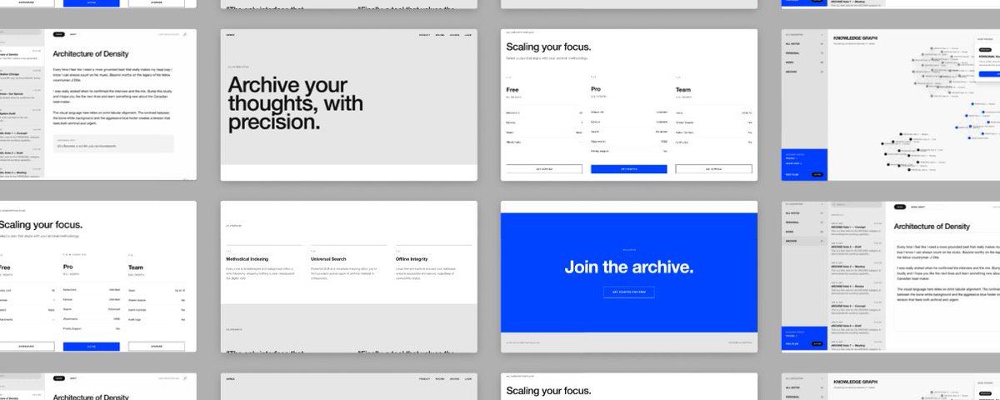

> # Million Dollar Product : 12 Rules to Building Something Users Love

# ミリオンダラープロダクト：ユーザーに愛されるものを作るための12のルール

> 

> I've built 50+ MVPs for founders in the last year and the pattern I keep seeing is always the same.

昨年、創業者のために50以上のMVPを構築してきたが、繰り返し見えてくるパターンは常に同じだ。

> Founders obsess over the stack. They debate Next.js vs Remix, Supabase vs Firebase, Claude vs GPT. They spend weeks on infrastructure decisions and then ship a product that users open once and never return to.

創業者は技術スタックに執着する。Next.js対Remix、Supabase対Firebase、Claude対GPTと議論し、インフラの決断に何週間も費やした挙げ句、ユーザーが一度開いたきり戻ってこないプロダクトを出荷する。

> The world is flooded with vibe coded look-alikes. Buggy tools, poor user experience, zero retention.

世界は「バイブコーディング」による似たり寄ったりのプロダクトで溢れかえっている。バグだらけのツール、劣悪なユーザー体験、ゼロの定着率。

> The problem is never the stack. The problem is that nobody stopped to think about the product.

問題は決して技術スタックにあるのではない。問題は、誰もプロダクトについて立ち止まって考えなかったことにある。

> Here is everything that actually goes into building something users love.

ユーザーに愛されるものを構築するために実際に必要なすべてを紹介する。

> 1. Nail Your User Persona Before You Write a Single Line of Code

1. コードを1行も書く前にユーザーペルソナを固める

> Most founders define their audience as "founders" or "SMBs" or "enterprises" and move on. That is not a persona. That is a category.

ほとんどの創業者は対象ユーザーを「創業者」「中小企業」「大企業」と定義してそのまま進む。それはペルソナではない。それはカテゴリーだ。

> A real user persona goes much deeper. It maps the exact daily workflow of the person using your product. It identifies their specific frustration and the workaround they are currently using to solve it. It accounts for their technical literacy, which directly determines how complex or simple your interactions need to be.

本物のユーザーペルソナはもっと深く掘り下げる。プロダクトを使う人の正確な日々のワークフローをマッピングし、具体的な不満と現在使っている回避策を特定し、インタラクションの複雑さや簡易さを直接決定する技術リテラシーを考慮する。

> The test is simple. If you cannot describe your target user in two sentences, you are not ready to build yet. Every design decision, every UX pattern, every onboarding step flows from who that person actually is. Get this wrong and everything downstream is built on a broken foundation.

テストは簡単だ。ターゲットユーザーを2文で説明できなければ、まだ構築する準備ができていない。すべてのデザイン決定、すべてのUXパターン、すべてのオンボーディングステップは、その人が実際に誰であるかから生まれる。これを間違えると、それ以降のすべてが壊れた土台の上に築かれる。

> 2. Articulate What the Product Should Feel Like Before You Open Figma

2. Figmaを開く前にプロダクトがどう感じられるべきかを明確にする

> There is a difference between what a product does and what it feels like to use it.

プロダクトが何をするかと、それを使うときどう感じるかは異なる。

> Before any screens get designed, you need to define your UX principles. Is this product fast and minimal, designed for power users who know what they want? Or is it guided and hand-holdy, designed for someone who needs to be walked through every step? These are fundamentally different products even if they solve the same problem.

画面をデザインする前に、UXの原則を定義する必要がある。このプロダクトは、自分が何を望んでいるかを知っているパワーユーザー向けの高速でミニマルなものか？それとも、すべてのステップを手取り足取り案内される必要がある人向けの誘導型のものか？同じ問題を解決するとしても、これらは根本的に異なるプロダクトだ。

> From there, map the critical user journey from the moment someone lands to the moment they experience their first value. That moment is what product people call the "aha moment" and it is the most important moment in your entire product. Everything in your UX should be engineered to get the user to that moment as fast as possible.

そこから、ユーザーが着地した瞬間から最初の価値を体験する瞬間までの重要なユーザージャーニーをマッピングする。その瞬間がプロダクト関係者の言う「アハ体験」であり、プロダクト全体で最も重要な瞬間だ。UXのすべては、ユーザーをその瞬間にできるだけ速く導くよう設計されるべきだ。

> UX is not a design decision. It is a product decision. Treat it like one.

UXはデザインの決断ではない。プロダクトの決断だ。そのように扱え。

> 3. Build Your Brand Foundation Before Your First Component

3. 最初のコンポーネントを作る前にブランドの基盤を築く

> Brand is not a logo. It is not a colour palette. It is not something you figure out after the product is built.

ブランドはロゴではない。カラーパレットでもない。プロダクトが完成した後に考えるものでもない。

> Brand is the sum of every decision your product makes in front of a user. It is your product name and why it was chosen. It is your tagline and whether it communicates the real value or just sounds clever. It is your brand pillars, the two or three things your product fundamentally stands for. It is your positioning statement, the clear articulation of who this is for and why it is different.

ブランドは、ユーザーの前でプロダクトが下すすべての決断の総体だ。プロダクト名とその選択理由。タグラインと、それが本当の価値を伝えているか単に賢く聞こえるだけかどうか。プロダクトが根本的に体現する2〜3つのブランドの柱。誰のためのものでなぜ違うのかを明確に表現したポジショニングステートメント。

> Most critically, brand is your voice and tone. Every label, every button text, every empty state message, every error notification is a brand decision. "Scaling your focus" communicates something completely different than "Choose a plan." "Work, Draft" communicates something completely different than "Untitled document 3." These micro decisions compound over an entire product experience into either trust or confusion.

最も重要なのは、ブランドはボイスとトーンだということだ。すべてのラベル、すべてのボタンテキスト、すべての空状態のメッセージ、すべてのエラー通知はブランドの決断だ。「Scaling your focus」は「Choose a plan」とまったく異なるものを伝える。「Work, Draft」は「Untitled document 3」とまったく異なるものを伝える。これらの微細な決断がプロダクト体験全体にわたって積み重なり、信頼か混乱かを生み出す。

> Define this foundation before you build. It will inform every component you create.

構築前にこの基盤を定義せよ。それが作るすべてのコンポーネントに影響を与える。

> 4. Map Your Information Architecture Before Any Screens

4. 画面を作る前に情報アーキテクチャをマッピングする

> Information architecture is the skeleton of your product and almost nobody thinks about it before they start building.

情報アーキテクチャはプロダクトの骨格であり、構築を始める前にほとんど誰も考えない。

> IA means mapping every page, every section and every user flow on paper before a single screen gets designed. It means defining your navigation model clearly. Will this product use a sidebar, a top nav or bottom tabs? Each choice communicates something different and works better for different use cases.

IAとは、画面をデザインする前に紙の上ですべてのページ、すべてのセクション、すべてのユーザーフローをマッピングすることだ。ナビゲーションモデルを明確に定義することを意味する。このプロダクトはサイドバー、トップナビ、ボトムタブのどれを使うか？各選択は異なることを伝え、異なるユースケースでより機能する。

> The most important principle in IA is to group features by user intent, not by how you built them. Developers naturally want to organise things by how they are structured in the codebase. Users organise things by what they are trying to accomplish. These are almost always different. Build the navigation for the user, not for yourself.

IAで最も重要な原則は、機能を構築方法ではなくユーザーの意図によってグループ化することだ。開発者は自然にコードベースの構造に従って整理しようとする。ユーザーは達成しようとしていることに従って整理する。これらはほぼ常に異なる。自分のためではなく、ユーザーのためにナビゲーションを構築せよ。

> IA done wrong means users cannot find features you spent weeks building. They exist in the product but they are invisible. That is a product failure regardless of how well the features work.

IAを誤ると、ユーザーは何週間もかけて構築した機能を見つけられなくなる。それらはプロダクトに存在するが、見えない。機能がどれだけうまく動いていても、それはプロダクトの失敗だ。

> 5. Layout Consistency Across Roles is Non Negotiable

5. ロール間のレイアウトの一貫性は譲れない

> If your product has role based access, which most modern SaaS products do, every role needs to experience the same logic even when they are seeing different data.

プロダクトにロールベースのアクセスがある場合（ほとんどの現代のSaaSプロダクトがそうだが）、各ロールは異なるデータを見ていても同じロジックを体験する必要がある。

> This means the same component behaviour across all views. The same visual hierarchy regardless of which role is logged in. The same interaction patterns whether you are an admin, a manager or an end user. Define a master layout grid and commit to never breaking it across pages.

これはすべてのビューで同じコンポーネントの動作を意味する。どのロールでログインしていても同じ視覚的階層。管理者、マネージャー、エンドユーザーのいずれであっても同じインタラクションパターン。マスターレイアウトグリッドを定義し、ページをまたいでそれを決して崩さないことにコミットせよ。

> Users should never feel like they switched products when they switch roles or navigate between sections. That feeling of inconsistency is invisible when you get it right and immediately obvious when you get it wrong. It is one of the clearest signals of whether a product was thoughtfully built or assembled in a hurry.

ユーザーはロールを切り替えたりセクション間を移動したりするときに、プロダクトが切り替わったと感じてはいけない。その不一致感は、正しくできているときは目に見えず、間違えているときはすぐに明らかになる。それはプロダクトが丁寧に構築されたか、急ぎで組み立てられたかを示す最も明確なシグナルの1つだ。

> 6. Build Your Design System Before Your First Screen

6. 最初の画面を作る前にデザインシステムを構築する

> Most vibe coders open Figma and start drawing components immediately. We build the token system first.

ほとんどの「バイブコーダー」はFigmaを開いてすぐにコンポーネントを描き始める。私たちはまずトークンシステムを構築する。

> A token system means your spacing scale is defined before anything is placed on a page. Your type scale is locked in before any text is styled. Your colour tokens, the named variables that carry meaning across the entire product, exist before a single component is created.

トークンシステムとは、ページに何かが配置される前にスペーシングスケールが定義されていることを意味する。テキストがスタイリングされる前にタイプスケールが固定されている。単一のコンポーネントが作成される前に、プロダクト全体に意味を持つ名前付き変数であるカラートークンが存在する。

> From there you build the component library: buttons, inputs, cards, modals, navigation elements. Each component gets all of its states documented and designed. Default, hover, active, disabled, error. Not just the states that look good but all of them.

そこからコンポーネントライブラリを構築する：ボタン、入力フィールド、カード、モーダル、ナビゲーション要素。各コンポーネントはそのすべての状態が文書化され設計される。デフォルト、ホバー、アクティブ、無効、エラー。見栄えの良い状態だけでなく、すべてを。

> This is the single biggest differentiator between a product that feels like it costs $500 and one that feels like it costs $50,000. Users cannot name what they are feeling. But they feel it immediately.

これが500ドル相当に感じるプロダクトと5万ドル相当に感じるプロダクトの最大の差別化要因だ。ユーザーは自分が感じていることを名付けられない。しかし、すぐに感じる。

> 7. Colour Palette is a Retention Decision

7. カラーパレットは定着率の決断だ

> Most founders pick colours they like. That is the wrong filter entirely.

ほとんどの創業者は好きな色を選ぶ。それはまったく間違ったフィルターだ。

> The right question is: what colours does your user trust? A fintech product and a children's learning app should never share the same palette because the emotional and psychological associations are completely different. Colour communicates trust, urgency, safety and delight before a single word is read.

正しい問いは「ユーザーが信頼する色は何か？」だ。フィンテックプロダクトと子供向け学習アプリは決して同じパレットを共有すべきでない。感情的・心理的な連想がまったく異なるからだ。色は1つの言葉が読まれる前に信頼、緊急性、安全、喜びを伝える。

> Define your full token set. Primary and secondary brand colours. Semantic colours, which are the most important and most ignored, covering success, warning, error and informational states. And your neutral scale, which carries more of your UI than most founders realise.

完全なトークンセットを定義せよ。プライマリとセカンダリのブランドカラー。最も重要でありながら最も無視される、成功、警告、エラー、情報状態をカバーするセマンティックカラー。そして、ほとんどの創業者が気づいているより多くのUIを担うニュートラルスケール。

> Colour communicates before words do. It is doing work in your product whether you designed it intentionally or not.

色は言葉より先に伝える。意図的に設計したかどうかにかかわらず、プロダクトの中で機能している。

> 8. Every Product State Needs to Be Designed

8. すべてのプロダクト状態をデザインする必要がある

> This is where most products fall apart completely.

ここでほとんどのプロダクトが完全に崩壊する。

> The happy path is what gets designed. The user lands, the data loads, everything works. Shipped.

デザインされるのはハッピーパスだ。ユーザーが着地し、データが読み込まれ、すべてが機能する。出荷。

> But real users encounter every other state constantly. The loading state when data is being fetched. The empty state when a user is new and there is nothing to display yet. The error state when something goes wrong. The edit state when content is being modified. The success state when an action is completed.

しかし実際のユーザーは、他のすべての状態に常に遭遇する。データが取得されているときのローディング状態。ユーザーが新しくまだ表示するものがないときの空の状態。何かがうまくいかないときのエラー状態。コンテンツが変更されているときの編集状態。アクションが完了したときの成功状態。

> The zero data state deserves special attention because it is the state every single new user encounters first and it is almost universally ignored. What does your product look like on day one when a user has not done anything yet? That experience determines whether they come back on day two.

ゼロデータ状態は特別な注意を要する。それはすべての新規ユーザーが最初に遭遇する状態であり、ほぼ普遍的に無視されているからだ。ユーザーがまだ何もしていない1日目にプロダクトはどのように見えるか？その体験が2日目に戻ってくるかどうかを決定する。

> Error messages are another critical failure point. An error message should tell a user exactly what to do next, not just what went wrong. "Something went wrong" is not an error message. It is an abandonment trigger.

エラーメッセージは別の重要な失敗点だ。エラーメッセージは、何が間違っていたかだけでなく、次に何をすべきかをユーザーに正確に伝えるべきだ。「何かが間違っています」はエラーメッセージではない。それは離脱のきっかけだ。

> 95% of vibe coded products only design the happy path. The edge cases are where users quit or where they fall in love.

バイブコーディングされたプロダクトの95%はハッピーパスしかデザインしない。エッジケースこそがユーザーが離れる場所であり、恋に落ちる場所だ。

> 9. Onboarding Should Collect Just Enough

9. オンボーディングは必要最低限だけ収集する

> The biggest onboarding mistake founders make is trying to learn everything about the user on day one.

創業者がするオンボーディングの最大の失敗は、1日目にユーザーについてすべてを学ぼうとすることだ。

> Good onboarding is built around one question: what is the minimum information needed to deliver a valuable first session? Anything beyond that is friction. Every extra field, every additional step, every optional question that feels mandatory is a user you lost before they ever experienced your product.

優れたオンボーディングは1つの問いを中心に構築される：価値ある最初のセッションを提供するために必要な最小限の情報は何か？それ以上はすべて摩擦だ。余分なフィールドごと、追加ステップごと、必須に感じられる任意の質問ごとに、プロダクトを体験する前に失ったユーザーだ。

> The principle to apply here is progressive disclosure. Ask for what you need at the start. As the user gets comfortable and derives more value from the product, ask for more. Trust is earned before data is collected, not the other way around.

ここで適用すべき原則は段階的開示だ。最初に必要なものを尋ねる。ユーザーが慣れ、プロダクトからより多くの価値を引き出すにつれて、さらに尋ねる。信頼はデータを収集する前に得られるもので、その逆ではない。

> Never gate your product behind a ten step setup flow. The goal of onboarding is to get the user to their first value moment as fast as possible. That is it.

10ステップのセットアップフローの後ろにプロダクトを隠すな。オンボーディングの目標は、ユーザーをできるだけ速く最初の価値の瞬間に導くことだ。それだけだ。

> 10. Performance is a Product Feature

10. パフォーマンスはプロダクトの機能だ

> Load time targets should be defined before you build, not measured after you ship.

ロード時間の目標は、出荷後に測定するのではなく、構築前に定義すべきだ。

> The standard to aim for is under two seconds for any core user action. Lazy load everything that is not immediately visible. Use skeleton screens instead of spinners wherever possible because perceived performance matters as much as actual performance. When a user sees a skeleton screen, their brain registers that the content is coming. When they see a spinner, their brain registers that they are waiting.

目指すべき標準は、どのコアユーザーアクションも2秒以内だ。すぐに見えないものはすべて遅延読み込みする。可能な限りスピナーの代わりにスケルトン画面を使え。知覚パフォーマンスは実際のパフォーマンスと同じくらい重要だからだ。ユーザーがスケルトン画面を見ると、脳はコンテンツが来ていることを認識する。スピナーを見ると、脳は待っていることを認識する。

> Users do not blame their internet connection when an app is slow. They blame the product. Performance is invisible when you get it right and the first thing users mention in negative reviews when you get it wrong.

アプリが遅いとき、ユーザーはインターネット接続を責めない。プロダクトを責める。パフォーマンスは正しくできているときは目に見えず、間違えているときにユーザーがネガティブレビューで最初に言及するものだ。

> 11. Micro Interactions Are the Difference

11. マイクロインタラクションが差をつける

> This is the layer almost every vibe coder skips entirely and it is the layer that makes users say "this just feels good" without being able to explain why.

これはほぼすべてのバイブコーダーが完全にスキップするレイヤーであり、ユーザーが理由を説明できずに「これはただ気持ちいい」と言うレイヤーだ。

> Every button click needs feedback. Every form submission needs a response. Every page transition needs a signal. The animation duration sweet spot is between 150 milliseconds and 300 milliseconds. Fast enough to feel snappy and responsive. Slow enough for the brain to register that something happened.

すべてのボタンクリックはフィードバックを必要とする。すべてのフォーム送信は応答を必要とする。すべてのページ遷移はシグナルを必要とする。アニメーション時間のスイートスポットは150ミリ秒から300ミリ秒の間だ。スナッピーで反応的に感じるほど速く、脳が何かが起きたことを認識するほど遅い。

> Micro interactions are not decorative. They are functional. They tell the user their action was received. They make the product feel alive rather than static. They are the difference between a product that users describe as "smooth" versus one they describe as "clunky" even if the underlying functionality is identical.

マイクロインタラクションは装飾的ではない。それらは機能的だ。ユーザーのアクションが受け取られたことを伝える。プロダクトを静的ではなく生き生きと感じさせる。基礎的な機能が同じでも、ユーザーが「スムーズ」と表現するプロダクトと「ぎこちない」と表現するプロダクトの差だ。

> 12. Build for the Second Session, Not the First

12. 最初のセッションではなく、2回目のセッションのために構築する

> Anyone can make a good first impression. The real metric is whether your user comes back on day three.

誰でも良い第一印象を作れる。本当の指標は、ユーザーが3日目に戻ってくるかどうかだ。

> Every product has an activation event, a specific action that, once completed, strongly predicts long term retention. Your job is to identify that activation event and then engineer your entire first session experience around getting users to it as fast as possible.

すべてのプロダクトにはアクティベーションイベントがある。一度完了すると長期的な定着率を強く予測する特定のアクションだ。あなたの仕事は、そのアクティベーションイベントを特定し、ユーザーをできるだけ速くそこに到達させることを中心に最初のセッション体験全体を設計することだ。

> This changes how you think about every decision. It is not "how do we make the product look impressive on first launch?" It is "how do we get users to the moment where they cannot imagine not having this product?"

これはすべての決断についての考え方を変える。「最初のローンチ時にプロダクトをいかに印象的に見せるか？」ではない。「ユーザーをこのプロダクトなしでは想像できない瞬間にどう導くか？」だ。

> Day one retention is easy. Day three retention is the real test. If users are not coming back, the product failed. Not the marketing. Not the distribution. The product.

1日目の定着は簡単だ。3日目の定着が本当のテストだ。ユーザーが戻ってこなければ、プロダクトが失敗したのだ。マーケティングではない。流通でもない。プロダクトだ。

> The Full Picture

全体像

> Clear user persona. Defined UX feel. Solid brand foundation. Tight information architecture. Consistent layout system across roles. Proper design tokens. A colour palette your user trusts. Every state designed. Minimal friction onboarding. Fast performance. Intentional micro interactions. Built for the second session.

明確なユーザーペルソナ。定義されたUXの感触。堅固なブランドの基盤。緻密な情報アーキテクチャ。ロール間で一貫したレイアウトシステム。適切なデザイントークン。ユーザーが信頼するカラーパレット。すべての状態がデザインされている。摩擦の少ないオンボーディング。高速なパフォーマンス。意図的なマイクロインタラクション。2回目のセッションのために構築。

> This is how you build a product people come back to, not just open once and forget.

これが、ユーザーが一度開いて忘れるのではなく、戻ってくるプロダクトを構築する方法だ。

> Most founders think great products come from great ideas. They don't. They come from great decisions made at every layer of the product, from the first user persona exercise all the way down to the 150 millisecond button animation.

ほとんどの創業者は、優れたプロダクトは優れたアイデアから生まれると考える。そうではない。最初のユーザーペルソナの演習から150ミリ秒のボタンアニメーションに至るまで、プロダクトのあらゆる層で下された優れた決断から生まれる。

> The vibe coded look-alikes flooding the market right now cut corners at every one of these layers. That is exactly why they fail.

今市場に溢れているバイブコーディングされた似たり寄ったりのプロダクトは、これらの層のすべてで手を抜いている。それがまさに失敗する理由だ。

> Do the work the others won't. That is the only real differentiator that matters.

他の人がやらない仕事をせよ。それが唯一重要な本当の差別化要因だ。
