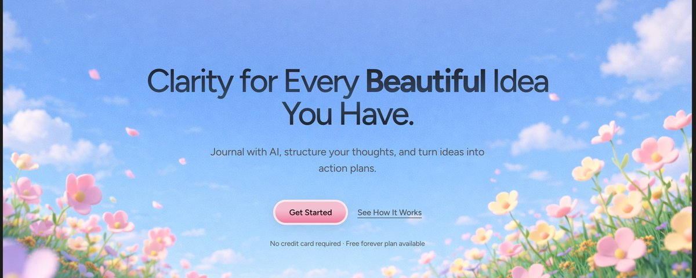

> # How to Create Stunning Websites Using AI Tools (Step-by-Step Guide)

# AIツールを使って魅力的なウェブサイトを作る方法（ステップバイステップガイド）

> 

> So what's the secret sauce for generating production worthy websites like the cover page ? Lets try to debug it and understand what makes a site appealing in the first place ? 🤔

カバーページのような本番レベルのウェブサイトを生成するための秘訣は何でしょうか？まずはそれを紐解いて、何がサイトを魅力的にするのかを理解してみましょう。🤔

> As a Design Engineer , I know about those small details, interactions , micro spacings, motion timings etc that makes a site go from AI SLOP to "WOW THAT'S AI"?

デザインエンジニアとして、私はサイトを「AIの粗悪品」から「これがAI！？すごい！」に変える、細かいディテール、インタラクション、マイクロスペーシング、モーションのタイミングなどを知っています。

> Below is the step by step understanding of what's happening . On the left side we have the actual process of generation and on the right side we have the prompt creation technique. Let's dive deeper

以下は、何が起きているかをステップごとに解説したものです。左側が実際の生成プロセス、右側がプロンプト作成技法です。さらに深く掘り下げていきましょう。

> STEP 1 : FIND INSPIRATION

ステップ1：インスピレーションを探す

> This is the most important step if you want to create a website without any design experience. Find sites that you personally like and want to recreate. Match the theme of your project with it , explore Pinterest , Dribble, Mobbin etc and pick something that you like.

デザイン経験がなくてもウェブサイトを作りたい場合、これが最も重要なステップです。自分が気に入っていて再現したいサイトを見つけましょう。プロジェクトのテーマに合わせて、Pinterest、Dribbble、Mobbinなどを探索し、好きなものを選んでください。

> Find something like this that you really like and feel will match the vibe of your application . For the above example we shall go with a cute themed background website.

このような、自分が本当に気に入っていてアプリケーションの雰囲気に合うと感じるものを見つけましょう。上記の例では、かわいいテーマの背景ウェブサイトを選びます。

> STEP 2 : CONVERT TO A LANDING PAGE BG

ステップ2：ランディングページの背景に変換する

> Go to ChatGPT or NanoBanana 2 , upload your selected image and then give this prompt . Update this prompt secondary details according to the image you have selected

ChatGPTまたはNanoBanana 2にアクセスし、選んだ画像をアップロードして、このプロンプトを入力してください。選んだ画像に合わせて、プロンプトの補足的な詳細を更新してください。

> Play with the prompt a little bit until desired output is reached , the prompt above may take you 80% there. I will create another tutorial to teach you how to master this as well.

望む出力が得られるまでプロンプトを少し調整してみてください。上記のプロンプトで80%は達成できるでしょう。これをマスターする方法については、別のチュートリアルも作成予定です。

> STEP 3 : THE LOVABLE MAGIC

ステップ3：Lovableの魔法

> Now we have our bg image ready , lets work on creating the actual website . Here comes the real knowledge of basic design systems and anti-AI slop you need to know :

背景画像の準備ができたので、実際のウェブサイト作成に取り掛かりましょう。ここで、知っておくべき基本的なデザインシステムと「AIの粗悪品」を防ぐための知識が登場します：

> The fonts

フォント

> Fonts tracking and leading

フォントのトラッキングとリーディング

> Phosphor icons instead of Lucide icons

LucideアイコンではなくPhosphorアイコン

> Understanding Insets and shadows ( MEDIUM - HARD)

インセットとシャドウの理解（中級〜上級）

> Blur to reveal animations

ブラーで明かすアニメーション

> STEP 3.1 : HOW TO CREATE THOSE BUTTON STYLES

ステップ3.1：あのボタンスタイルの作り方

> This is a bit hard to understand step for new comers so I will try to make it as simple as i can ( Understanding Insets and shadows ). For this example I created this button in Figma myself few months ago ( you can select from a inspo you found ) . By just seeing the button we can see , there is

これは初心者には少し理解しにくいステップなので、できるだけ簡単に説明します（インセットとシャドウの理解）。この例では、数ヶ月前に私がFigmaでこのボタンを自作しました（見つけたインスピレーションから選ぶこともできます）。ボタンを見ただけで次のことがわかります：

> some sort of gradient in bg

背景に何らかのグラデーション

> thick borders

太めのボーダー

> some light shadow for 3D effect

3D効果のための淡いシャドウ

> Then I asked GPT to create the prompt as well by giving it the picture of the button styles and how it is gradient dark in bottom to gradient light on top . ( Visually try to understand how it works yourself )

次に、ボタンスタイルの画像と、下が濃いグラデーションで上が明るいグラデーションになっていることをGPTに伝えて、プロンプトも作成してもらいました。（視覚的に自分でどう機能するか理解してみてください）

> Now it will give you a big json prompt, take it and paste it into lovable along with your bg image and VOILA

すると大きなJSONプロンプトが生成されるので、それを背景画像と一緒にlovableに貼り付ければ、完成です！

> CURRENT PROMPT :

現在のプロンプト：

> It might not give exact results in first go , so try to tweak it next 2-3 prompts with the help of the above principles I taught.

最初の試みで正確な結果が得られないかもしれませんので、上で教えた原則を参考に、次の2〜3回のプロンプトで調整してみてください。

> If you want more such tutorials for different themes and section, comment down below .

異なるテーマやセクションに関するチュートリアルをもっと知りたい方は、下にコメントしてください。

> Also let me know if I should create a video tutorial for it 🫶

ビデオチュートリアルを作成すべきかどうかも教えてください 🫶
