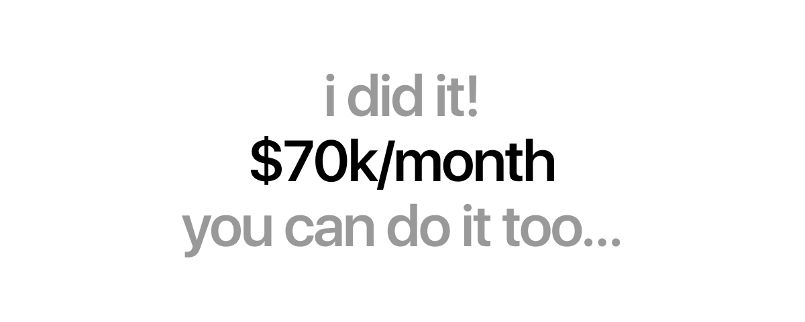

> # How I went from $0 and 0 Followers -> $70k/m and 40k followers in 1 year.

# 0ドル・フォロワー0人から1年で月収7万ドル・フォロワー4万人になった方法

> 

> Hey, this is Satya. I'm 21 years old and founder of one of the fastest growing design studio - Kree8, and have my own SaaS product - Sprrrint.

こんにちは、Satyaです。私は21歳で、急成長中のデザインスタジオKree8の創業者であり、自社SaaSプロダクトSprrrintも持っています。

> I  have 43k followers on X and about to reach $100k/m, but exactly a year ago:

現在、Xで4万3千フォロワーを持ち、月収10万ドルに届こうとしています。しかし、ちょうど1年前は：

> I had 0 followers on X and was making $0/m. I probably didn't even think X is for creatives. So I wouldn't waste much time and talk straight to the point what this article is about.

Xのフォロワーは0人で、月収は0ドルでした。X（旧Twitter）はクリエイター向けではないとすら思っていたかもしれません。時間を無駄にせず、この記事の要点を直接話しましょう。

> This is the message I sent to one of the designer when I was starting, so can say I was exactly in your position last year:

これは私が始めた頃にあるデザイナーに送ったメッセージです。昨年、私はまさにあなたと同じ立場にいたと言えます：

> So what would I do if I am starting again from 0.

では、もし私がゼロから再出発するとしたら何をするか。

> 1st I'll focus on growing my followers and skills, and the money will 100% follow. Tbh, if you have great design skills, pls reach out. I'm ready to pay $6–8k/m.  Yeah so anyway…

まずフォロワーとスキルの成長に集中します。そうすればお金は必ずついてきます。正直、優れたデザインスキルがあるなら連絡してください。月6〜8千ドルを払う準備があります。それはともかく…

> Here's what you'll find in this article:

この記事でわかること：

> - How I'll grow my followers
> - How I'll improve your skills from zero
> - How I'll reach $10k/m fast

- フォロワーを増やす方法
- スキルをゼロから伸ばす方法
- 月収1万ドルに速く到達する方法

> SO LET'S START!

さあ、始めましょう！

> Here's how I'll grow my followers:

フォロワーを増やす方法：

> Ⅰ. Game of Observation

Ⅰ. 観察のゲーム

> First, I'll start observing viral posts on X and save them on a separate bookmark folder.

まず、X上のバズ投稿を観察し、専用のブックマークフォルダに保存します。

> Here are some viral types of content I observed:

観察したバズコンテンツの種類：

> 1. Hot takes / unpopular opinions (big reach)

1. 過激な意見／少数派の意見（大きなリーチ）

> These spark replies + quote tweets = algorithm juice.

これらはリプライとQTを誘発します＝アルゴリズムの燃料になります。

> Examples:

例：

> "99% of landing pages don't need animations. They need clarity."

「ランディングページの99%にアニメーションは不要。必要なのは明確さだ。」

> "If your SaaS needs a video to explain it, the UX already failed."

「SaaSの説明に動画が必要なら、すでにUXは失敗している。」

> "Design systems are useless if your PM ignores them."

「デザインシステムはPMが無視すれば無意味だ。」

> Why it works: People argue. X loves arguments.

なぜ機能するか：人は議論します。Xは議論が大好きです。

> Format tip:

フォーマットのコツ：

> One sharp sentence. No emojis. No hashtags.

一文で鋭く。絵文字なし。ハッシュタグなし。

> 2.  Before → After design transformations (insane saves)

2. デザインのビフォー→アフター変換（大量の保存）

> Examples:

例：

> "Redesigned this landing page in 2 hours. Here's what I changed "

「このランディングページを2時間でリデザインした。変更点はこちら」

> "Client said conversions were bad. The problem was obvious."

「クライアントはコンバージョンが悪いと言った。問題は明らかだった。」

> What to show:

何を見せるか：

> Slide 1: ugly / messy version
> Slide 2: clean redesign
> In Thread: why each change mattered (Optional)

スライド1：ダサい／乱雑なバージョン
スライド2：スッキリしたリデザイン
スレッド内：各変更の理由（任意）

> Why it works: Visual + proof = instant credibility.

なぜ機能するか：ビジュアル＋証拠＝即座の信頼性。

> 3. "Steal this" frameworks (bookmark magnets)

3. 「これをパクれ」フレームワーク（ブックマーク誘引）

> People LOVE saving these.

人々はこれを保存するのが大好きです。

> Examples:

例：

> "I use this landing page structure for every SaaS client"

「すべてのSaaSクライアントにこのランディングページ構造を使っている」

> "My exact process for pricing page design"

「プライシングページデザインの私の正確なプロセス」

> "The only hero section formula you need"

「必要なヒーローセクションの公式はこれだけ」

> Format:

フォーマット：

> Numbered list (5–7 points)
> Short lines
> No fluff

番号付きリスト（5〜7項目）
短い文
余計な言葉なし

> Goal: Saves > likes.

目標：保存数＞いいね数。

> 4.  Calling out bad design (roast content)

4. 悪いデザインを指摘する（ローストコンテンツ）

> Examples:

例：

> "This checkout flow loses money. Here's why."

「このチェックアウトフローはお金を失っている。理由はこちら。」

> "Great product, terrible onboarding."

「素晴らしいプロダクト、ひどいオンボーディング。」

> Rules:

ルール：

> Critique the design, not the brand/team
> Always explain how to fix it
> This builds authority without being toxic.

ブランドやチームではなくデザインを批評する
常に修正方法を説明する
これにより、毒にならずに権威を築けます。

> ....and many more.

….他にも多数。

> ⅠⅠ. Then I'll create content something like that but with my own design or twist

ⅠⅠ. 次に、そのようなコンテンツを自分のデザインや工夫を加えて作ります

> I'm not reposting or plagiarizing.

転載や盗用ではありません。

> I'm rebuilding proven ideas through my own lens.

実証済みのアイデアを自分の視点で再構築しています。

> Same structure, different:

同じ構造で、違うのは：

> opinion
> examples
> visuals
> tone

意見
例
ビジュアル
トーン

> If a format worked once, it'll work again - if the insight is original.

フォーマットが一度機能したなら、洞察がオリジナルであれば再び機能します。

> This saves time and removes guesswork. I'm not experimenting blindly; I'm iterating on what already works.

時間を節約し、当て推量をなくします。盲目的に実験するのではなく、すでに機能しているものを繰り返し改善しています。

> Think of it as:

これを考え方として：

> "Steal the frame, not the painting."

「絵ではなく、額縁を盗め。」

> Here are few examples of my post which went super viral when I followed the same structure and content style:

同じ構造とコンテンツスタイルに従ったときに大バズした私の投稿の例：

> ⅠⅠⅠ. Post it with an engaging caption like "Did I cook" (optional & controversial)

ⅠⅠⅠ. 「Did I cook」のような引きつけるキャプションと一緒に投稿する（任意・議論を呼ぶ）

> Captions aren't decoration - they're conversation starters.

キャプションは飾りではなく、会話のきっかけです。

> Short, slightly controversial hooks like:

短く、少し論争的なフックの例：

> "Did I cook?"

「これって最高じゃない？」

> "Am I wrong for this?"

「私が間違ってる？」

> "This might be a bad take…"

「これは悪い意見かもしれない…」

> …lower the barrier for replies.

…リプライのハードルを下げます。

> Replies > likes. Replies = reach.

リプライ＞いいね。リプライ＝リーチ。

> Some people will love it, some will hate it  and that's fine.

好きな人もいれば嫌いな人もいる。それでいい。

> Neutral posts die. Opinionated posts travel.

中立な投稿は埋もれます。意見のある投稿は広まります。

> 4. Post 2–3 times a day

4. 1日2〜3回投稿する

> X rewards volume + consistency, especially when you're growing.

Xは量と一貫性に報います。特に成長中はそうです。

> Posting multiple times:

複数回投稿することで：

> Increases surface area
> Lets you test different ideas fast
> Removes emotional attachment to one post

露出面積が増える
異なるアイデアを素早くテストできる
一つの投稿への感情的な執着がなくなる

> Not every post needs to go viral.

すべての投稿がバズる必要はありません。

> One hit can carry 10 average posts.

一つのヒットが10の平均的な投稿を支えられます。

> The goal isn't perfection - it's momentum.

目標は完璧さではなく、モメンタム（勢い）です。

> So this is the only thing you need to know to grow your X account fast. but in this process don't forget to create or post  something that you want, not for the likes not for the engagement, that'll help you stand out and makes you happy, that's important.

これがXアカウントを速く成長させるために知っておくべきことです。しかし、このプロセスで、いいねやエンゲージメントのためではなく、自分が投稿したいものを忘れないでください。それがあなたを際立たせ、幸せにします。それが重要です。

> And also no need to be the reply guy, I mean it can help but I've never replied to other's post for growing followers, and I'm doing pretty great ;)

また、他人の投稿にリプライし続ける必要もありません。助けになることもありますが、私はフォロワーを増やすために他人の投稿にリプライしたことはなく、かなりうまくやっています ;)

> Here's how I'll improve my skills (For Beginners)

スキルを伸ばす方法（初心者向け）

> I. Start with ONE tool (Figma)

I. 一つのツール（Figma）から始める

> Don't try to "learn design" in theory.

理論で「デザインを学ぼう」としないでください。

> Design is a skill - you learn it by doing.

デザインはスキルであり、実践によって習得します。

> Pick one tool (Figma) and get comfortable with it:

一つのツール（Figma）を選び、慣れましょう：

> Watch 20–40 mins of tutorials daily
> Learn only what you need to move shapes, text, and frames
> That's enough to begin.

毎日20〜40分のチュートリアルを視聴する
図形、テキスト、フレームを動かすのに必要なことだけ学ぶ
始めるにはそれで十分。

> II. Learn the real basics (not everything)

II. 本当の基礎を学ぶ（すべてではなく）

> Before fancy effects, focus on fundamentals:

派手なエフェクトの前に、基礎に集中しましょう：

> Color usage (contrast > aesthetics)
> Gradients & shadows (subtle, not decorative)
> Typography (font size, weight, spacing)
> Visual hierarchy (what should be seen first?)

色の使い方（コントラスト＞美しさ）
グラデーションと影（装飾的でなく、さりげなく）
タイポグラフィ（フォントサイズ、ウェイト、スペーシング）
視覚的ヒエラルキー（何を最初に見せるか？）

> These skills will keep you ahead of 90% of designers on X

これらのスキルがあれば、X上のデザイナーの90%より先を行けます。

> III. Practice by recreating real designs

III. 実際のデザインを模倣して練習する

> The fastest way to learn is copying with intention.

最も速い学習法は、意図を持って模倣することです。

> Recreate real apps or websites
> Redesign screens you admire
> Even copy my designs if it helps - for practice only

実際のアプリやウェブサイトを再現する
気に入ったスクリーンをリデザインする
練習のためなら私のデザインをコピーしても構わない（練習のみ）

> You're training your eye, not your originality (yet).

今はオリジナリティではなく、目を鍛えています。

> Bonus:

ボーナス：

> Do challenges like 30 days, 30 designs
> Consistency beats talent early on

30日間30デザインのようなチャレンジをする
初期は一貫性が才能に勝る

> Ⅳ. Ask for feedback

Ⅳ. フィードバックを求める

> Design improves faster with outside eyes.

デザインは外からの目線があると速く改善します。

> Post your work on X
> Ask clearly: "What looks off here?"
> Tag designers you admire and ask for honest feedback
> Don't defend your work.

作品をXに投稿する
明確に聞く：「ここで何が変に見えますか？」
尊敬するデザイナーをタグ付けして正直なフィードバックを求める
自分の作品を弁護しない。

> V. Work on your own opinionated projects

V. 自分の意見を持ったプロジェクトに取り組む

> Now comes the real growth.

いよいよ本当の成長がやってきます。

> Find websites or apps you think look bad
> Redesign them the way you think they should be
> Show before → after
> Post these on X.

自分がダサいと思うウェブサイトやアプリを見つける
あるべき姿にリデザインする
ビフォー→アフターを見せる
これらをXに投稿する。

> This does three things:

これにより3つのことが起こります：

> Sharpens your design thinking
> Builds your personal brand
> Attracts real clients organically

デザイン思考を磨く
パーソナルブランドを構築する
本物のクライアントを自然に引き寄せる

> That's it. No courses. No secrets. Just reps.

それだけです。コースも秘密も不要。ただ繰り返すのみ。

> Design isn't learned by watching.

デザインは見て学ぶものではありません。

> it's learned by shipping, fixing, and shipping again.

リリースして、修正して、またリリースすることで学びます。

> How I'll reach $10k/m fast

月収1万ドルに速く到達する方法

> So now I have some followers and skills, and expect that you are also here, now comes the most important thing - Money.

フォロワーとスキルが身についたところで、あなたも同じ段階にいると思います。次に最も重要なこと——お金の話です。

> And tbh if you doing what I said, recreating viral contents and posting 2-3x  day on X, You don't have to do anything specific now, the clients will reach out to you in your DMs  for works.

正直、私が言った通りバズコンテンツを再現してXに1日2〜3回投稿していれば、特別なことをしなくてもDMでクライアントから仕事の依頼が来るようになります。

> When I hit 3k followers, I already started getting many leads without doing any cold dms or anything.

3千フォロワーに達した頃には、コールドDMなど何もしなくても多くのリードが来るようになっていました。

> But still you can do these things to increase the chances more:

それでも、可能性をさらに高めるためにこれらのことができます：

> I. Improve big brands publicly (roast or before → after)

I. 大手ブランドを公開で改善する（ローストまたはビフォー→アフター）

> Instead of saying "I'm good at design", I'd show it.

「私はデザインが得意」と言う代わりに、見せます。

> Pick well-known brands or SaaS products
> Redesign one key screen or landing section
> Share it as a before → after or light roast

有名なブランドやSaaSプロダクトを選ぶ
重要なスクリーンまたはランディングセクションを一つリデザインする
ビフォー→アフターまたは軽いローストとして共有する

> This does two things:

これにより2つのことが起こります：

> Builds instant credibility
> Attracts founders who already have money

即座の信頼性を構築する
すでにお金を持っている創業者を引き寄せる

> Good work + public distribution = inbound leads.

良い仕事＋公開配布＝インバウンドリード。

> II. Talk openly about money

II. お金について公開で話す

> Designers avoid money talk.

デザイナーはお金の話を避けます。

> That's exactly why it works.

だからこそ効果があります。

> Share what you charged
> Share how long it took
> Share how fast it scaled

請求した金額を共有する
かかった時間を共有する
どれだけ速くスケールしたかを共有する

> Example:

例：

> "This project paid $4,000 and took 3 days."

「このプロジェクトは4千ドルで3日かかった。」

> This reframes you from designer → business asset.

これにより、デザイナーからビジネス資産へと再定義されます。

> High-paying clients notice this immediately.

高額クライアントはこれにすぐ気づきます。

> III. Show client love + real outcomes

III. クライアントの声＋実際の成果を見せる

> Don't just post testimonials. Post what changed.

推薦の言葉だけを投稿しないでください。何が変わったかを投稿してください。

> Share:

共有すること：

> What was broken
> What you fixed
> What happened after

何が壊れていたか
何を修正したか
その後何が起きたか

> Example:

例：

> "Client was stuck on their landing page for weeks.
> We redesigned it in 2 days.
> They shipped the same week and started getting demos."

「クライアントは数週間ランディングページで行き詰まっていた。
私たちは2日でリデザインした。
同じ週にリリースし、デモを受け始めた。」

> Clients don't care about colors.

クライアントは色を気にしません。

> They care about speed, clarity, and results.

気にするのはスピード、明確さ、そして結果です。

> Closing truth

締めくくりの真実

> $10k/month doesn't come from being the best designer.

月収1万ドルは最高のデザイナーであることからは生まれません。

> It comes from being the most visible, trusted, and easy to hire.

最も目立ち、信頼され、雇いやすい存在であることから生まれます。

> Show your work.
> Talk about money.
> Make success obvious.

作品を見せてください。
お金について話してください。
成功を明らかにしてください。

> And if you don't have clients yet, create fake ones.

まだクライアントがいなければ、架空のものを作りましょう。

> Early on, I designed full projects on my own and presented them like real-world briefs.

初期の頃、私は独自にプロジェクト全体をデザインし、実際のブリーフのように提示しました。

> This helped potential clients see my thinking, execution, and how a project would look if we worked together - which built trust before I had social proof.

これにより、潜在的なクライアントは私の思考、実行力、そして一緒に仕事をした場合のプロジェクトの見え方を理解できました——ソーシャルプルーフを得る前に信頼を築いたのです。

> That's my entire approach.

これが私のアプローチ全体です。

> I'll grow my audience by learning from what already works.

すでに機能していることから学んでオーディエンスを増やします。

> I'll sharpen my skills by practicing publicly and asking for feedback.

公開で練習してフィードバックを求めることでスキルを磨きます。

> And I'll make money by showing real proof, real speed, and real outcomes.

そして、実際の証拠、実際のスピード、実際の成果を見せることでお金を稼ぎます。

> Thank you for reading this article and hope it helped you. Reach out to me if you want to ask some specific questions or tag me if need any help, I'll try my best to help you.

この記事を読んでいただきありがとうございます。お役に立てれば幸いです。具体的な質問があれば連絡してください。助けが必要な場合はタグ付けしてください。できる限り助けます。

> Ok then, meet you in next article!

では、次の記事でお会いしましょう！
