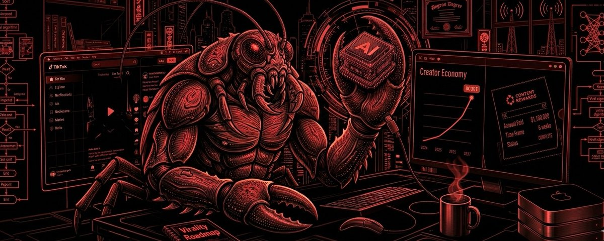

> # This OpenClaw AI Agent Made Me $10K Clipping Pop Culture Content...

このOpenClaw AIエージェントで、ポップカルチャーコンテンツをクリッピングして$10Kを稼いだ話

> 

> most people hear "ai agent" and think, oh cool, it sends my emails for me.

「AIエージェント」と聞いて多くの人は、ああクール、メールを送ってくれるんだね、と思う。

> no. stop.

違う。そんな話じゃない。

> i'm going to show you how we built a content engine that clips, scripts, and distributes pop culture content across multiple channels. completely on autopilot and pulls brand payouts from content rewards while we're not even at our desks.

これから説明するのは、ポップカルチャーコンテンツを自動でクリッピング・スクリプト化し、複数チャンネルへ配信するコンテンツエンジンの作り方だ。完全自動で稼働し、席を外している間もブランドからの報酬を稼ぎ続ける。

> we don't require any camera for this.

カメラは一切不要。

> just openclaw,doing the work.

OpenClawが全部やってくれる。

> let's kill the misconception first

まず誤解を解こう

> people are out here automating their notion reminders and calling it passive income.

Notionのリマインダーを自動化して「不労所得」と呼んでいる人がいる。

> that's not what this is.

そういう話ではない。

> what we built is a full content production pipeline. input: the internet. output: monetized short-form videos. the human in the loop? barely.

私たちが構築したのは、完全なコンテンツ制作パイプラインだ。入力：インターネット。出力：収益化されたショート動画。人間の関与？ほぼゼロ。

> pop culture is perfect for this because the source material never runs out. every day there's a new celebrity moment, a film anniversary, a throwback clip, a beef, a controversy, a ranking debate. the algorithm is starving for this content. and almost nobody is feeding it at scale.

ポップカルチャーはこの用途に最適だ。ネタが尽きないからだ。毎日、新しいセレブの出来事、映画の記念日、懐かしいクリップ、対立、炎上、ランキング論争が生まれる。アルゴリズムはこのコンテンツに飢えている。そしてこれを大量供給できている人はほとんどいない。

> we are.

私たちはやっている。

> the stack. three tools, one machine.

スタック：3つのツール、1つのマシン

> here's the actual pipeline, tools in sequence.

実際のパイプラインを、ツールの順番で説明する。

> openclaw is the agent layer. it doesn't just run tools , it orchestrates the whole thing, makes decisions, and moves content through each stage without anyone babysitting it.

OpenClawはエージェント層だ。単にツールを実行するのではなく、全体を指揮し、判断を下し、誰も監視しなくてもコンテンツを各ステージへと進める。

> claude is the brain behind the scripts. you feed it a prompt, "give me 10 wild facts about the making of titanic that most people don't know" or "break down why the kanye and drake beef actually started"  and it spits out a clean short-form script in under a minute. hook, body, cta. done. openclaw runs these in batches. dozens of scripts in one sitting.

Claudeはスクリプトを担う頭脳だ。「タイタニックの制作に関する知られざる10の事実を教えて」や「カニエとドレイクのビーフが実際にどこから始まったか解説して」というプロンプトを与えると、1分以内にきれいなショートフォームスクリプトを出力する。フック、本文、CTA。完了。OpenClawはこれをバッチで実行し、一度に数十本のスクリプトを生成する。

> capcut handles the final product. openclaw drops the clips in, layers the script as captions, adds a voiceover through capcut's built-in tts, puts music underneath, and exports a finished vertical short. platform-ready. every time.

CapCutが最終製品を担う。OpenClawがクリップを投入し、スクリプトをキャプションとして重ね、CapCut内蔵のTTSで音声を追加し、BGMを敷いて、縦型ショート動画として書き出す。プラットフォームに即投稿できる状態で、毎回。

> that's the whole thing. claude writes it. capcut packages it. openclaw runs it all.

これが全体像だ。Claudeが書き、CapCutがパッケージ化し、OpenClawが全部動かす。

> the pop culture angle nobody is maximizing

誰も最大活用していないポップカルチャーの切り口

> there are decades of footage, interviews, red carpet moments, and behind-the-scenes clips on the internet right now. a lot of it clippable, royalty-free, or cleared for transformation. award show moments. vintage late night interviews. music video drops. box office chaos.

インターネット上には何十年分もの映像、インタビュー、レッドカーペット、舞台裏クリップが存在する。その多くはクリッピング可能で、ロイヤリティフリーか、改変許可済みだ。授賞式の瞬間。ビンテージ深夜トークショー。MVのリリース。興行収入の波乱。

> the specific angle that's being slept on, historical pop culture

まだ誰も気づいていない特定の切り口——それは「歴史的なポップカルチャー」だ

> throwback content goes crazy on short-form. "things you forgot happened in 2009" gets views. "the most unhinged celebrity moments of the 2000s" gets views. "what actually went down between [artist a] and [artist b]" gets views every single time.

懐かしコンテンツはショートフォームで爆発する。「2009年に起きたのに忘れていたこと」は再生される。「2000年代の最もぶっ飛んだセレブの瞬間」は再生される。「[アーティストA]と[アーティストB]の間に実際に何があったか」は毎回再生される。

> and here's the kicker because it's historical, it doesn't expire. a video about a 2007 scandal is just as watchable today. you can produce 50 of these in one session and they'll stay relevant for months.

そしてここが肝心なのだが、歴史的なコンテンツは賞味期限がない。2007年のスキャンダルについての動画は今でも普通に見られる。1回のセッションで50本製造でき、何ヶ月も関連性を保ち続ける。

> that's the source advantage. and it compounds.

これがソースとしての優位性だ。そして複利的に効いてくる。

> how openclaw actually runs this day to day

OpenClawが実際に日々どう動かしているか

> we trained our agent and let it loose. here's what it's handling:

エージェントをトレーニングして解き放った。以下がエージェントが担っていること：

> scripting, openclaw runs batched claude prompts across our content calendar. we loaded it with topic clusters upfront: celebrity feuds, film history, music drama, tv moments. it pulls 10-20 scripts per session. we glance at a sample. the rest go straight into the queue.

スクリプト作成：OpenClawはコンテンツカレンダーに沿って、Claudeへのプロンプトをバッチ実行する。事前にトピッククラスターを登録した：セレブの確執、映画史、音楽ドラマ、TVシーン。1セッションあたり10〜20本のスクリプトを引き出す。サンプルをちらっと確認して、残りは直接キューへ。

> clipping, it pulls from our source library and matches clips to the scripts. we trained it on what works. 5-8 seconds per cut for fast pop culture content. hook in the first 2 seconds. build tension before the payoff.

クリッピング：ソースライブラリから引き出し、クリップをスクリプトにマッチさせる。何が効くかをトレーニング済み。ポップカルチャーの高速コンテンツでは1カット5〜8秒。最初の2秒でフック。オチの前に緊張感を構築。

> assembly,the package goes into capcut templates we already built. captions, music, voiceover, export. openclaw moves straight to the next one.

組み立て：パッケージは事前に構築したCapCutテンプレートへ。キャプション、音楽、音声、書き出し。OpenClawはすぐ次へ進む。

> scheduling it queues everything across our accounts automatically. we're running three channels off one pipeline right now.

スケジューリング：全アカウントへ自動でキュー投入。現在、1つのパイプラインで3チャンネルを運用中。

> result: 3-5 videos a day across three channels without us touching the editing suite.

結果：編集ソフトに一切触れず、3チャンネルで1日3〜5本の動画をアップ。

> where the money actually comes from

実際どこからお金が来るのか

> here's where it all clicks together.

ここで全てが噛み合う。

> content rewards is a platform where brands post campaigns with real budgets, we're talking individual budgets clearing $100k and pay creators per verified 1,000 views. no pitching brands. you don't need to be chasing invoices nor rate negotiations.

Content Rewardsは、ブランドが実際の予算（個別予算は$100Kを超えるものもある）でキャンペーンを掲載し、確認済み1,000回再生あたりでクリエイターに報酬を支払うプラットフォームだ。ブランドへの売り込み不要。請求書の追跡も料率交渉も不要。

> you make content that fits a brief. it gets approved. you get paid per view.

ブリーフに合ったコンテンツを作る。承認される。再生回数に応じて支払われる。

> the categories live on that platform right now,ai content, faceless content, clipping. which is exactly what this pipeline produces. pop culture short-form is a direct match for what brands in entertainment, streaming, lifestyle, and consumer goods are funding there, you can even make money using music/audio campaigns.

現在そのプラットフォームにあるカテゴリーは、AIコンテンツ、顔出しなしコンテンツ、クリッピング。まさにこのパイプラインが生産するものだ。ポップカルチャーショートフォームは、エンターテイメント、ストリーミング、ライフスタイル、消費財ブランドが資金を投じているものと直接マッチする。音楽・オーディオキャンペーンで稼ぐことも可能だ。

> here's the part that matters most, the pipeline you'd build for youtube and tiktok is the exact same pipeline you'd point at a content rewards brief. same tools. same format. same workflow. you just swap the topic to match the brief.

最も重要な点は、YouTubeやTikTok向けに構築するパイプラインが、Content Rewardsのブリーフに向けるパイプラインとまったく同じだということ。同じツール。同じフォーマット。同じワークフロー。トピックをブリーフに合わせて入れ替えるだけ。

> one system. two revenue streams. that's why this stack is worth building.

1つのシステム。2つの収益源。だからこのスタックを構築する価値がある。

> the mistake almost everyone makes

ほぼ全員がやりがちなミス

> when people crack a pipeline, their instinct is to post immediately. one video at a time. reactive. chasing the algorithm every day.

パイプラインを確立すると、多くの人はすぐに投稿したくなる。1本ずつ。リアクティブに。毎日アルゴリズムを追いかけて。

> that's the treadmill. it never stops.

それはトレッドミルだ。永遠に止まらない。

> the real move is to spend 4-6 weeks running the pipeline at full capacity first. build a library of 200, 300 videos. then schedule one per day and walk away from the posting calendar entirely.

本当の戦略は、まず4〜6週間パイプラインをフル稼働させることだ。200〜300本のライブラリを構築する。それから1日1本ずつスケジュールして、投稿カレンダーから完全に手を引く。

> the algorithm rewards consistency more than almost anything else. a channel posting every single day for 12 months builds momentum that sporadic posting can never catch, no matter how good the individual videos are. you can't maintain that with discipline. you can only guarantee it by engineering it during production, not by trying to stay motivated across 365 separate days.

アルゴリズムは一貫性をほぼ何よりも重視する。12ヶ月毎日投稿するチャンネルは、散発的な投稿では決して追いつけないモメンタムを構築する。個々の動画の質がどれだけ高くても関係ない。これを意志の力で維持することはできない。365日モチベーションを保とうとするのではなく、制作段階でそれをエンジニアリングすることでしか保証できない。

> one sprint. a full year of output. then you move on to whatever's next.

1回のスプリント。丸1年分のアウトプット。その後は次のことへ。

> honest bit, what it can't do yet

正直なところ、まだできないこと

> this isn't magic. there's still a human layer we keep on purpose.

これは魔法ではない。意図的に残している人間の層がまだある。

> we skim a sample of scripts before they go into production, maybe 10-20% of the batch. we audit quarterly to catch any quality drift. we browse content rewards every couple weeks and point the pipeline at whatever briefs fit.

制作に入る前に、スクリプトのサンプル（バッチの10〜20%程度）を軽く確認する。品質の劣化を検知するため四半期ごとに監査する。数週間ごとにContent Rewardsを見て、合うブリーフにパイプラインを向ける。

> everything else runs on its own.

それ以外は全て自動で動く。

> and as openclaw gets more capable, that review layer keeps getting smaller.

そしてOpenClawの能力が向上するにつれ、そのレビュー層はどんどん小さくなっていく。

> how fast you can actually get this going

実際にどのくらいの速さで動かせるか

> week one: build the pipeline. get the claude prompting pattern down for pop culture scripts. set up capcut templates so editing is fast and repeatable. connect openclaw to your scheduler.

1週目：パイプラインを構築する。ポップカルチャースクリプト向けのClaudeプロンプトパターンを確立する。編集が速くて繰り返せるようCapCutテンプレートをセットアップする。OpenClawをスケジューラーに接続する。

> weeks two and three: produce. aggressively and without stopping. throwback moments, celebrity breakdowns, film and music retrospectives. build the library. own the format.

2〜3週目：制作。積極的に、止まらずに。懐かしい瞬間、セレブの分析、映画・音楽の振り返り。ライブラリを構築する。そのフォーマットを制する。

> week four: open content rewards. browse active campaigns. find the briefs that match , ai content, clipping, faceless. start submitting at volume.

4週目：Content Rewardsを開く。アクティブなキャンペーンを閲覧する。マッチするブリーフを見つける——AIコンテンツ、クリッピング、顔出しなし。大量に投稿し始める。

> by day 30 you're not manually creating content. you've built a machine that does it.

30日目までに、手動でコンテンツを作ることはなくなっている。それをやってくれるマシンを構築したのだから。

> the tools are there. the platform budgets are sitting there waiting. the format is proven.

ツールはある。プラットフォームの予算はそこで待っている。フォーマットは実証済みだ。

> the only thing left is whether you build the pipeline or keep doing it the slow way.

残るのは、パイプラインを構築するか、それとも旧来の遅いやり方を続けるか、だけだ。

> join here→content rewards

こちらから参加→content rewards
