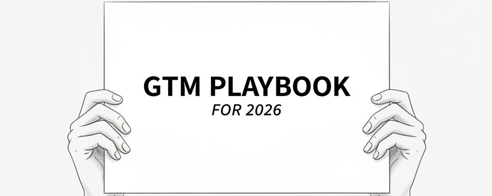

> # The GTM Flywheel Behind $7M ARR (And Why We Killed Our Outbound Engine to Build It)
# 700万ドルARRを生んだGTMフライホイール（そしてなぜアウトバウンドエンジンを廃止したのか）

> 

> Most B2B companies between $1M and $10M ARR are running a GTM motion that's about to hit a wall. The outbound engine that built early revenue starts flattening.
ARRが100万〜1,000万ドルの間にあるほとんどのB2B企業は、まもなく壁にぶつかるGTM戦略を走らせている。初期収益を築いたアウトバウンドエンジンが横ばいになり始める。

> CAC creeps up. Reply rates plateau. The pipeline depends entirely on one channel.
CAC（顧客獲得コスト）が上昇し、返信率は頭打ちになる。パイプラインはたった一つのチャネルに完全依存している。

> Everything still "works," but nothing compounds.
すべてが一応「機能している」のに、何も複利的に成長しない。

> This is a phase transition. The system that gets you to $6M is not the system that gets you to $20M. We learned this at ColdIQ after crossing $6M ARR in 31 months.
これはフェーズの転換点だ。600万ドルに到達させてくれたシステムは、2,000万ドルに連れて行ってくれるシステムではない。ColdIQが31か月でARR600万ドルを突破したとき、私たちはこれを学んだ。

> Here's the playbook for rebuilding a GTM that compounds, and how to phase the transition without killing revenue:
複利的に成長するGTMを再構築するためのプレイブックと、収益を殺さずにトランジションを段階的に進める方法を紹介しよう。

> The three pillars of a GTM that compounds
複利的なGTMを支える3つの柱

> A GTM that compounds needs three layers working together, not one channel pushed harder.
複利的なGTMには、一つのチャネルを強引に伸ばすのではなく、三つの層が連携して機能することが必要だ。

> Pillar 1: Signal-based outbound.
柱1：シグナルベースのアウトバウンド

> Stop targeting by job title and firmographics alone. Use tools like Clay to pull real-time signals: hiring data, funding rounds, tech stack changes, leadership moves. Then build the email around what those signals mean for the prospect's business.
役職や企業属性だけでターゲティングするのをやめよう。Clayのようなツールを使ってリアルタイムのシグナルを取得する。採用データ、資金調達ラウンド、技術スタックの変化、経営陣の異動などだ。そしてそれらのシグナルが見込み客のビジネスに何を意味するかを中心にメールを組み立てる。

> At ColdIQ, a Fortune-500 subsidiary binged our AI Sales Tools directory 17 times in 90 minutes. That signal triggered a 73-second personalized Loom, a cold call at 9:14 AM their local time, and a demo locked within 24 hours.
ColdIQでは、Fortune500の子会社が90分間でAIセールスツールディレクトリを17回閲覧した。そのシグナルが73秒のパーソナライズされたLoom動画を送るきっかけになり、現地時間の午前9時14分にコールドコールを行い、24時間以内にデモを確定させた。

> The contract closed at over €200K annual. That's what signal-based outbound looks like in practice. Higher reply rates, more qualified conversations, less wasted volume.
契約は年間20万ユーロ超でクローズした。これがシグナルベースのアウトバウンドの実際の姿だ。返信率が上がり、質の高い商談が増え、無駄なアプローチが減る。

> Pillar 2: Content as a trust layer.
柱2：信頼の層としてのコンテンツ

> Content doesn't replace outbound. It makes outbound convert better. When a prospect has already seen your name three times before your cold email lands, the reply rate changes completely.
コンテンツはアウトバウンドの代替ではない。アウトバウンドのコンバージョンを高めるものだ。コールドメールが届く前にすでに見込み客が自分の名前を三度目にしていれば、返信率はまるで変わる。

> At ColdIQ, we turned LinkedIn content into a team-wide operation. Six people posting consistently. 4 million impressions in a single quarter. 356 meetings booked directly from LinkedIn. $80,000 in monthly recurring revenue from that one channel.
ColdIQでは、LinkedInコンテンツをチーム全体の取り組みに変えた。6人が継続的に投稿し、1四半期で400万インプレッション。LinkedInだけで356件のミーティングをブッキングし、そのチャネル単体で月額8万ドルの経常収益を生んだ。

> The key: it wasn't a separate effort. It was fuel for everything else.
重要なのは、それが独立した活動ではなかったことだ。それは他のすべての活動への燃料だった。

> Pillar 3: Inbound that actually converts.
柱3：実際にコンバートするインバウンド

> Launch real tools and resources, not gated PDFs. Build things that solve real problems in your space.
ゲート付きPDFではなく、実際のツールやリソースをリリースしよう。自分たちの領域で実際の問題を解決するものを作る。

> At ColdIQ, we run over 50 apps internally, so we built free tools that help others in the market figure out which ones actually matter. The goal is turning tool users and content readers into qualified leads who book themselves.
ColdIQでは社内で50以上のアプリを運用しているので、市場の人々がどれが本当に重要かを判断するのに役立つ無料ツールを作った。目標は、ツールユーザーやコンテンツ読者を、自分でアポを取る質の高いリードに変えることだ。

> Inbound in 2026 isn't posting and hoping. It's a system that turns attention into pipeline.
2026年のインバウンドは、投稿して待つものではない。注目をパイプラインに変えるシステムだ。

> These three pillars start to compound because each feeds the others.
この三つの柱は、それぞれが他を支えるため、複利的に成長し始める。

> Outbound generates conversations, content builds trust before the email ever lands, and inbound captures the demand you've already created.
アウトバウンドは商談を生み、コンテンツはメールが届く前に信頼を築き、インバウンドはすでに生み出した需要を取り込む。

> But knowing the pillars is the easy part. The hard part is layering them in while your current engine is still paying the bills.
しかし、柱を知ることは簡単な部分だ。難しいのは、現行のエンジンがまだ収益を生んでいる間にそれらを重ねていくことだ。

> The phased playbook for rebuilding at scale
スケールしながら再構築するための段階的プレイブック

> Most founders who see this framework try to launch all three pillars at once. It doesn't work.
このフレームワークを見たほとんどの創業者は、三つの柱を同時に立ち上げようとする。それはうまくいかない。

> Each pillar needs the one before it to be running, or there's nothing to compound.
各柱は前の柱が動いていることを必要とする。そうでなければ、複利成長させるものが何もない。

> Here's how we phased it at ColdIQ while keeping revenue intact the entire time:
ColdIQで収益を維持しながら段階的に進めた方法を紹介しよう。

> Phase 1: Audit ruthlessly (Week 1–2).
フェーズ1：徹底的な監査（1〜2週目）

> Separate what's actually working from what feels like it's working.
実際に機能していることと、機能しているように感じることを分ける。

> Track reply rates by segment, CAC trends, channel attribution, pipeline velocity.
セグメント別の返信率、CAC推移、チャネルアトリビューション、パイプライン速度を追跡する。

> Don't tear anything down yet. Just see clearly where diminishing returns are starting. When we did this at ColdIQ, the answer was obvious once we looked: one channel, flattening returns, rising cost per meeting. The ceiling was there the whole time. We just hadn't measured for it.
まだ何も壊すな。逓減収益がどこから始まっているかをただ明確に見るのだ。ColdIQでこれを行ったとき、見てみると答えは明白だった。一つのチャネル、横ばいのリターン、上昇するミーティング単価。天井はずっとそこにあった。ただ、それを測定していなかっただけだ。

> Phase 2: Layer the content engine (Month 1–3).
フェーズ2：コンテンツエンジンの積み重ね（1〜3か月目）

> Start LinkedIn content while outbound keeps running.
アウトバウンドを継続しながら、LinkedInコンテンツを開始する。

> Post 3–5 times per week.
週3〜5回投稿する。

> Optimize every team member's profile.
チームメンバー全員のプロフィールを最適化する。

> Build a system around four content formats: tool carousels, client campaign breakdowns, giveaway posts, and journey posts.
四つのコンテンツフォーマットを中心にシステムを構築する。ツールカルーセル、クライアントキャンペーンの詳細解説、プレゼント投稿、ジャーニー投稿だ。

> Spend 30 minutes a week on ideation using tools like Taplio. Study what performs, reverse-engineer hooks and structures.
Taplioのようなツールを使って週30分をアイデア出しに充てる。何がうまくいくかを研究し、フックと構造を逆エンジニアリングする。

> The first 30 posts might generate almost nothing. That's normal. Our post 31 went viral. 100,000+ impressions, 24 meetings booked, 4 clients signed. Revenue jumped from $6,000 to $15,000 a month overnight.
最初の30投稿はほぼ何も生まないかもしれない。それは普通だ。31投稿目がバイラルになった。10万以上のインプレッション、24件のミーティング予約、4社のクライアント獲得。収益は一夜にして月6,000ドルから15,000ドルに跳ね上がった。

> The key metric during this phase: are outbound conversion rates lifting in segments where content is visible?
このフェーズの重要指標は、コンテンツが見えているセグメントでアウトバウンドのコンバージョン率が上昇しているかどうかだ。

> Phase 3: Build signal infrastructure (Month 2–4).
フェーズ3：シグナルインフラの構築（2〜4か月目）

> Implement Clay for data enrichment and signal detection.
データエンリッチメントとシグナル検知のためにClayを導入する。

> Replace firmographic targeting with signal-based targeting.
企業属性ターゲティングをシグナルベースのターゲティングに置き換える。

> Pull hiring posts, funding rounds, tech stack changes, leadership moves. The email isn't about the signal itself. It's about what the signal means for the prospect's business. This is where quality replaces volume.
採用投稿、資金調達ラウンド、技術スタックの変化、経営陣の異動を取得する。メールはシグナル自体についてではない。そのシグナルが見込み客のビジネスに何を意味するかについてだ。ここが量から質への転換点だ。

> At ColdIQ, signal-based targeting pushed our win rate to 28% and average contract value past €150K.
ColdIQでは、シグナルベースのターゲティングによって勝率を28%に押し上げ、平均契約額を15万ユーロ超にした。

> Phase 4: Connect the flywheel (Month 4–6).
フェーズ4：フライホイールの接続（4〜6か月目）

> Launch inbound assets.
インバウンドアセットをリリースする。

> Run warm outreach to people who engaged with content, read blog articles, or visited the website.
コンテンツに反応した人、ブログ記事を読んだ人、ウェブサイトを訪問した人にウォームアウトリーチを行う。

> Outbound now targets prospects who've already seen your name. Every channel feeds data and trust into every other channel.
アウトバウンドは今や、すでに自分の名前を見たことのある見込み客をターゲットにする。すべてのチャネルがデータと信頼を他のすべてのチャネルに送り込む。

> This is where compounding starts.
ここで複利成長が始まる。

> At ColdIQ, this is the phase that took us from $6M to past $7M and climbing toward $1M a month.
ColdIQでは、このフェーズが私たちを600万ドルから700万ドル超へ、そして月100万ドルへと向かわせた段階だ。

> The actual moat
真のお堀（競争優位性）

> "Working" and "compounding" are different things. Every founder knows this intellectually. Very few act on it while revenue is still growing. The playbook isn't the moat. The willingness to rewrite it is.
「機能している」ことと「複利成長している」ことは別物だ。すべての創業者が頭ではわかっている。収益がまだ成長している間にそれに基づいて行動する人はほとんどいない。プレイブック自体がお堀ではない。それを書き直す意志こそがお堀だ。
