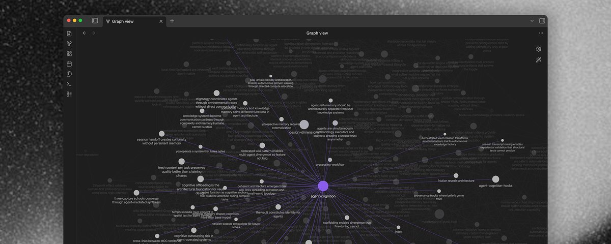

> # Skill Graphs > SKILL.md

# スキルグラフ > SKILL.md

> 

> people underestimate the power of structured knowledge. it enables entirely new kinds of applications

人々は構造化された知識の力を過小評価している。それはまったく新しい種類のアプリケーションを可能にする。

> right now people write skills that capture one aspect of something. a skill for summarizing, a skill for code review and so on. (often) one file with one capability

現在、人々はある物事の一側面を捉えるスキルを書いている。要約のためのスキル、コードレビューのためのスキル、といった具合だ。（多くの場合）1ファイルに1つの機能。

> thats fine for simple tasks but real depth requires something else

シンプルなタスクにはそれで十分だが、真の深さには何か別のものが必要だ。

> imagine a therapy skill that provides relevant information about cognitive behavioral patterns, attachment theory, active listening techniques, emotional regulation frameworks and so on

認知行動パターン、愛着理論、積極的傾聴技術、感情調整フレームワークなどに関する情報を提供するセラピースキルを想像してみよう。

> a single skill file cant hold that

単一のスキルファイルではそれを収めることができない。

> skill graphs

スキルグラフ

> a skill graph is a network of skill files connected with wikilinks

スキルグラフとは、wikiリンクで繋がったスキルファイルのネットワークだ。

> instead of one big file you have many small composable pieces that reference each other. each file is one complete thought, technique or skill and [[wikilinks between them create a traversable graph]]

1つの大きなファイルの代わりに、互いを参照する多くの小さな組み合わせ可能なピースを持つ。各ファイルは1つの完全な思考、技術、またはスキルであり、[[それらの間のwikiリンクがトラバース可能なグラフを作る]]。

> a skill graph applies the same skill discovery pattern recursively inside the graph itself

スキルグラフは、グラフ自体の内部で同じスキル発見パターンを再帰的に適用する。

> every node has a yaml description the agent can scan without reading the whole file

すべてのノードにはYAML説明があり、エージェントはファイル全体を読まずにスキャンできる。

> every wiki link carries meaning because its woven into prose so the agent follows relevant paths and skips what doesnt matter

すべてのwikiリンクは意味を持つ。なぜなら文章に織り込まれているので、エージェントは関連するパスをたどり、重要でないものをスキップする。

> progressive disclosure:
>
> index → descriptions → links → sections → full content

段階的な開示：
インデックス → 説明 → リンク → セクション → 全コンテンツ

> most decisions happen before reading a single full file

ほとんどの決定は1つの完全なファイルを読む前に行われる。

> the primitives

プリミティブ（基本要素）

> you already have everything you need

必要なものはすべてすでに持っている。

> wikilinks that read as prose in sentences, so they carry meaning not just references

文章の中で散文として読めるwikiリンク。参照だけでなく意味を伝える。

> yaml frontmatter with descriptions so the agent can scan without reading full files

エージェントがファイル全体を読まずにスキャンできるよう、説明付きのYAMLフロントマター。

> MOCs (maps of content) that organize clusters of related skills into navigable sub-topics

関連するスキルのクラスターをナビゲート可能なサブトピックに整理するMOC（コンテンツマップ）。

> skill links to other skills which link to other skills and the graph goes as deep as the domain requires

スキルが他のスキルにリンクし、そのスキルがさらに他のスキルにリンクし、グラフはドメインが必要とする深さまで広がる。

> arscontexta plugin

arscontextaプラグイン

> arscontexta is a skill graph that teaches your agent how to build skill graphs

arscontextaは、エージェントにスキルグラフの作り方を教えるスキルグラフだ。

> (okay actually its about building knowledge bases but thats the same thing...)

（実際にはナレッジベースの構築についてだが、それは同じことだ……）

> ~250 connected markdown files that teach an agent how to build a massive knowledge base aka skill graph for you

約250の繋がったMarkdownファイルが、エージェントに大規模なナレッジベース（別名スキルグラフ）の構築方法を教える。

> one skill file couldnt do that

1つのスキルファイルではそれはできない。

> but things change if you build a graph of interconnected research claims (/skills) about cognitive science, zettelkasten, graph theory, agent architecture where each piece links to others, each one composable and the whole thing is traversable

しかし、認知科学、ツェッテルカステン、グラフ理論、エージェントアーキテクチャについての相互に繋がった研究上の主張（/スキル）のグラフを構築すれば話は変わる。各ピースが他のピースにリンクし、それぞれが組み合わせ可能で、全体がトラバース可能だ。

> what this enables

これが可能にすること

> think about it:
>
> a trading skill graph: risk management, market psychology, position sizing, technical analysis, each piece linked to related concepts so context flows between them
>
> a legal skill graph: contract patterns, compliance requirements, jurisdiction specifics, precedent chains, all traversable from one entry point
>
> a company skill graph: org structure, product knowledge, processes, onboarding context, culture, competitive landscape
>
> none of these fit in one file but all of them work as graphs

考えてみよう：

- トレーディングスキルグラフ：リスク管理、市場心理、ポジションサイジング、テクニカル分析。各ピースが関連概念にリンクし、コンテキストが流れる。
- 法律スキルグラフ：契約パターン、コンプライアンス要件、管轄地域の詳細、判例チェーン。すべて1つのエントリーポイントからトラバース可能。
- 企業スキルグラフ：組織構造、製品知識、プロセス、オンボーディングコンテキスト、文化、競合状況。

これらはいずれも1つのファイルには収まらないが、すべてグラフとして機能する。

> how to build one

構築方法

> the easy way: install the arscontexta claude code plugin, pick the research preset and point it at any topic

簡単な方法：arscontexta Claude Codeプラグインをインストールし、リサーチプリセットを選んで任意のトピックを指定する。

> it sets up the markdown folder structure for you and then you fill it with /learn and /reduce

Markdownフォルダ構造をセットアップしてくれるので、あとは `/learn` と `/reduce` で埋めていく。

> the manual way its simpler than you think

手動の方法は思ったよりシンプルだ。

> a skill graph doesnt need to live in your .claude/skills/ folder. the key is an index file that tells the agent what exists and how to traverse it

スキルグラフは `.claude/skills/` フォルダに置く必要はない。重要なのは、何が存在し、どのようにトラバースするかをエージェントに伝えるインデックスファイルだ。

> heres what an index looks like for a knowledge work skill graph:

ナレッジワークスキルグラフのインデックスの例：

> the index isnt a lookup table its an entry point that points attention. the agent reads it, understands the landscape and follows the links that matter for the current conversation

インデックスはルックアップテーブルではなく、注意を向けるエントリーポイントだ。エージェントはそれを読み、全体像を理解し、現在の会話に関係するリンクをたどる。

> each linked file is a standalone methodology claim (= skill). heres what one node looks like:

リンクされた各ファイルは独立した方法論的主張（＝スキル）だ。1つのノードの例：

> see how the wikilinks inside the prose tell the agent when and why to follow them

文章内のwikiリンクが、エージェントにいつ・なぜそれをたどるべきかを伝えているのがわかる。

> an map of contents (MOCs) organize sub-topics when the graph gets larger.

コンテンツマップ（MOC）は、グラフが大きくなったときにサブトピックを整理する。

> the evolution

進化

> skills are context engineering, basically curated knowledge injected where it matters

スキルはコンテキストエンジニアリングだ。基本的には、重要な箇所に注入されたキュレーションされた知識だ。

> skill graphs are the next step

スキルグラフは次のステップだ。

> instead of one injection the agent navigates a knowledge structure, pulling in exactly what the current situation requires

1回の注入ではなく、エージェントは知識構造をナビゲートし、現在の状況が必要とするものを正確に引き込む。

> this is the difference between an agent that follows instructions and an agent that understands a domain

これが、指示に従うエージェントと、ドメインを理解するエージェントの違いだ。

> arscontexta is a claude code plugin that does this for building knowledge systems. 249 files of structured knowledge the agent traverses to derive a local knowledge system that really fits your workflow

arscontextaはナレッジシステムの構築のためにこれを行うClaude Codeプラグインだ。249ファイルの構造化された知識をエージェントがトラバースして、ワークフローに本当に合ったローカルナレッジシステムを導き出す。

> go use it and build skill graphs for everything else

ぜひ使って、他のすべてのためのスキルグラフを構築しよう。

> heinrich

— heinrich
