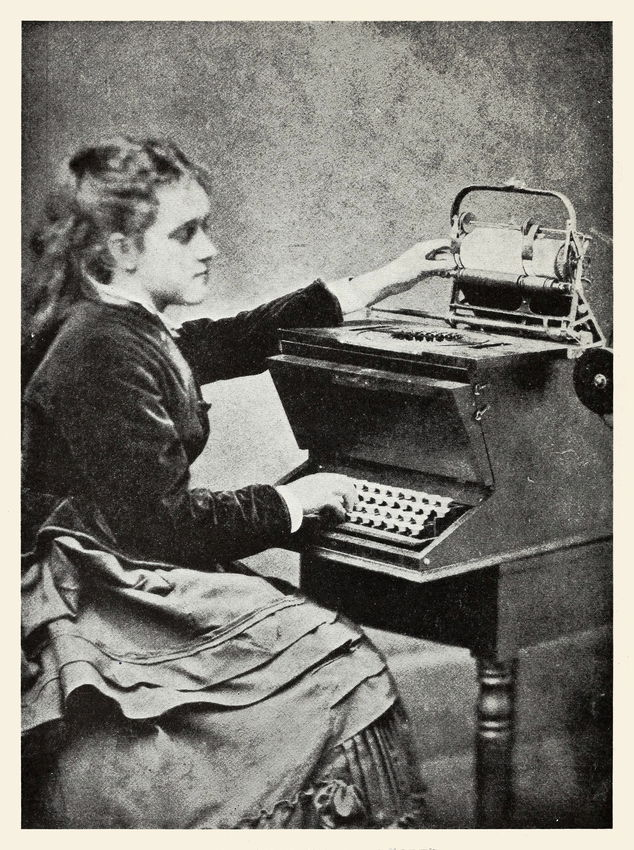
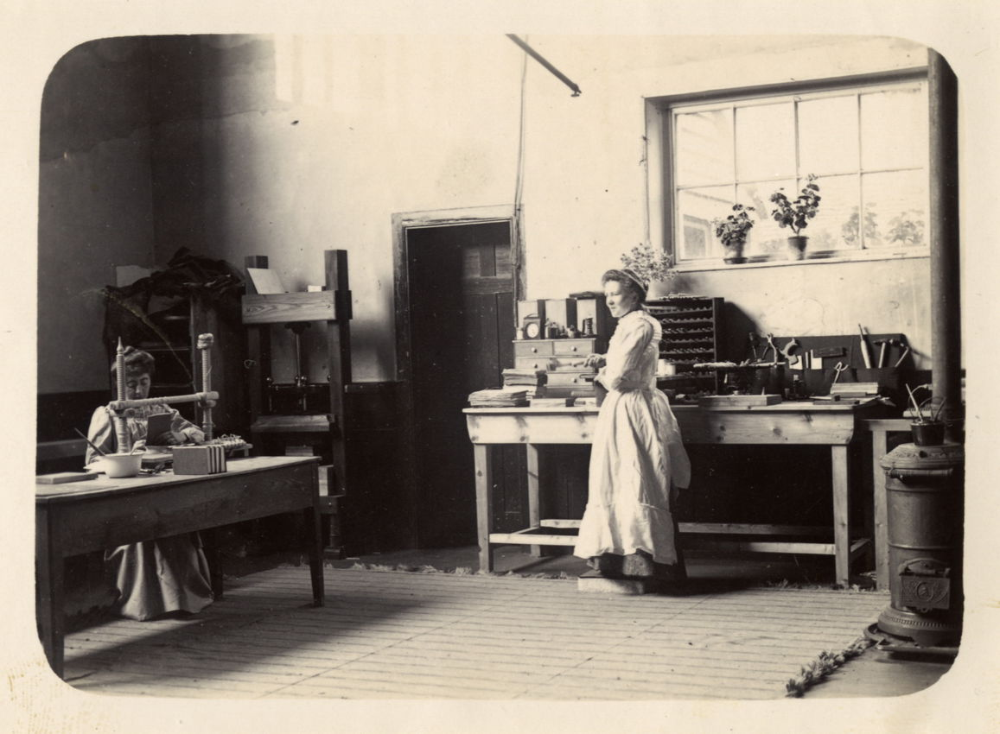
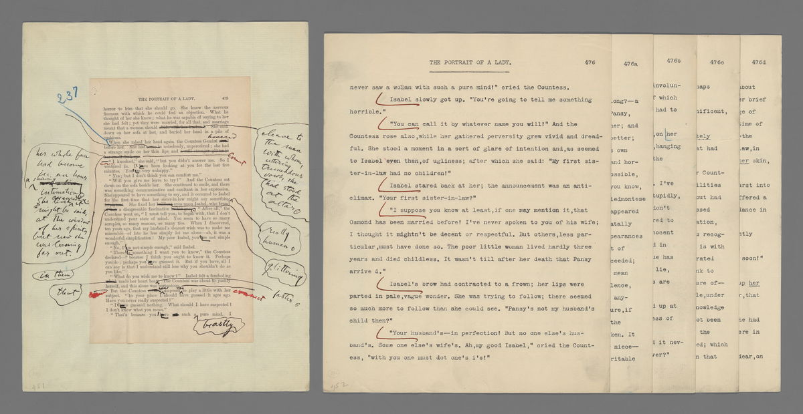
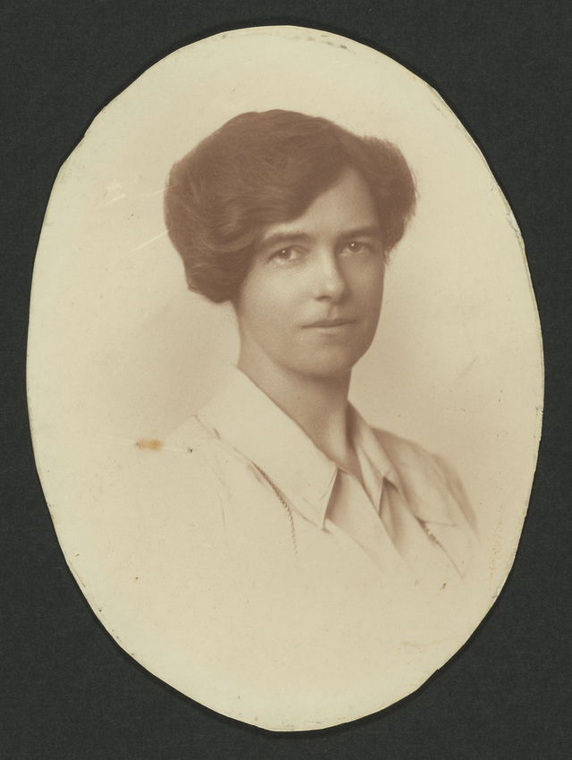
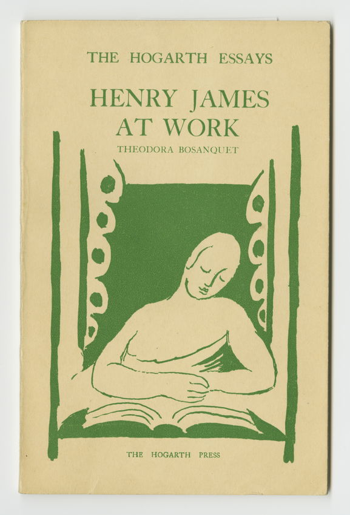
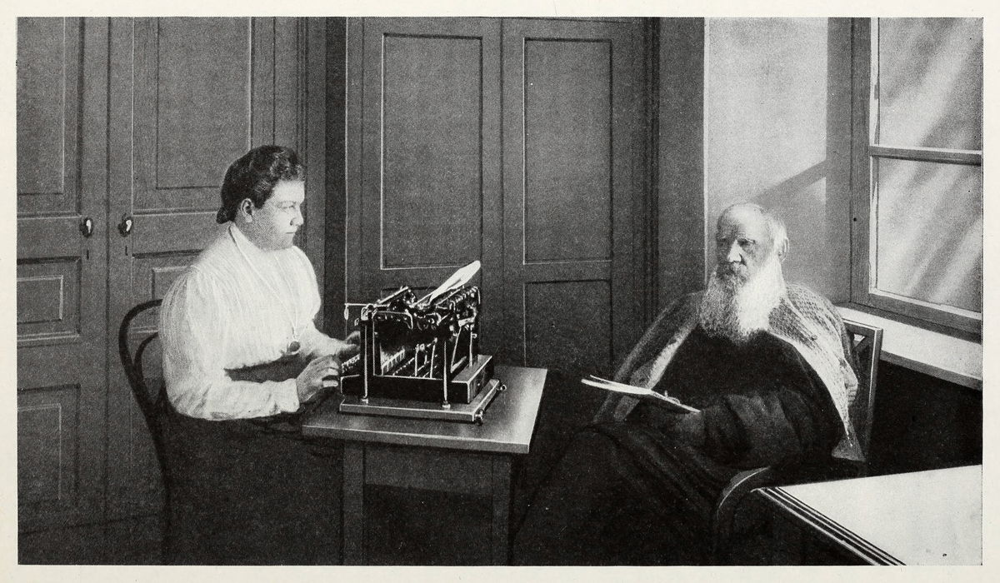

> # Typing for Love or Money: The Hidden Women's Labor behind Modern Literary Masterpieces
# お金のために、または愛のために打つ：近代文学の傑作を支えた女性たちの隠れた労働

> Taking dictation, revising manuscripts, typing copies, literary amanuenses often labour for little compensation and even less recognition. Christine Jacobson explores the neglected efforts of women like Theodora Bosanquet, Véra Nabokov, and Valerie Eliot, who — through their work as typists, editors, and champions — had a profound impact on modern literature.
口述を書き取り、原稿を修正し、清書を打ち込む文学的代書人たちは、しばしばわずかな報酬と、さらに少ない評価の中で働いていた。クリスティン・ジェイコブソンは、テオドラ・ボサンケ、ヴェーラ・ナボコフ、ヴァレリー・エリオットといった女性たちの見過ごされてきた努力を探る。彼女たちはタイピスト、編集者、擁護者としての仕事を通じて、近代文学に深い影響を与えた。

> Published
掲載日

> February 4, 2026
2026年2月4日

> 

> Scroll through the whole page to download all images before printing.

> Lillian Sholes demonstrating a prototype typewriter invented by her father, Christopher Latham Sholes, 1872 — [Source](https://archive.org/details/storyoftypewrite00unse/page/52/mode/2up).
クリストファー・レイサム・ショールズが発明したタイプライターの試作品を操作するリリアン・ショールズ、1872年 — [出典](https://archive.org/details/storyoftypewrite00unse/page/52/mode/2up)。

> When inventor Christopher Latham Sholes debuted the typewriter in 1872, he declined to pose with his machine for press photographs. Instead, the first images of his invention depict his daughter, Lillian, operating an early prototype of the Remington No. 1 in a velvet bodice and full-skirted dress, her right hand hovering over the keys while her left hand grasps the carriage release lever. For the photograph's nineteenth-century audience, the message would have likely been clear: this machine is so easy to operate, a woman can do it.
発明家クリストファー・レイサム・ショールズが1872年にタイプライターを発表したとき、彼はプレス写真で自身の機械とともに写ることを断った。代わりに、彼の発明の最初の写真には、娘のリリアンがベルベットのボディスとフルスカートのドレスを身にまとい、レミントン1号の初期試作品を操作する姿が映っている。右手がキーの上に浮かび、左手はキャリッジリリースレバーを握っている。19世紀の写真の観客にとって、そのメッセージはおそらく明確だっただろう：この機械は操作が簡単すぎて、女性でもできる、と。

> The typewriter, from its birth, has been tied to a set of assumptions about gender and skill. These assumptions persist to the present and color our cultural understanding of typists' labor. Take the pilot episode of _Mad Men_ for instance, in which office manager Joan Holloway shows new secretary Peggy Olson to her assigned typewriter and tells her not to be overwhelmed: "It looks complicated, but the men who designed it made it simple enough for a woman to use." And many women did: while they made up only four percent of clerical workers before 1880 (before the widespread adoption of the typewriter), women represented half by 1920, with the majority employed as stenographers or typists.[1](#fn1) Sholes was later celebrated for paving a path to the white-collar workforce for women and liberating them from meager economic opportunity. The frontispiece of _The Story of the Typewriter_, a 1923 account of the machine's invention, renders this idea in a literal fashion.
タイプライターは、その誕生から、ジェンダーとスキルに関する一連の思い込みと結びついてきた。これらの思い込みは現在まで続き、タイピストの労働に対する文化的理解を色づけている。例えばドラマ『マッドメン』のパイロット版では、オフィスマネージャーのジョーン・ホロウェイが新人秘書ペギー・オルソンに担当のタイプライターを案内し、圧倒されないよう告げる。「複雑に見えるけど、設計した男性たちが女性でも使えるくらい簡単にしてくれたわ。」実際に多くの女性がそうした：1880年以前（タイプライターが広く普及する前）は事務職員の4パーセントにすぎなかった女性が、1920年には半数を占め、その大多数は速記者やタイピストとして雇われていた[1](#fn1)。ショールズはその後、女性にホワイトカラー労働への道を切り開き、わずかな経済的機会からの解放をもたらしたと称えられた。1923年の機械発明の記録書『タイプライターの物語』の口絵は、この考えを文字通りの形で表現している。

> 

> Scroll through the whole page to download all images before printing.

> Cover of _The Story of the Typewriter, 1873–1923_, a book published by the Herkimer County Historical Society in celebration of the machine's fiftieth anniversary. Source: Houghton Library, Harvard University.
ハーキマー郡歴史協会がタイプライター誕生50周年を記念して出版した『タイプライターの物語、1873–1923年』の表紙。出典：ハーバード大学ホートン図書館。

> Scroll through the whole page to download all images before printing.

> Frontispiece from _The Story of the Typewriter, 1873–1923_ depicting Christopher Latham Sholes. The image is accompanied by a quotation from the typewriter's inventor: "I feel that I have done something for the women who have always had to work so hard. This will enable them more easily to earn a living" — [Source](https://archive.org/details/storyoftypewrite00unse/page/n5/mode/2up).
クリストファー・レイサム・ショールズを描いた『タイプライターの物語、1873–1923年』の口絵。画像には発明家の言葉が添えられている：「私はいつも懸命に働かなければならなかった女性たちのために何かをできたと感じている。これによって彼女たちがより容易に生計を立てられるようになるだろう」— [出典](https://archive.org/details/storyoftypewrite00unse/page/n5/mode/2up)。

> But contrary to assumptions, typists' labor required advanced technical skills. Most women in the workforce were trained at secretary or typing schools, a considerable investment of time and money. Office secretaries were also often required to move beyond the skills they were trained in — touch-typing, taking dictation — to other areas such as graphic design, research, and editing. Secretarial manuals from the first half of the twentieth century like John Gregg and Rupert SoRelle's widely used _Applied Secretarial Practice_ (1934) evince the immense range of duties demanded of the average secretary, with chapters covering the US tax code for handling payroll contrasting sharply with chapters on personal grooming and cultivating a cheerful telephone persona.[2](#fn2)
しかし、思い込みに反して、タイピストの労働には高度な技術スキルが必要だった。労働力に参加する女性のほとんどは秘書学校やタイピング学校で訓練を受けており、時間と金銭の相当な投資が必要だった。また、オフィスの秘書たちは、訓練を受けたスキル——タッチタイピングや口述の書き取り——を超えて、グラフィックデザイン、調査、編集などの分野へと仕事を広げることを求められることも多かった。20世紀前半の秘書マニュアル、例えばジョン・グレッグとルパート・ソレルの広く使われた『実用秘書実践』（1934年）は、平均的な秘書に求められる膨大な業務範囲を示しており、給与処理のための米国税法を扱う章と、身だしなみや電話での明るい対応を培う章が並んでいる[2](#fn2)。

> As typing became professionalized, opportunities for typists proliferated outside of the traditional office. Articles in _The Gregg Writer_, an early trade magazine for secretaries and stenographers, urged women to apply their skills in aiding "that romantic being, the author".[3](#fn3) In magazines like _The Author, Playwright and Composer_, women such as "Mrs. A. M. Gill" and "Miss M. Fuller" advertised their services for "typing, preparation of MSS \[manuscripts\] … indexing and proofing".[4](#fn4) For those interested, a position as an amanuensis — that is, one who copies or takes dictation of literary work — afforded more intellectually satisfying labor and a supporting role in producing literary culture.
タイピングが専門職化するにつれ、伝統的なオフィス以外でのタイピストの機会も増えていった。秘書や速記者向けの初期の業界誌『グレッグ・ライター』の記事は、女性たちに「あのロマンチックな存在、作家」を支援することにスキルを活かすよう促した[3](#fn3)。『作家・劇作家・作曲家』などの雑誌では、「A・M・ギル夫人」や「M・フラー嬢」といった女性たちが「タイピング、原稿（MSS）の準備……索引作成と校正」のサービスを広告していた[4](#fn4)。興味のある人にとって、代書人——つまり文学作品を書き写したり口述を記録したりする人——の地位は、より知的に充実した労働と、文学文化を生み出す補助的な役割を提供していた。

> Though their names and contributions are not often recognized, amanuenses had profound impacts on the careers and legacies of modern writers. Skilled typists could create manuscripts from dictation or clean up messy handwritten drafts, freeing authors to focus on the development of a work rather than its production. But like office secretaries, they did much more than just type. Amanuenses served as important first reаders, helpful editors, and champions of a writer's work. While some women took on this labor in exchange for a salary, many others offered their hard-won typing skills at no cost, but rather, in their capacity as wives, mothers, or daughters. These women did their typing work in the home, often while juggling domestic and childcare duties.
その名前と貢献はあまり認知されていないが、代書人たちは近代作家のキャリアと遺産に深い影響を与えた。熟練したタイピストは口述から原稿を作成したり、乱雑な手書き原稿を清書したりすることができ、作家たちが作品の製作ではなく発展に集中できるよう解放した。しかしオフィスの秘書と同様に、彼女たちは単にタイプするだけではなかった。代書人たちは重要な最初の読者、有能な編集者、そして作家の作品の擁護者として機能した。ある女性たちは報酬と引き換えにこの仕事を引き受けた一方、多くの女性たちは苦労して得たタイピングスキルを無償で提供した——妻、母、娘としての立場で。これらの女性たちは自宅でタイピング作業を行い、しばしば家事や育児を同時にこなしながら働いた。

> Scholars and biographers have been slow to examine how these collaborations functioned. This is not surprising: as secretarial work became feminized, "type labor" became undervalued and misunderstood. Popular portrayals of typists have contributed to the lack of understanding.[5](#fn5) Adding to these hurdles, typists' labor has not traditionally been credited in library catalogs or archives, making it more difficult for scholars to surface their contributions. But if one knows where to look, literary archives _do_ contain paper trails of amanuenses and can reveal the depth of their impact on writers' legacies.
研究者や伝記作家たちは、これらの協力関係がどのように機能したかを調べることに遅れをとってきた。これは驚くことではない：秘書の仕事が女性化するにつれ、「タイプ労働」は過小評価され、誤解されるようになった。タイピストの一般的な描写も理解の欠如に貢献してきた[5](#fn5)。これらの障壁に加えて、タイピストの労働は伝統的に図書館目録やアーカイブでクレジットされてこなかったため、研究者が彼女たちの貢献を発見することがより困難になっていた。しかし、どこを探せばよいかを知っていれば、文学アーカイブは確かに代書人の記録を含んでおり、作家の遺産への影響の深さを明らかにすることができる。

> In her memoir about her time working with Henry James, Theodora Bosanquet writes, "the business of acting as a medium between the spoken and the typewritten word was at first as alarming as it was fascinating."[6](#fn6) Alarming, she explains, because James kept a new and rather complicated Remington model typewriter at his home in Rye, East Sussex, which she quickly had to master. But accounts from diaries, letters, and other archival materials kept by Bosanquet and her predecessor Mary Weld suggest the work of taking dictation from "the master", as James was referred to in his time, could also make alarming demands.
ヘンリー・ジェイムズとの仕事について書いた回顧録の中で、テオドラ・ボサンケはこう書いている：「話し言葉とタイプされた言葉の間の媒体として機能することは、最初は魅力的であると同時に不安でもあった。」[6](#fn6) 不安だったのは、と彼女は説明する、ジェイムズがイースト・サセックスのライにある自宅に新しい複雑なレミントンモデルのタイプライターを置いており、それをすぐに習得しなければならなかったからだ。しかしボサンケと彼女の前任者メアリー・ウェルドが保管していた日記、手紙、その他のアーカイブ資料からの記録は、当時「マスター」と呼ばれていたジェイムズから口述を受ける仕事が、不安になるような要求をすることもあったことを示唆している。

> 

> Scroll through the whole page to download all images before printing.

> Mary Weld in the Watchbell Street Studio bookbindery, Rye, ca. 1901–1904. Source: MS Eng 1579 (36), Mary Kathleed Weld Kingdon Papers, Houghton Library, Harvard University.
ライのウォッチベル・ストリート・スタジオ製本工場でのメアリー・ウェルド、1901〜1904年頃。出典：MS Eng 1579 (36)、メアリー・キャスリード・ウェルド・キングドン文書、ハーバード大学ホートン図書館。

> In 1897, Henry James found himself in need of an amanuensis after he began to suffer from a debilitating rheumatism in his right wrist, telling a friend that "all writing is the crazy pain you see proof of. I shall soon take to dictating to a typist."[7](#fn7) He found Mary Weld by writing to a local secretarial college, and after settling on what she would wear — dark coat, skirt, sailor hat — the two settled down to work. Soon after Weld started, James wrote to his brother William, comparing her with a former male secretary: "MacAlpine's lady successor is an improvement on him! And an economy!"[8](#fn8) In other words, Weld was much better at her job than her predecessor but was likely paid less.
1897年、ヘンリー・ジェイムズは右手首に衰弱させるリウマチを患い始め、代書人が必要となった。友人に「書くことはすべて、見ての通り狂ったような痛みだ。タイピストに口述することにしようと思う」と告げた[7](#fn7)。彼は地元の秘書学校に手紙を書いてメアリー・ウェルドを見つけ、彼女の服装——ダークコート、スカート、セーラーハット——を決めた後、二人は仕事に取り掛かった。ウェルドが仕事を始めてすぐ、ジェイムズは兄ウィリアムへの手紙で彼女を以前の男性秘書と比較した：「マカルパインの女性後継者は彼より優れている！しかも経済的だ！」[8](#fn8) 言い換えれば、ウェルドは前任者よりもはるかに優れた仕事をしていたが、おそらく給与は低かった。

> The two worked each morning at James' home — writing time that Weld would later call the "sacred hours". Using the new Remington Standard 8, she typed _The Wings of the Dove_, _The Ambassadors_, and _The Golden Bowl_, noting in her calendar diaries the start and end dates of each. (_The Wings of the Dove_, for example, took 194 days to complete.)[9](#fn9) In a handwritten recollection titled "The Master, or a Glimpse of Henry James", Weld detailed the exactness required for her work, recalling that, for James, there was "not a word, not a comma, in his writing that has not its own just right place in the picture".[10](#fn10)
二人は毎朝ジェイムズの自宅で作業した——その執筆時間をウェルドは後に「神聖な時間」と呼んだ。新しいレミントン・スタンダード8を使って、彼女は『鳩の翼』、『大使たち』、『黄金の盃』をタイプし、それぞれの開始日と終了日を手帳の日記に記録した。（例えば『鳩の翼』は完成まで194日かかった。）[9](#fn9) 「マスター、あるいはヘンリー・ジェイムズの一瞥」と題された手書きの回想録の中で、ウェルドは自分の仕事に求められる正確さを詳述し、ジェイムズにとって「彼の文章には、その絵の中に正当な場所を持たない一語も、一つのコンマも存在しない」と回想した[10](#fn10)。

> That Weld understood and admired James' boundary-pushing syntax underscores how in sync she was with her employer as both amanuensis and reader. Significantly, the three novels she typed are the masterpieces of James' late period, exploring the minute workings of consciousness in dense, ornate prose that is famously difficult to read. James' biographer Leon Edel and others have argued that the changes in James' style during this period were, in part, a product of his shift to dictation. No longer confined by his rheumatic wrist, James could unspool his sentences to Weld with complete freedom. While he had always exhibited a fondness for long sentences with loose conjunctions, his style became even more baroque.[11](#fn11) One may argue that this change would have happened with or without Weld, but he is fortunate to have found someone who understood his aims so entirely. When _The Wings of the Dove_ was published, James inscribed a copy to Weld: "To Miss Weld, her collaborator, Henry James".[12](#fn12)
ウェルドがジェイムズの境界を押し広げる構文を理解し称賛していたことは、彼女が代書人であり読者として、雇用主といかに息を合わせていたかを示している。重要なことに、彼女がタイプした三つの小説はジェイムズの後期の傑作であり、意識の細微な働きを、難解で知られる密度の高い華麗な散文で探求している。ジェイムズの伝記作家レオン・エデルらは、この時期のジェイムズのスタイルの変化は、部分的には口述への移行の産物だったと論じている。リウマチの手首に縛られることなく、ジェイムズは完全な自由でウェルドに文章を紡ぎ出すことができた。彼は常にゆるい接続詞を持つ長い文章を好んでいたが、スタイルはさらにバロック的になった[11](#fn11)。この変化はウェルドの有無にかかわらず起きていたと言う人もいるかもしれないが、彼は自分の目的を完全に理解してくれる人を見つけた幸運者だった。『鳩の翼』が出版されると、ジェイムズはウェルドへの一冊にこう記した：「ウェルド嬢へ、彼女の共作者、ヘンリー・ジェイムズ」[12](#fn12)。

> James seemed to perfect this manner of writing with his final amanuensis, the "slim, boyish" Theodora Bosanquet, whom he hired after Weld left her employment to start a family.[13](#fn13) Bored with indexing a report on coastal erosion, Bosanquet jumped at the opportunity to take diction from James, whose work she admired, even if it required moving from London to remote East Sussex. Bosanquet typed what became known as the New York Edition of his works, an ambitious project James undertook to revise his early novels and stories and translate their simpler prose into his later, more convoluted style. To create these new versions, James started from the proofs of the first editions, scribbling minor corrections in the margins. Pages that needed more extensive revisions (mostly additions) were dictated to Bosanquet, who would number each additional page with a letter (i.e., 8a, 8b, 8c). The revised manuscript for _The Portrait of a Lady_ held at Houghton Library shows how dramatically a novel could be expanded through dictation; a single scene could be lengthened so much that Bosanquet's labeling system sometimes reached the middle of the alphabet.[14](#fn14)
ジェイムズはこの書き方を、最後の代書人である「細身で少年ぽい」テオドラ・ボサンケとともに完成させたようだ。彼女はウェルドが家族を持つために職を離れた後に雇われた[13](#fn13)。海岸侵食に関する報告書の索引作成に飽き飽きしていたボサンケは、ロンドンから遠隔のイースト・サセックスへの移住が必要だとしても、自分が尊敬するジェイムズから口述を受ける機会に飛びついた。ボサンケがタイプしたのは、後にニューヨーク版として知られることになる作品群だ。これはジェイムズが自身の初期の小説と短編を改訂し、よりシンプルな文章を後期のより複雑なスタイルに翻訳するという野心的なプロジェクトだった。これらの新しいバージョンを作るために、ジェイムズは初版のゲラから始め、余白に軽微な修正を書き込んだ。より大幅な改訂（主に追加）が必要なページはボサンケに口述され、彼女は各追加ページに文字で番号を付けた（例：8a、8b、8c）。ホートン図書館に所蔵されている『ある婦人の肖像』の改訂原稿は、口述によって小説がいかに劇的に拡張できるかを示している。一つの場面が大幅に引き延ばされることがあり、ボサンケのラベリングシステムがアルファベットの中ほどまで達することもあった[14](#fn14)。

> 

> Scroll through the whole page to download all images before printing.

> Manuscript of Henry James' _Portrait of a Lady_ annotated by Theodora Bosanquet, ca. 1906. Source: MS Am 1237.17, Henry James Papers, Houghton Library, Harvard University.
テオドラ・ボサンケによって注釈されたヘンリー・ジェイムズの『ある婦人の肖像』原稿、1906年頃。出典：MS Am 1237.17、ヘンリー・ジェイムズ文書、ハーバード大学ホートン図書館。

> 

> Scroll through the whole page to download all images before printing.

> Portrait of Theodora Bosanquet. MS Eng 1213.8. Theodora Bosanquet Papers, Houghton Library, Harvard University — [Source](https://iiif.lib.harvard.edu/manifests/view/ids:17925162$1i).
テオドラ・ボサンケの肖像。MS Eng 1213.8。テオドラ・ボサンケ文書、ハーバード大学ホートン図書館 — [出典](https://iiif.lib.harvard.edu/manifests/view/ids:17925162$1i)。

> Scroll through the whole page to download all images before printing.

> Cover of Theodora Bosanquet. Henry James at Work (The Hogarth Press, 1924). Source: Houghton Library, Harvard University.
テオドラ・ボサンケ著『ヘンリー・ジェイムズの仕事場で』（ホガース・プレス、1924年）の表紙。出典：ハーバード大学ホートン図書館。

> In 1924, Virginia and Leonard Woolf solicited and published a small print run of Bosanquet's memoir, _Henry James at Work_, in which Bosanquet recounts the writer telling her "I know I'm too diffuse when I'm dictating", adding, "It all seems to be so much more effectively and unceasingly pulled out of me in speech than in writing."[15](#fn15) Bosanquet and her machine were essential to the process. James nicknamed her his "Remington priestess" and when the priestess' machine broke down and was temporarily replaced with a newer, silent model, James found it nearly impossible to continue working.
1924年、バージニアとレナード・ウルフはボサンケの回顧録『ヘンリー・ジェイムズの仕事場で』の少部数の出版を依頼し刊行した。その中でボサンケは、作家が彼女に「口述するとき私は拡散しすぎることを知っている」と告げ、さらに「書くよりも話すほうが、すべてがより効果的に、絶え間なく私から引き出されるようだ」と続けたと回想している[15](#fn15)。ボサンケと彼女の機械はそのプロセスに不可欠だった。ジェイムズは彼女に「レミントンの女祭司」というあだ名をつけ、女祭司の機械が故障して一時的により新しい静かなモデルに替えられたとき、ジェイムズは仕事を続けることがほぼ不可能だと感じた。

> James and Bosanquet became deeply attached, working closely together until the end of his life. Bosanquet even took dictation while James was on his deathbed, and, curiously, after his death too. Scholar Pamela Thurschwell has surfaced notes from seances and automatic writings (written words produced by someone in a trance-like state) that Bosanquet made throughout the 1930s, now held in the Society for Psychical Research archive at Cambridge University Library.[16](#fn16) Among them, Thurschwell found requests from the ghost of Henry James to resume their dictation sessions in hopes of producing the first literary work from the spiritual realm, "to add to the evidence you have of our world". The archives suggest that she sat down for chats with James three to four times a day. While the automatic writings are illegible, Bosanquet, ever the good typist, kept typed transcriptions of everything.
ジェイムズとボサンケは深く結びつき、ジェイムズの人生の最後まで密接に協力した。ボサンケはジェイムズが臨終の床にあるときでも口述を受け、そして不思議なことに、彼の死後も続けた。学者のパメラ・サースクウェルは、ボサンケが1930年代を通じて行った降霊術や自動書記（トランス状態の人が書く文字）のノートを発見した。それらは現在ケンブリッジ大学図書館の心霊研究協会アーカイブに所蔵されている[16](#fn16)。その中でサースクウェルは、霊界から最初の文学作品を生み出すことを願って口述セッションを再開するよう求めるヘンリー・ジェイムズの幽霊からのリクエストを発見した。「あなたが私たちの世界について持っている証拠に加えるために」。アーカイブは彼女が一日に三〜四回ジェイムズとおしゃべりのために座ったことを示唆している。自動書記は判読不能だが、常に優秀なタイピストだったボサンケは、すべてのタイプ打ちの転写を保管していた。

> \*\*\*

> Neither Weld nor Bosanquet recorded what they were paid by James, though we can deduce from James' letter to his brother that he paid them less than men he had employed. But Weld and Bosanquet describe their dictation sessions as enthralling, enjoyable work, and taking place mainly in the morning, with their afternoons free to pursue other interests. In Weld's case, James paid for her to be trained in the art of bookbinding, while Bosanquet worked on her own writing. Noticing Weld's fondness for flowers, James took care to gather fresh bouquets from his garden to adorn her desk. In other words, he appears to have been a decent employer. It is harder to pin down the working conditions and remuneration for wives who typed their husbands' work.
ウェルドもボサンケも、ジェイムズから支払われた報酬を記録していないが、ジェイムズが兄に送った手紙から、彼が雇っていた男性よりも少ない賃金を彼女たちに支払っていたことがわかる。しかしウェルドとボサンケは、自分たちの口述セッションを魅惑的で楽しい仕事として描写しており、主に午前中に行われ、午後は他の興味を追求するために自由だったと述べている。ウェルドの場合、ジェイムズは製本技術の訓練を受けさせるための費用を支払い、一方ボサンケは自分自身の執筆に取り組んだ。ウェルドの花への愛好を見て取ったジェイムズは、彼女の机を飾るために庭から新鮮な花束を集めることを怠らなかった。言い換えれば、彼はまともな雇用主だったようだ。夫の仕事のために打ち込んだ妻たちの労働条件や報酬を明確にするのは、より難しい。

> Vladimir Nabokov — the novelist, poet, translator, entomologist, lepidopterist, and chess master, fluent in English, French, and Russian — never learned to do two things: drive or type. These duties were handled by his wife Véra. Described by Nabokov as his "first and best reader", Véra took on the work of typing his manuscripts from the start of their marriage in 1920s Berlin. "She presided as adviser and judge over the making of my first fiction", Nabokov told an interviewer, indicating that her role was more significant than simply making clean copies.[17](#fn17) Véra often demurred when asked to elaborate on her contributions, admitting only to correcting his spelling and usage of idioms. But Stacy Schiff and other biographers have noted her role in saving the manuscript of _Lolita_ from destruction on more than one occasion, reasserting Véra's important role as arbiter and champion of Nabokov's work.
ウラジーミル・ナボコフ——小説家、詩人、翻訳家、昆虫学者、鱗翅目研究者、チェスの達人であり、英語、フランス語、ロシア語に堪能——は、二つのことを学ばなかった：運転とタイピングだ。これらの仕事は妻のヴェーラが担った。ナボコフが「最初かつ最良の読者」と呼んだヴェーラは、1920年代のベルリンでの結婚当初から彼の原稿をタイプする仕事を引き受けた。「彼女は私の最初の小説の制作において、顧問と審査官として采配を振るった」とナボコフはインタビュアーに語り、彼女の役割が単に清書をすることよりもはるかに重要だったことを示唆している[17](#fn17)。ヴェーラは貢献を詳しく説明するよう求められるとしばしば渋り、スペルと慣用句の使用法を修正するだけだと認めた。しかし、ステイシー・シフなどの伝記作家たちは、一度ならず『ロリータ』の原稿を破棄から救った彼女の役割を指摘し、ナボコフの作品の裁定者と擁護者としてのヴェーラの重要な役割を再確認した。

> Throughout the 1930s, Véra supported the couple as the sole breadwinner by working in an office as a stenographer. At home, she typed for Nabokov late into the night, effectively consigned to the typewriter for much of her waking hours. She continued typing for him after the birth of their son Dmitri in 1936, juggling feedings with taking dictation for _Invitation to a Beheading_. Seemingly the only time she slowed down was after a bout of pneumonia in 1942 during which, as Nabokov wrote apologetically to his publisher, she "still could not manage more than five pages a day."[18](#fn18)
1930年代を通じて、ヴェーラは速記者としてオフィスで働き、夫婦の唯一の稼ぎ手として家族を支えた。自宅では夜遅くまでナボコフのためにタイプし、起きている時間の大半をタイプライターに費やした。1936年に息子のドミトリが生まれた後も彼のためにタイプを続け、授乳しながら『招待』の口述を書き取った。彼女がペースを落としたのは、1942年の肺炎の発症後だけだったようで、ナボコフが出版社に謝罪して書いたように、彼女は「まだ一日5ページ以上はこなせなかった」[18](#fn18)。

> 

> Scroll through the whole page to download all images before printing.

> Vera and Vladimir Nabokov at their living room table, photographed by Carl Mydans, 1958. Source: Carl Mydans/Time & Life Pictures (not public domain).
リビングルームのテーブルでのヴェーラとウラジーミル・ナボコフ、カール・マイダンズによる撮影、1958年。出典：カール・マイダンズ／タイム・ライフ・ピクチャーズ（パブリックドメインではない）。

> A photograph from 1958 taken by Carl Mydans illuminates the workflow the couple eventually honed. The two sit together at a small table; Nabokov holds an index card aloft a stack of more index cards housed in a small box and Vera sits at a typewriter. The writer drafted scenes, details, and plot points on cards which he could reshuffle endlessly until he was satisfied with a novel's progression. Depending on how fleshed out they were, Nabokov would either use them to dictate to Véra or hand them over to her for typing in triplicate (always in triplicate).
カール・マイダンズが撮影した1958年の写真は、夫婦が磨き上げた作業手順を明らかにしている。二人は小さなテーブルの前に座っており、ナボコフは小箱に収められた多数のインデックスカードの上に一枚を掲げ、ヴェーラはタイプライターの前に座っている。作家はカードにシーン、詳細、プロット上の出来事を下書きし、小説の進行に満足するまで何度でも並べ替えることができた。どの程度詳細に書かれているかに応じて、ナボコフはそれをヴェーラへの口述に使うか、三通タイプするために（常に三通）彼女に渡した。

> Véra also handled her husband's correspondence, negotiated his publishing contracts, submitted his short stories to magazines, and even filled out and submitted his Guggenheim Fellowship application. Though discreet, she left a paper trail by identifying herself as the correspondent or disclosing that the missive came "on behalf of Vladimir Nabokov". The most obvious tell of whether something was prepared by Mr. or Mrs. Nabokov is the quality of the typing. Nabokov hardly typed, and when he did, did it badly.
ヴェーラはまた、夫の書簡の処理、出版契約の交渉、雑誌への短編の投稿、さらにはグッゲンハイム・フェローシップの申請書の記入と提出までも行った。控えめではあったが、彼女は自分を書簡の送り主として名乗るか、または「ウラジーミル・ナボコフの代理として」送られた旨を明らかにすることで記録を残した。ナボコフ氏かナボコフ夫人かのどちらが準備したかを示す最も明白な手掛かりは、タイピングの質だ。ナボコフはほとんどタイプせず、たまにタイプすると下手だった。

> The Nabokov family papers at Houghton Library illuminate other important aspects of Véra's contributions. During academic appointments at Cornell and Wellesley, Vladimir had Véra prepare notes for his lectures and asked her to deliver them when he was ill. Typed lecture notes on the novel _Doctor Zhivago_ from this period survive and include a rare mark of authorship at the top: "For VN by VE' N". A birthday card drawn by Vladimir for their son Dmitri cheekily references her status as the family's chauffeur: she drives down a highway dotted with billboards advertising Vladimir's novels while he catches butterflies from the passenger seat.
ホートン図書館のナボコフ家文書は、ヴェーラの貢献の他の重要な側面を明らかにしている。コーネル大学とウェルズリー大学での学術職の間、ウラジーミルはヴェーラに講義のノートを準備させ、自分が病気のときには代わりに担当するよう頼んだ。この時期の小説『ドクター・ジバゴ』に関するタイプ打ちの講義ノートが現存し、その上部には珍しい著作表記がある：「VN（ウラジーミル・ナボコフ）のために VE'N（ヴェーラ・ナボコフ）が作成」。ウラジーミルが息子ドミトリへの誕生日カードに描いた絵は、家族の運転手としての彼女の地位をユーモラスに示している：彼女がウラジーミルの小説の広告が立ち並ぶハイウェイを運転する一方、彼は助手席から蝶を捕まえている。

> 

> Scroll through the whole page to download all images before printing.

> Vladimir Nabokov's "Happy Birthday" pencil sketch, ca. 1960–77. Source: MS Russ 140. Nabokov Family Papers, Houghton Library, Harvard University (not public domain).
ウラジーミル・ナボコフの「お誕生日おめでとう」鉛筆スケッチ、1960〜77年頃。出典：MS Russ 140。ナボコフ家文書、ハーバード大学ホートン図書館（パブリックドメインではない）。

> As far as the archival records show, Véra took great pleasure in performing these duties, and the Nabokovs' marriage was a happy one. Unhappy marriages, however, can also be productive literary partnerships. T. S. Eliot once said that his troubled marriage to first wife Vivienne Haigh-Wood brought about "the state of mind out of which came _The Waste Land_".[19](#fn19) But Vivienne played other roles in the poem's composition. "I have done a rough draft of part III", Eliot wrote in a letter, "but I do not know whether it will do, and must wait for Vivienne's opinion as to whether it is printable."[20](#fn20) Like Véra Nabokov, Vivienne was an essential first reader for her husband. An important early draft of _The Waste Land_ is covered in notes by Ezra Pound which, thanks to his own notoriety and role in helping the poem find a publisher, have been the subject of much scholarship. However, Vivienne also left significant notes on the poem. Scholar Arwa Al-Mubaddel argues that Vivienne's impact is most substantial in the second section, originally titled "In the Cage", and Vivienne supplied the title of the final section, "A Game of Chess", which includes a dialogue between a man and woman who resemble the couple.
アーカイブの記録が示す限り、ヴェーラはこれらの職務を遂行することに大きな喜びを感じており、ナボコフ夫妻の結婚は幸福なものだった。しかし不幸な結婚も、実り多い文学的パートナーシップになり得る。T・S・エリオットはかつて、最初の妻ヴィヴィアン・ヘイウッドとの困難な結婚が「『荒地』を生み出した心境」をもたらしたと語った[19](#fn19)。しかしヴィヴィアンは詩の創作に他の役割も果たした。「第III部の草稿を書いた」とエリオットは手紙に書き、「しかし十分かどうかわからず、出版に値するかどうかヴィヴィアンの意見を待たなければならない」と続けた[20](#fn20)。ヴェーラ・ナボコフと同様に、ヴィヴィアンは夫にとって不可欠な最初の読者だった。『荒地』の重要な初期草稿はエズラ・パウンドの注釈で覆われており、彼自身の名声と詩を出版社に紹介した役割のおかげで、多くの研究の対象となってきた。しかしヴィヴィアンもまた詩に重要な注釈を残している。学者のアルワ・アル＝ムバッデルは、ヴィヴィアンの影響が最も大きいのは「檻の中で」と当初題されていた第二部であり、ヴィヴィアンは夫婦に似た男女の対話を含む最終部「チェス・ゲーム」というタイトルを提供したと主張している。

> Many of Vivienne's changes make the dialogue sharper and more conversational, such as revising "it's the medicine I took in order to bring it off" to "it's the _pills_ I took to bring it off". Vivienne wrote new lines, including the pointed "What you get married for if you don't want to have children." All her additions and changes appear in later typescript drafts and in the published version of the poem. Both husband and wife were skilled typists, so it is not known for certain who may have typed copies of _The Waste Land_ for publication, but on the copy Vivienne marked up, she wrote, "Make any of these alterations – or none if you prefer. Send me back this copy and let me have it".[21](#fn21) It seems likely Vivienne was offering to type a clean draft with the accepted changes. Whether she acted as a typist for Eliot or not, Vivienne played a key role in the poem's production. Yet despite the fruit their tumultuous partnership yielded, it was not enough to save the marriage. The couple separated in 1933 and after years of struggles with mental health, Vivienne was committed by her brother to the Northumberland House Insane Asylum where she remained until her death.[22](#fn22)
ヴィヴィアンの変更の多くは対話をより鋭く、より会話的にした。例えば「それを成し遂げるために飲んだ薬だ」を「それを成し遂げるために飲んだ_錠剤_だ」に修正するなどだ。ヴィヴィアンは新しい行も書き加えた。「子供が欲しくないなら、なぜ結婚するの」という鋭い一行もその一つだ。彼女のすべての追加と変更は、後のタイプ原稿の草稿と詩の出版版に現れている。夫婦ともに熟練したタイピストだったため、出版のために『荒地』のコピーをタイプしたのが誰かは確実にはわかっていない。しかしヴィヴィアンが書き込みをしたコピーには、「これらの変更のいくつかを加えてください——あるいは望むなら何も加えなくてよい。このコピーを送り返して、私に持っていてほしい」と書いた[21](#fn21)。ヴィヴィアンは採用された変更を加えた清書版をタイプすることを申し出ていたようだ。彼女がエリオットのタイピストとして機能したかどうかにかかわらず、ヴィヴィアンは詩の制作において重要な役割を果たした。しかし彼女たちの波乱に富んだパートナーシップが生み出した実りにもかかわらず、それは結婚を救うには十分ではなかった。夫婦は1933年に別居し、精神的な健康との長年の闘いの末、ヴィヴィアンは兄によってノーサンバーランド・ハウス精神病院に収容され、そこで死を迎えた[22](#fn22)。

> 

> Scroll through the whole page to download all images before printing.

> Vivienne Eliot posing with her typewriter at 9 Clarence Gate Gardens, ca. 1921–22. MS Am 2560, Henry Ware Eliot T. S. Eliot collection, Houghton Library, Harvard University — [Source](https://iiif.lib.harvard.edu/manifests/view/ids:46911110$1i).
クラレンス・ゲート・ガーデンズ9番地でタイプライターとともに写るヴィヴィアン・エリオット、1921〜22年頃。MS Am 2560、ヘンリー・ウェア・エリオット T・S・エリオット・コレクション、ハーバード大学ホートン図書館 — [出典](https://iiif.lib.harvard.edu/manifests/view/ids:46911110$1i)。

> Eliot's second wife Valerie was forty years his junior and his secretary at Faber and Faber; the poet proposed to her at the office by slipping a handwritten note among the other letters he wanted her to type for the day. British newspapers printed announcements about their marriage with jocose allusions to their age difference and their workplace romance. "Here we go again", Valerie wrote at the top of one clipping which heralded her as "good news for secretaries everywhere in love with the boss".[23](#fn23)
エリオットの二番目の妻ヴァレリーは彼より40歳年下で、フェイバー・アンド・フェイバーの秘書だった。詩人はその日タイプしてほしい他の手紙の中に手書きのメモを忍ばせてプロポーズした。イギリスの新聞は二人の結婚の発表を掲載し、年齢差と職場のロマンスについて冗談めかして言及した。「また始まった」とヴァレリーはあるクリッピングの上に書いた。そのクリッピングは彼女を「上司に恋した世界中の秘書にとっての朗報」と称えるものだった[23](#fn23)。

> Valerie's papers in the T. S. Eliot collection at Harvard reveal a woman content in her hybrid role of secretary-wife; many letters to friends detail a happy marriage in which she continued doing his typing after giving up her job at Faber and Faber. In addition to handling much of his correspondence, her private letters reveal she helped him with his last play, _The Elder Statesman_, while managing the emotional highs and lows Eliot experienced over the play's successes and setbacks. "I seem to be perpetually on the go. . . typing and retyping THE ELDER STATESMAN, attending all the rehearsals, and trying to prevent Tom from getting over-strained from alternate exultation and depression."[24](#fn24) After Eliot's death, Valerie mounted an ambitious campaign to compile and edit his complete letters, which has yielded ten volumes to date. Valerie was also the first to bring greater attention to Vivienne's editorial work on _The Waste Land_; in 1971, she published a facsimile of the typescript with Vivienne and Pound's notes, which she had printed in two different colors so they could be distinguished from each other.
ハーバード大学のT・S・エリオット・コレクションにあるヴァレリーの文書は、秘書と妻の複合的な役割に満足していた女性を明らかにしている。多くの友人への手紙は、フェイバー・アンド・フェイバーの職を辞した後も彼のタイピングを続けた幸福な結婚を詳述している。多くの書簡の処理に加えて、彼女の私的な手紙は、エリオットが劇の成功と挫折で経験した感情の高低を管理しながら、最後の戯曲『長老政治家』の制作を手伝ったことを明かしている。「私は絶え間なく動き回っているように見える……『長老政治家』をタイプし、またタイプし直し、すべてのリハーサルに参加し、トムが歓喜と落胆の交替で過度の緊張を感じないようにしようとしている」[24](#fn24)。エリオットの死後、ヴァレリーは彼の書簡全集を編集する野心的な取り組みを開始し、現在までに10巻が刊行されている。ヴァレリーはまた、『荒地』に対するヴィヴィアンの編集作業に初めてより大きな注目を集めた人物でもある。1971年に彼女はヴィヴィアンとパウンドの注釈付きタイプ原稿のファクシミリを出版した。二人の注釈を区別できるよう、二種類の色で印刷した。

> 

> Scroll through the whole page to download all images before printing.

> "Count Tolstoi giving direct dictation to his daughter on the typewriter", photograph from _The Story of the Typewriter, 1873-1923_ — [Source](https://archive.org/details/storyoftypewrite00unse/page/95/mode/1up).
「トルストイ伯爵が娘にタイプライターで直接口述している」、『タイプライターの物語、1873-1923年』からの写真 — [出典](https://archive.org/details/storyoftypewrite00unse/page/95/mode/1up)。

> The typewriter era — from its popular uptake in the 1880s to the rise of personal computing in the late 1900s — paralleled a remarkable period of literary development, spanning realism, the rise of modernism, postmodernism, and on. But amanuenses performed their labors long before the machine became the dictationist's tool of choice. Consider a circa 1909 photograph of Alexandra Tolstoy at a typewriter taking dictation from her father, the Russian novelist Lev Tolstoy. This image (a version of which later ran as an ad for [Remington](https://www.bridgemanimages.com/en/noartistknown/leo-tolstoy-his-wife-and-daughter-alexander-in-front-of-the-typewriter-represented-in-an/etching/asset/5459584)) acknowledges Alexandra's role in Tolstoy's work but elides another important amanuensis in the family. Tolstoy's wife, Sophia, is believed to have hand-copied the manuscript for _War and Peace_ seven times from beginning to end, often working at night by candlelight after her children had gone to bed, using an inkwell pen and sometimes requiring a magnifying glass to read her husband's notes.[25](#fn25) The typewriter was patented the year after the novel's publication.
タイプライターの時代——1880年代の普及から1900年代後半のパーソナルコンピュータの台頭まで——は、リアリズム、モダニズムの台頭、ポストモダニズムとその後を含む、文学の発展の目覚ましい時期と並行していた。しかし代書人たちは、その機械が口述者の選ぶ道具となるよりずっと以前から労働を行っていた。ロシアの小説家レフ・トルストイから口述を受けるタイプライターの前に座る娘アレクサンドラ・トルストイの1909年頃の写真を考えてほしい。この画像（後に[レミントン](https://www.bridgemanimages.com/en/noartistknown/leo-tolstoy-his-wife-and-daughter-alexander-in-front-of-the-typewriter-represented-in-an/etching/asset/5459584)の広告として使用されたバージョン）は、トルストイの作品におけるアレクサンドラの役割を認めているが、家族のもう一人の重要な代書人を省略している。トルストイの妻ソフィアは、子供たちが寝た後、夜にろうそくの光の下で作業し、夫のノートを読むのに虫眼鏡を必要とすることもあり、墨壺のペンを使って『戦争と平和』の原稿を最初から最後まで七回手で写したと信じられている[25](#fn25)。タイプライターが特許を取得したのは、その小説の出版の翌年だった。

> This mother and daughter pair underscore the relatively short period in which amanuenses used typewriters to do their work. Bookended by centuries of copying by hand, on one end, and desktop computing, on the other, amanuenses who typed represent roughly a century of literary labor. Their efforts deserve to be better understood. Notes, letters, diaries, and manuscripts show these women's impact extended far beyond the act of simple recording; their labor liberated authors (men and women alike) from drudgery, produced legible texts quickly that could be read by publishers and printers, required great mental agility and literary fluency, and often entailed crucial secondary roles as reader, editor, responder, and secretary. As more is learned about the works of other literary typists, the list of their contributions is sure to grow.
この母と娘のペアは、代書人たちがタイプライターを使って仕事をした比較的短い期間を浮かび上がらせる。一方には何世紀にもわたる手書きの写し、他方にはデスクトップコンピュータを両端として、タイプした代書人たちは約一世紀の文学的労働を代表している。彼女たちの努力はより深く理解されるべきだ。メモ、手紙、日記、原稿は、これらの女性の影響が単純な記録という行為をはるかに超えていたことを示している。彼女たちの労働は作家（男女を問わず）を単調な仕事から解放し、出版社や印刷業者が読める判読可能なテキストを素早く作成し、高度な精神的機敏さと文学的流暢さを必要とし、しばしば読者、編集者、応答者、秘書として重要な二次的役割を担った。他の文学タイピストの仕事についてより多くが明らかになるにつれ、彼女たちの貢献のリストは確実に増えていくだろう。

> The text of this essay is published under a [CC BY-SA](https://creativecommons.org/licenses/by-sa/4.0/) license, see [here](https://publicdomainreview.org/legal#reusing-our-articles) for details.
本エッセイのテキストは[CC BY-SA](https://creativecommons.org/licenses/by-sa/4.0/)ライセンスの下で公開されています。詳細は[こちら](https://publicdomainreview.org/legal#reusing-our-articles)をご覧ください。
