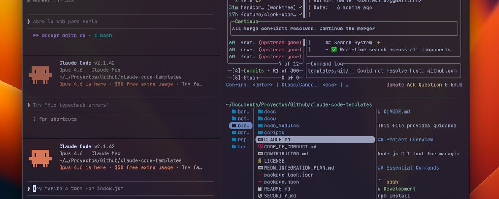

# My Ghostty setup for Claude Code with SAND Keybindings

First... Why I Switched to Ghostty

After months using Claude Code daily I realized I was barely using VSCode or Cursor, just the terminal and git panel, everything else Claude Code handled.

The problem is VSCode’s terminal is fragile, long Claude Code sessions crash it, even on an M4. It’s not hardware, it’s a terminal not built for AI-scale output... I needed a real terminal

Ghostty came up, community matters and it’s built by @mitchellh, co-founder of HashiCorp, someone with a serious track record. Ghostty felt future-proof.

This is the first of three articles about my workflow with Ghostty and Claude Code I start with my "SAND" keybindings that make panel management second nature

My Ghostty setup for Claude Code with SAND Keybindings

Monitoring Claude Code changes with Lazygit

Parallel agents with Git worktrees and Claude Code

Getting Started with Ghostty

Download Ghostty from ghostty.org (macOS and Linux). Once installed, you need a configuration file at ~/.config/ghostty/config.

The easiest way to set it up? Open Claude Code and tell it:

Configure Ghostty with this config: https://gist.github.com/davila7/5b07f55a6e65a06c121da9702d10c2e2

Claude will read the gist, create the config file, and you're done. If you prefer to do it manually:

How I Manage Panels in Ghostty

Using Ghostty with Claude Code works best with split panels you might have Claude on one side, git changes on another, maybe a file browser on a third If you can’t split, navigate, and close panels without thinking you end up fumbling with shortcuts instead of coding.

I kept forgetting Ghostty’s keybindings so I organized them into a mnemonic SAND Four letters, four actions every panel operation falls into one of these categories

S - Split: Create new panels

Split your terminal into multiple panels.

Cmd+D splits right (vertical)

Cmd+Shift+D splits down (horizontal)

A - Across: Move between tabs

Navigate across tabs.

Cmd+T opens a new tab

Cmd+Shift+Left/Right moves between them

N - Navigate: Jump between split panels

Move focus between your splits.

Cmd+Alt+Arrows jumps in any direction

Cmd+Shift+E equalizes all splits

Cmd+Shift+F zooms into one panel (press again to restore)

D - Destroy: Close panels and tabs

Close what you don't need. Cmd+W closes the current panel or tab.

My Workflow Layout

This is what my daily setup looks like, and it scales from 1 to 3 Claude Code instances running in parallel... remember use SAND!

Start simple: one Claude Code panel on the left, S (Cmd+D) to split right, and run lazygit there to monitor every commit and diff Claude makes in real time.

Then S again (Cmd+Shift+D) to split the right panel down and open yazi as a file browser:

But when you're working on multiple tasks, you can split the left side into 2 or 3 Claude Code instances, each running on a different Git worktree:

If some Claude Code panels get too big because you need more context you can press Cmd+Shift+E to equalize all windows and bring them back to a balanced layout

That’s the power of combining Ghostty with worktrees you go from a single agent to a multi-agent setup without leaving your terminal

Tip:

stick a post-it with the letters SAND somewhere you can see it every time you see it, practice the commands after a week you’ll have Ghostty fully under control from the keyboard

Next Articles

This was the first article ehe next two will show how I work with Ghostty and Claude Code

One article will cover Lazygit, watch Claude Code’s commits, diffs, and branch changes in real time

The other will cover git worktrees and parallel agents, run multiple Claude Code instances on different tasks and use yazi to browse project files

Follow me to catch the next articles! 👇
