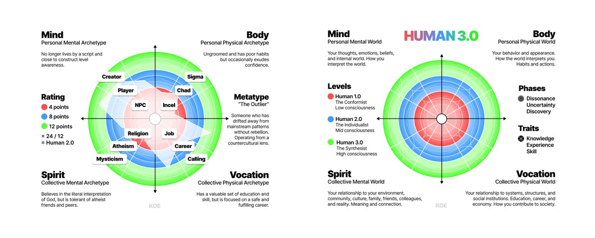

# Human 3.0 – A Map To Reach The Top 1%

As corny as this may sound, I've always wanted to become an absolute unit of an individual.

Not just having a nice and muscular body, but to be fully developed in every domain of life.

I wanted to become multidimensionally jacked. I wanted to max out all of my stats. I didn't want to be an NPC. I wanted to be a level 100 player. All areas of the map unlocked. Maxed out physicality, intellect, and professions. Bank overflowing with gold. I wanted to do it all. Mind, body, spirit, relationships, money.

This desire has drastically influenced my life.

As a teenager, I became obsessed with fitness. Then, I wanted to absorb as much knowledge as possible. Then I wanted to be free, so I failed at various business models until I finally made one work. I've had various spiritual and philosophical stints that I believe have helped me see “superficial pursuits” like money and fitness in a completely different light than the average person.

Over the past 15 years, I've researched the depths of psychology, personal development, philosophy, social dynamics, technology, the internet, startups, money, religion, and meaning.

After writing about my findings online for the past 6 years, I've noticed critical overlapping patterns that have begun to form a new philosophy for today's world. My personal philosophy, that is, but some may resonate with it.

That's where HUMAN 3.0 comes in.

I want to synthesize everything I've learned into one comprehensive map to navigate the modern landscape. I want to provide you with the knowledge, skills, and principles that help you escape mediocrity and actualize your highest potential. I will attempt to make this as non-dogmatic and science-backed as possible, but I also want to get the point across with clarity and conviction. I plan to write this for today's world using clear, natural language while simplifying these concepts as best I can so that this doesn't turn into a forgotten textbook. For that reason, I am going to speak how I speak and pass the nuance off to you. The nuance and critical thinking always lie with the reader.

Much of it will be wrong, and I encourage you to question what I say. In fact, I hope that you can build this out with me. If you talk about HUMAN 3.0 in your own writing or content, I'd love to see it. Take these ideas and build on them. If you like the H3.0 model, use it.

Now, there are plenty of incredible models already out there.

Spiral Dynamics (psychology), Buddhism & Christianity (meaning), Materialism and Mentalism (nature of reality), eCommerce & consulting (business), Red Pill & Feminism (social dynamics), and so on. Anywhere you look, you can find hundreds of models that promise you the answer to all your problems.

All have their truths, but the critical flaw is that they are often isolated to one domain or perspective of life. We learn math, English, and science as singular, siloed classes when knowledge is an infinite set of nested webs. We dissect frogs in a lab and draw conclusions without considering the entirety of the ecosystem and interconnected relationships from which they come. Beyond that, and for some this is hard to swallow, many spiritual teachers have frail bodies. Many businessmen can't maintain relationships. Many “alpha males” are emotionally unaligned. While these are incredible accomplishments in their own regard, it is rare that one is truly self-developed.

Even if these models or gurus do connect multiple domains, like Ancient Greek philosophies, they were often prevalent before the internet, technology, and AI started to change everything. On a more important note, very few touch on areas such as work and money, which is surprising, as those dominate most people's minds and lives.

Today, we will lay the foundation of HUMAN 3.0.

Over the coming months (maybe years), we will uncover what it truly means to live life to its fullest. I will not be able to cover all of the details that this model contains in this introduction.

Note: I have created a HUMAN 3.0 Knowledge Base with nuances of the model, civilizational impact, historical context, scientific foundations, and my personal principles weaved in. If you want a comprehensive and skimmable breakdown of the entirety of the model, read it here or paste it into AI to explore it. I’ll also link it at the end (I’d recommend reading this first).

HUMAN 3.0 – A Model To Maximize Your Potential

I created an AI Prompt to help you map your own development, find your Metatype, and identify the next core problem to solve in your life. I will include a link to it below as well. I would recommend reading this article first so you understand what’s going on.

This model offers the big picture. It is not a dogmatic set of actionable steps, but a set of guidelines for reaching your maximum potential and bust through mental, physical, spiritual, and vocational plateaus faster. It orients patterns found across human development and builds on top of various scientific, psychological, spiritual, and vocational models that have already done a lot of the heavy lifting.

My goal is to take the best parts of the world's greatest theories and apply them to the life of the individual.

Once you understand this model, you can begin to map where your current level of development lies within each quadrant (your Archetype) and what your overall development looks like (your Metatype). Then, you can attempt to move further toward a 3.0+ Level Metatype - one who has maximized all areas of life.

We will discuss those later in this letter, but for now, let's understand the foundation.

1) Quadrants

The foundation of Human 3.0 is four quadrants that represent the four domains of life.

Mind (Personal Mental World) – Your thoughts, emotions, beliefs, and internal world. How you interpret the world.

Body (Personal Physical World) – Your behavior and physical appearance. How the world interprets you. Includes nutrition, training, hobbies, habits, grooming, communication, apparel, etc.

Spirit (Collective Mental World) – Your relationship to your environment, community, culture, family, friends, colleagues, and reality. How you derive meaning and connection.

Vocation (Collective Physical World) – Your relationship to systems, structures, and social institutions like education, career, and the economy. How you fit into and contribute to society.

Adapted from Ken Wilber's AQAL model, the quadrants represent the four fundamental perspectives, creating a generalized map of all knowledge and experience.

This map of reality prevents partial thinking and doesn't reduce problems to one perspective. An internal mental problem may not be best solved by vocational means like getting a new job. A spiritual problem may not be best solved by bodily means like nutrition. A capitalist and Christian are developed in their respective domains, but will experience unnecessary pain when trying to apply their model to problems within other domains. Money often doesn’t solve for meaning and vice versa, but that doesn’t mean they aren’t intimately connected. All of these domains overlap, and by developing yourself in all of the above you begin to live a life where you become in control of your future.Since life, development, and evolution follow a general unfolding toward more chaos or complexity, and ordered structures are created to contain that chaos, we can call the process of life, especially your personal life, "problem solving."

A seed unfolds until it becomes a flower. A flower is many times more complex than a seed, and to reach that state, it needs resources from its environment to self-develop. The seed has the natural desire to grow, and through many courses of evolution, it has solved the problems that have led to many other species of plants dying off.

One may not think the seed is consciously trying to grow or solve problems. Still, through observation and connecting patterns to our personal life, that's what we would call it, since we have created language. We can start to understand that there is a natural flow of life toward greater complexity. Complexity introduces problems, and to constrain the entropy that stems from complexity, an ordered structure must emerge through creation.

In your own personal evolution, you have the desire to reach your potential → you take a step into the unknown and are introduced to complexity → you acquire knowledge and skill to solve problems that prevent forward movement (or stagnate and let chaos consume you) → your identity expands and ascends to a new level → the process repeats unless you get stuck.

This pattern can be noticed across all planes and domains of reality. I encourage you to think through more examples, but for the sake of brevity, let's move on.

2) Levels

Within each quadrant, there are 3 macro levels of development that represent low consciousness (1.0), mid consciousness (2.0), and high consciousness (3.0).

These levels are adapted from various models in developmental psychology, such as Spiral Dynamics and the 9 Stages of Ego Development, which are already well-researched overlays of many psychological theories. In short, these have shown that our mind (our values, beliefs, and worldview that influence how we think and make decisions) evolves through predictable stages over time.

Human 1.0 (The Conformist) – Values established authority and traditions. Characterized by narrow-mindedness, black and white thinking, and believing there is only "one right way," which often stems from childhood conditioning.

Human 2.0 (The Individualist) – Rejects the norm and pursues their own goals. Has the desire to acquire status and be perceived as valuable. They are less narrow-minded, but now believe that their way is the one right way.

Human 3.0 (The Synthesist) – Able to adopt multiple perspectives, connect various patterns of reality, and strategize new paths. They understand that all perspectives hold truths that can be synthesized for more holistic and mutually beneficial results. They can display what some may perceive as level 1 traits, such as narrow-mindedness, but it is an intentional choice to tune out noise.

In a model like Spiral Dynamics, the "spiral" describes how individuals shift focus throughout their development between self and other (like rejecting the community of religion and embracing individual atheism). In Human 3.0, this happens when one reaches a new level in a specific quadrant. Someone can become an Individualist in Mind, which may cause a shift in focus toward Spirit, where they are still at the Conformist stage and submit to authority.

The descriptions of each level take different shapes in each quadrant, like how a 3.0 Synthesist in the Vocation quadrant (Lower Right) can effectively leverage AI to pursue their life’s work, while a 1.0 Conformist believes AI is purely evil due to a lack of knowledge, skill, and experience.

In the Body quadrant (Upper Right), a low consciousness individual has no understanding of the nutrition they put in their body, leading to obesity and sloth, because they haven't acquired the Traits to make better decisions, while a high consciousness individual understands how various nutrients interact with their body and can tweak their diet to help serve their goals.

These levels reflect your complexity of self in any given domain. The entire Human 3.0 graph represents you. The more complex you are (by cultivating perspective and expanding consciousness), the more interesting life becomes, because you can choose the challenges you wish to take on. Like a video game: Level 1 is similar to an NPC or non-player character running on a script, Level 2 is the main character choosing their storyline, and Level 3 is the programmer who can create new games that others also enjoy playing.Note: Lower or higher levels are not “bad” or “good,” they are points along someone’s individual journey. A person who is “high consciousness” is not better, just more developed, and that development has it’s obvious perks.You do not leave any given level. You transcend and include the one before it. You acquire a greater perspective that allows you to leverage the knowledge, skill, and tools that you acquired during the lower stages.

We will discuss more examples in depth below.

If you're enjoying this, join here if you want these articles sent directly to you, just in case the algorithm doesn't show you them.

3) Phases

Within each level, there are 3 phases of development that one must go through to reach the next level. Phases represent vertical development, moving up a level or regressing back down.

There are 3 general patterns that we can observe when an individual goes through a profound change:

Dissonance (Phase 1) – Once an individual has "gotten their taste" of their current stage of life, and if they do not get numbed by narrow-mindedness and comfort, they will feel tired of where they are, but unsure of what kind of life comes next.

Uncertainty (Phase 2) – If that individual becomes aware enough of their distaste, they take an uncertain step into the unknown and open themselves up to new knowledge and skill.

Discovery (Phase 3) – Like navigating a map, they discover the education, tools, resources, and insights that allow them to reach the next level of development.

For terminology's sake, we can map specific areas of one's life by appending the phase they are in to the level they are in within a particular domain.

As an example, "Vocation 2.1" (Level 2, Phase 1) would represent the development of collective exterior consciousness (relationship to systems, structures, and social institutions). The "2" represents the Individualist level, and ".1" represents that they have almost exhausted that stage and must take an uncertain step toward level 3 to discover what lies in their next chapter. For the Vocation quadrant, this could mean that they have pursued a new career, but realized they were climbing the wrong ladder, and need to make a shift toward discovering their calling.

Individuals can easily experience False Transformation during this process. They may feel as if they've advanced through each phase to reach a new level, but they are simply imitating what that level of development would look like without the required trait development. This is self-deception and traps people in their current stage, preventing them from progressing further until they solve the remaining problems that exist at their current level.This False Transformation can happen when one develops themself in one domain (like the domain of mind) and they assume they have advanced in another (like the domain of spirit or vocation).Individuals can also regress to a lower level during a temporary period of stress or when a problem outside their current level comes into their life. This explains why you may look back to a time where "things felt better" and you yearn to bring that sensation back to the present.

An enjoyable life, as shown in flow psychology and the musings of many philosophers such as Nietzsche, resides in the progression through these phases by overcoming resistance. Profound change rarely happens by accident. When you are intentional about your vision, goals, and priorities without regressing by nature of distractions and comfort, the chaos that would consume most people during these phases becomes tolerable and often the most fulfilling parts of life that you hold close to your heart.

At level 3 and beyond, individuals can pursue more complex challenges and simulate these phases for the love of the game (like a CEO who sells their company, becomes depressed, and starts another one from a more enlightened point of view), and since they create the game, it becomes infinite.

4) Traits

Within each phase, there is a threshold of knowledge, experience, and skill that must be acquired before the next level reveals itself to you. While phases represent vertical development, traits represent horizontal development, or navigating the unknown until you have discovered enough to reach the next phase.

Each quadrant, level, and phase presents different challenges that demand a certain level of skill. That skill requires experimentation and education.

One can be knowledgeable in fitness, but without practice and experience, they become the fat personal trainer archetype. Their knowledge is admirable, but few people take them seriously, which has it’s pros and cons.

The trap with both vertical (phases) and horizontal (traits) development is boredom and anxiety. If you attempt to jump to a new level of development without the skill and experience to do so, you will become anxious and fail. If you do not attempt to move up a level at all, you will grow bored and resort to comfort and distraction.

Both boredom and anxiety lead to disorder in the mind and remove you from the unfolding flow of evolution. Your life may seem okay, but everything feels dull and meaningless.

That leads us into Channels – a way to combat disorder and make substantial progress.

5) Channels

When you reach the Dissonance Phase of any Level, you gain the ability to leverage a “Channel.”

Think of a Channel as an exciting quest in a video game. A rabbit hole of knowledge or skill. When you can’t stop researching a topic or working on a project and time passes by surprisingly quick.

On the Human 3.0 Graph, you can see that one end of the Channel is in the knowledge Trait while the other is in the skill Trait. Usually, a person becomes “obsessed” with learning or building, and that results in rapid experience gain moving them quickly toward their next Level of development within a specific quadrant.

A few examples would be:

Mind – Becoming immersed in a deep meditative state (skill) or following a line of thought that keeps you up at night, resulting in a plethora of ideas that light up your brain (knowledge).

Body – You find a new diet, supplement, or methodology and binge-watch all possible content you can about it (knowledge). You become obsessed with running or lifting for a 3-month period, making more gains than you ever have before (skill).

Spirit – Mystical experiences. Honeymoon phases. Intimate moments. Finding a philosophy that “clicks” with your current phase of life. And so on.

Vocation – Reaching a point of maximum clarity that quickly leads into an exciting career change, product launch, or creative stint (skill). You find the perfect opportunity and can’t stop learning the required skills to start a business (knowledge).

The process for entering a Channel is as follows.

First, you must reach the Dissonance phase after you fully acclimate to the Level you are in. Once you grow tired of where you are, and if you don’t become numb to your problems, you use your distaste as fuel to push into the unknown. You create an aim or vision or goal within a specific quadrant (like Body). You begin acquiring knowledge and skill. You learn and do. You make mistakes and refine your aim. You experiment enough until you find the Channel that you get sucked into.

You can tell someone is in a Channel by how excited they are when they talk about it, like someone who has reached the point of writing a book where the words can’t stop flowing. They have vision. Their skill and knowledge provide a sense of clarity that allows them to shoot forward in progress.

When you are in the Dissonance phase, the best advice I can give is to search for excitement and enthusiasm and pursue that without shame, because that shame signals a lower Level of Mind, and you can develop the skill of confidence during that process.

On “Glitches:”

There are certain tactics to force yourself into a Channel or bust through a developmental plateau that we will call “Glitches” – like a glitch in the matrix, if the matrix were the boundaries of Level 1 and 2 until you create your own in Level 3.Psychedelics can force someone into a mystical experience. PEDs can accelerate fitness progress. Moving into an apartment you can’t afford can provide a real deadline, forcing you to learn and do until you make your side business work.AI is the most recent and widely available Glitch that crosses into all domains. It can be used to self-develop or self-destruct rapidly. Taste and discerment is required. AI is only pure good or pure evil from a limited perspective.Be careful with these, as while they accelerate progress, they increase in risk at lower levels of consciousness. If you take psychedelics without prior experience to interpret that altered state, you may go insane. AI psychosis and outsourcing your mind to AI is becoming more prevalent, not because AI is bad, but because it’s like taking steroids. If you haven’t built a base, extensively studied all domains of nutrition, understood all potential interactions, and been training for 5+ years (metaphorically), the AI will have nasty side effects. Even then, many high reward mechanisms in reality come at a cost no matter how careful you are. For certain people with certain goals, one can make a conscious decision to take that risk despite the consequences. For most people, especially in Level 1, they are death sentences.Max out your “natural” potential so you have ample experience and don’t get one-shotted. Knowledge and skill decrease risk.

If you feel lost, you are probably in a Dissonance phase, and if you stick it out, you can find your next Channel and fall back in love with life.

Archetypes & Metatypes

In future letters and videos, we can use the Human 3.0 Graph to understand people (like Jordan Peterson, Andrew Tate, or Alan Watts), or to overcome problems in your life, like not being able to make money or find a partner.

If you have a specific request for a problem you're facing or a person you want to understand, reply to this letter.

In this model, I've included what are called Archetypes and Metatypes.

Archetypes – patterns of people that show up in specific quadrants and levels within those quadrants.

Metatypes – the synthesis of a single person's four archetypes within each quadrant.

Think of Metatypes as a sort of personality test, but for one’s self-development.

I created a prompt to identify your Metatype, map your development across all quadrants, and find the core problem in your life here.

In the example above, I am only showing 3 archetypes within each quadrant. There are many more than that, so please understand that these are not set in stone. I’m just having fun with these.

You'll notice that there is a general progression from low consciousness to high consciousness as someone develops themself within a quadrant:

NPC → Player → Creator in the Mind quadrant describes someone who stops living by the script they were assigned at birth, starts playing their own game, then creates new games to play (similar to "construct-level" awareness).

Incel → Chad → Sigma or Beta Male → Alpha Male → Sigma Male in the Body quadrant are common archetypes we see in today's world that you can observe in one's behavior and appearance. This can correspond with other areas on the graph or have further causes within the same quadrant. Like how an Incel typically has higher estrogen levels from diet and environment, and how social structures in the Vocation quadrant have led to processed food and microplastics, which further exacerbate that problem on a mass scale.

Job → Career → Calling is one of many progressions in the Vocation quadrant. Relating to work, this can start with anything nowadays. Some people may not even have a job, or they go into their calling early in life. The key insight about the progression through each level is that they start with low consciousness (Conformist) and have the ability to progress to high consciousness (Synthesist).

Religion → Atheism → Mysticism in the Spirit quadrant is a common pattern (not the only pattern) that we see in those raised in a strict religious household, leading to rebellion. Then they rediscover a new perspective on God and loop back around to the truths that were contained in Level 1.

Ken Wilber's "pre-trans fallacy" occurs when people confuse pre-rational (Conformist) states with trans-rational (Synthesist) states because both appear "non-rational" from a conventional rational (Individualist) perspective. This can happen both ways.One can elevate a Level 1 primitive state to Level 3 status, and some often reduce genuine Level 3 development to being primitive thinking.In other words, a "bible thumper" with lack of knowledge and experience beyond their childhood conditioning finds it difficult to take a mystic seriously, when the mystic often holds the same truths, but from a more comprehensive perspective.If it helps, think of the IQ bell curve meme.

Of course, this is only one minor example of how developmental progression can play out in the Spirit quadrant. There are various patterns across personal relationships, sports, families, scientific or metaphysical beliefs, and more.

There are dozens to hundreds of archetypes within each quadrant, not just the three I displayed in each.

Now, for the example given above, when we plot points of development within each quadrant, level, phase, and trait, we gain a comprehensive understanding of where a certain individual lies. (You can see this in the opaque white shape on the map.)

This specific example of a person would be at Human 2.0.

How do we come to that?

For every point in Level 1, they receive 1 point.

For every point in Level 2, they receive 2.

For every point in Level 3, they receive 3.

Then, we can divide by the total amount by 12 (the total number of developmental slices on the graph), resulting in 2.0.

In this example, we can create a description for their development within each quadrant as follows:

Mind – No longer lives by a script and is close to construct level awareness.

Body – Ungroomed and has poor habits, but occasionally exudes confidence.

Spirit – Believes in the literal interpretation of God, but is tolerant of atheist friends and peers.

Vocation – Has a valuable set of education and skills, but is focused on a safe and fulfilling career.

If we were to map more than just 3 Archetypes per quadrant, this would become a lot more complex and comprehensive, but we will save that for future letters.

Now, if we take those descriptions and merge them into one, we get their Metatype. I plan to use AI for this because I don't want things to be a static "personality test" that puts you in one of 16 generalized boxes.

In this case, we can consider this person's Metatype to be "The Outlier." In brief, this is someone who has drifted away from mainstream patterns without rebellion, operating from a countercultural lens. They don’t care about their appearance, but this may be False Transformation, as they lack experience in the Body quadrant.

The 3.0 Lifestyle

“How does one balance development in all quadrants? Especially if one quadrant exhausts a lot of time, focus, and energy?”

The ultimate goal is to create a lifestyle where all quadrants are accounted for through problem-solving.

If your Vocation consumes too much of your time so that your Mind is distraught, you are too drained for your Body, and cannot entertain Spirit, that is an obvious problem that you must attempt to solve through knowledge and skill acquisition, creating the chance for a Channel. In this case, one may study business opportunities for an hour every day and make some time for practice. It may take longer than someone else, but once you begin moving through the Phases, you feel more confident that you can decrease or completely eliminate the current job that is taking up your time.

That shift may make another problem more apparent, like having low energy or not being respected by potential clients and customers. Reaching the next level of business may not require more development in business, but in solving problems related to the body, mind, or spirit. Even then, you may build an incredible business and have all the money in the world, but you can have a hole in the middle of your chest due to a lack of meaning in your Vocational pursuits.

By the simple nature of problem-solving (and staying vigilant of distractions that prevent you from noticing them), you create a lifestyle where work becomes play, health is your default state, meaning is abundant, and your mind is on your side.

If you actually read all the way to the bottom, nice.

Join here if you want these articles sent directly to you, just in case the algorithm doesn't feed them to you.
