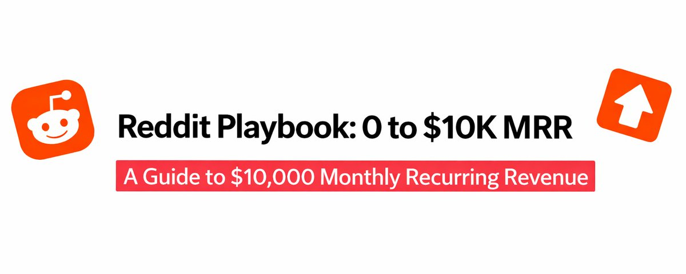

# Redditマーケティング:完全プレイブック

ほとんどの創業者はRedditマーケティングは死んだと思っています。

彼らは間違っています。ただ、やり方が間違っているだけです。

私は6ヶ月間、クライアント、コンテンツ、コミュニティフィードバックのためにRedditをマイニングしてきました。40以上の適格なリード、12件のディスカバリーコール、3件の契約プロジェクトを生み出しました。

ここに、禁止や大量のダウンvoteを受けることなく、Redditを収益チャネルに変えるために使用している完全なシステムがあります。

なぜRedditが実際に機能するのか(他の人が失敗するとき)

Redditはツイッターではありません。RedditはLinkedInではありません。

ツイッターでは、フォロワーに向けて放送しています。Redditでは、あなたが解決する正確な問題を抱えている見知らぬ人との会話に参加しています。

違い:

ツイッター=注目ゲーム

Reddit=信頼ゲーム

Redditユーザーは1マイル離れたところからマーケティングの臭いを嗅ぎ分けます。しかし、彼らは真の価値、本物のストーリー、実行可能なソリューションが大好きです。

コツは、マーケターとしてではなく、まずコミュニティメンバーとして現れることです。

Redditマーケティングの3つのコアピラー

私が見てきた成功したすべてのReddit戦略は、これら3つの原則に従っています:

1/ まず価値、常に

あなたは現れてピッチすることはできません。それは即死です。

代わりに:

徹底的に質問に答える

ツールやリソースを無料で共有する

人々がお金を払うであろうフレームワークを提供する

販売するのではなく、助ける専門家として自分を位置づける

あなたが彼らを助けた後、人々があなたのプロフィールをチェックするとき、マーケティングは自然に起こります。

2/ 戦略的なサブレディット選択

すべてのサブレディットがマーケティングに等しいわけではありません。

最高のものは:

10K-500Kメンバー(エンゲージメントのスイートスポット)

毎日のアクティブな議論

メンバーとしての創業者/ビルダー

(価値を伴う)自己宣伝を許可するモッドルール

エージェンシー/開発作業のための私のトップサブレディット:

r/SaaS(技術的な支援を探している創業者)

r/startups(初期段階、予算意識)

r/indiehackers(仲間のビルダー)

r/nocode(非技術的な創業者)

r/buildinpublic(透明性を愛する人)

r/webdev(技術コミュニティ)

避けるべき:

r/entrepreneur(広すぎる、低品質)

r/marketing(みんなが売っている)

モッドが即座にプロモーションを削除するサブレディット

3/ コンテンツ金鉱戦略

ここでRedditがコンテンツ作成マシンになります。

毎日、Reddit上の人々は共有しています:

何を構築したか、どのように

何が失敗したか、なぜ

彼らが立ち往生している痛点

彼らが発見したツール

あなたの仕事:これらをツイッター/LinkedInコンテンツに変える。

プロセス:

高価値のReddit投稿を見つける(洞察、痛点、成功ストーリー)

あなたの解説を加えてツイッタースレッドとして再パッケージ化

Redditユーザーをクレジットする(好意を構築する)

ツイッターでエンゲージメントを促進

繰り返す

私はこの方法で30以上のバイラルスレッドを作成しました。Redditは生の信号を提供し、あなたは構造と明確性を追加します。

実際にRedditで機能する4つの投稿タイプ

50以上の投稿をテストした後、これら4つのフォーマットが一貫して結果を出します:

タイプ1:詳細なソリューション投稿

フォーマット:

問題から始める(共感できる痛み)

正確なソリューションを共有する(ステップバイステップ)

ツール、コードスニペット、スクリーンショットを含める

「質問に喜んで答えます」で終わる

タイトル例:「MVPビルド時間を12週間から3週間に短縮した方法」

なぜ機能するのか:

実際の問題を解決する

販売せずに専門知識を示す

会話を招く

人々があなたのプロフィールをチェックする

タイプ2:ツール/リソースドロップ

フォーマット:

ツール、スタック、またはリソースのリスト

それぞれに簡単な説明と使用例

すべて無料または安価なオプション

「これが私が実際に使用しているもの」

タイトル例:「AI MVPを構築するための完全な$0技術スタック」

なぜ機能するのか:

即座の価値

ブックマークに値する

知識豊富と位置づけ

保存と共有が簡単

タイプ3:残酷に正直な事後検証

フォーマット:

何を構築/試したか

何がうまくいかなかったか

犯した具体的な間違い

異なる方法でやること

タイトル例:「間違った技術スタックに8000ドルを無駄にした。やるべきだったこと。」

なぜ機能するのか:

脆弱性が信頼を構築する

人々は間違いから学ぶ

あなたが完璧ではなく本物だと示す

記憶に残り、共感できる

タイプ4:「何でも聞いて」価値爆弾

フォーマット:

信頼性を述べる(Xを構築、Yを達成)

あらゆる質問に答えることを申し出る

詳細な回答ですべてのコメントに返信

2〜3時間エンゲージメントに費やす

タイトル例:「スタートアップ向けに40以上のMVPを構築しました。技術スタック、タイムライン、よくある間違いを避けることについて何でも聞いてください。」

なぜ機能するのか:

直接的なエンゲージメント

権威を構築

複数のタッチポイントを作成

DMが自然に続く

実行フレームワーク

これが私の正確な毎週のRedditルーチンです:

月曜日:リサーチ

トップ5のターゲットサブレディットをスクロール

10〜15の高価値投稿を保存

言及された痛点を記録

トレンドトピックを特定

火曜日〜木曜日:エンゲージ

毎日5〜10の投稿にコメント

詳細で役立つ回答を提供

リンクなし、ピッチなし、純粋な価値

カルマと可視性を構築

金曜日:作成

最高のサブレディットに1つの詳細な投稿を書く

4つの実証済みフォーマットの1つを使用

実際の例とスクリーンショットを含める

午前9〜11時EST(ピーク活動)に投稿

週末:変換

すべてのコメントに応答

フォローアップ質問をする人にDM

Reddit投稿をツイッターコンテンツに変える

どの投稿がプロフィール訪問を促進したか追跡

すべきでないこと(禁止されない方法)

これらのルールを破ると、Redditはあなたを破壊します:

すべきでないこと:

投稿本文で製品にリンクする

同じコメントをどこにでもコピーペースト

宣伝するためだけに参加

ダウンvoterと議論

複数のサブレディットに一度にスパム

新しいアカウントを使用(まず100以上のカルマを取得)

すべきこと:

プロフィール/バイオにリンクを追加

コメントで「これのために何かを構築した」とさりげなく言及

宣伝する前に2週間真剣に参加

ダウンvoteを受け入れて先に進む

一度に1つのサブレディットをテスト

まず他人を助けてカルマを構築

変換パス

Redditは直接変換しません。実際のパスは次のとおりです:

役立つRedditコメント

ユーザーがあなたのプロフィールをチェック

バイオ/ピン留め投稿を見る

あなたのツイッター/ウェブサイトをクリック

そこであなたをフォロー

時間をかけてあなたの仕事を見る

最終的にDMまたはコール予約

タイムライン:最初のインタラクションから変換まで2〜8週間。

これは長期ゲームです。販売を成約するのではなく、信頼を構築しています。

私のReddit戦略からの実際の結果

過去6ヶ月:

47の詳細なコメントを投稿

8つの長編投稿を作成

1,200以上のカルマを獲得

週40以上のプロフィール訪問

潜在的なクライアントからの12のDM

3つのプロジェクトに署名(合計18,000ドル)

ROI:

投資時間:週3〜4時間

直接収益:18,000ドル

間接(コンテンツアイデア):プライスレス

Redditの洞察から作成したコンテンツは、ツイッターで100K以上のインプレッションを促進しました。

コンテンツ再利用システム

ここでRedditが10倍以上価値があるものになります。

私が見つけるすべてのReddit投稿はツイッターコンテンツになります:

Reddit投稿の例:「12ヶ月で10万ドルのSaaSを構築しました。うまくいったこととうまくいかなかったこと。」

私のツイッターバージョン:「このRedditユーザーは12ヶ月未満で10万ドルを稼ぎました。完全なプレイブックは次のとおり:

1/ 実際にうまくいったこと

[重要なポイントを抽出]

2/ うまくいかなかったこと

[レッスンを抽出]

3/ 本当のレッスン

[私の解説を追加]

12ヶ月の間違いを3分に圧縮」

結果:15Kのインプレッション、200以上のブックマーク、クライアントになった5人の新しいフォロワー。

使用するツール

Redditマーケティングスタック:

Apolloアプリ(より良いRedditブラウジング)

Notion(投稿とアイデアを追跡)

CloudApp(スクリーンショット/注釈)

Buffer(Redditからツイッターコンテンツをスケジュール)

すべて無料または安価。

よくある間違い

ほとんどの人がRedditマーケティングで失敗するのは:

早すぎるピッチ 最初のインタラクションで誰もあなたの製品を望んでいません。まず信頼を構築してください。

ツイッターのように扱う Redditは遅く、深く、よりコミュニティに焦点を当てています。アプローチを調整してください。

早すぎる諦め 結果には最低4〜6週間かかります。一貫性を保ってください。

ルールを無視する すべてのサブレディットにはルールがあります。読んでください。従ってください。または禁止されます。

エンゲージを忘れる コメントせずに投稿することは役に立ちません。エンゲージメント>コンテンツ。

30日間Redditマーケティングチャレンジ

このシステムをテストしたいですか?ここにあなたのロードマップがあります:

第1週:セットアップ

5つのターゲットサブレディットに参加

カルマを100以上に構築(真剣にコメント)

バイオ+リンクでRedditプロフィールを更新

各サブレディットのトップ投稿を研究

第2週:エンゲージ

毎日5つの投稿にコメント

詳細で役立つ回答を提供

宣伝なし、価値だけ

どのコメントがアップvoteされるか追跡

第3週:作成

実証済みフォーマットを使用して1つの詳細な投稿を書く

実際の経験またはツールリストを共有

すべてのコメントに応答

プロフィール訪問スパイクに注意

第4週:変換

Reddit投稿をツイッターコンテンツに変える

興味を示したユーザーにDM

生成されたリードを追跡

何がうまくいったか分析

30日後、あなたのニッチでRedditが機能するかどうかがわかります。

Redditマーケティングについての最終的な真実

Redditは成長ハックではありません。関係チャネルです。

あなたはバイラルになりません。一晩で1000のサインアップを得ません。即座のROIは見えません。

しかし、あなたは:

真の接続を構築

オーディエンスを深く理解

無限のコンテンツアイデアを作成

高品質のリードを生成

本当の権威を確立

Redditで勝つ創業者は、販売するためではなく、助けるために現れる人々です。

与えるよりも多く取る専門家になってください。

クライアントはあなたを見つけます。

クイックスタートアクションプラン

今日これを行ってください:

r/startupsとr/indiehackersに参加

本物のアドバイスで3つの投稿にコメント

コンテンツアイデアのために5つの高価値投稿を保存

ツイッターでRedditバイオを更新

これを30日間毎日行うようにリマインダーを設定

それだけです。複雑な戦略はありません。一貫した価値と真のエンゲージメントだけ。

Redditマーケティングは、それをマーケティングのように扱うのをやめて、コミュニティ構築のように扱い始めると機能します。
