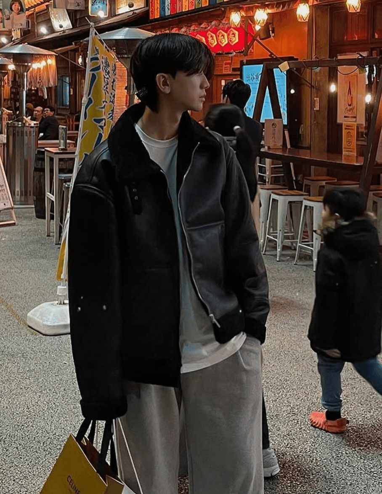
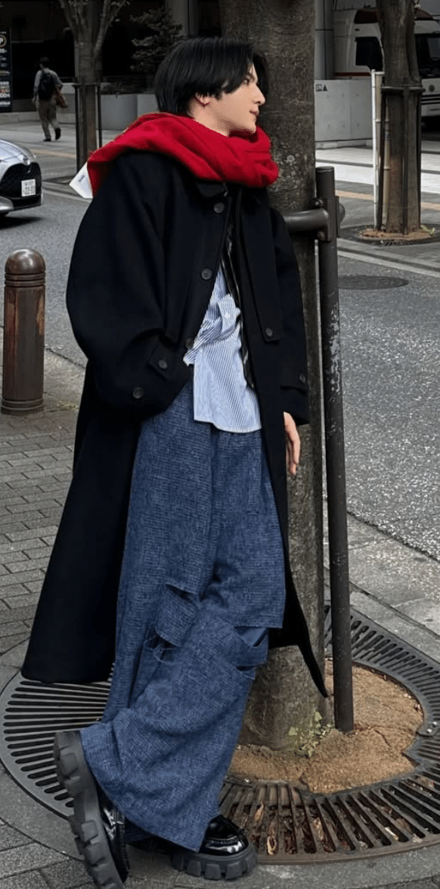
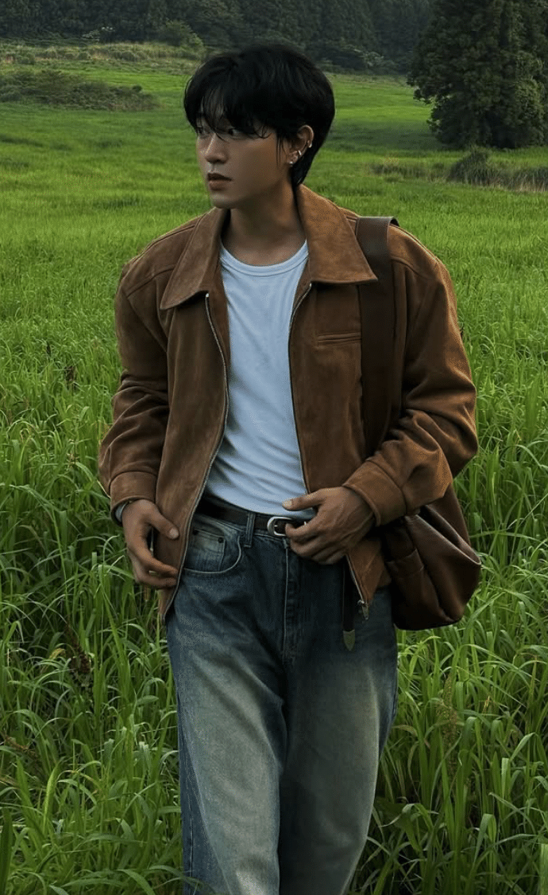
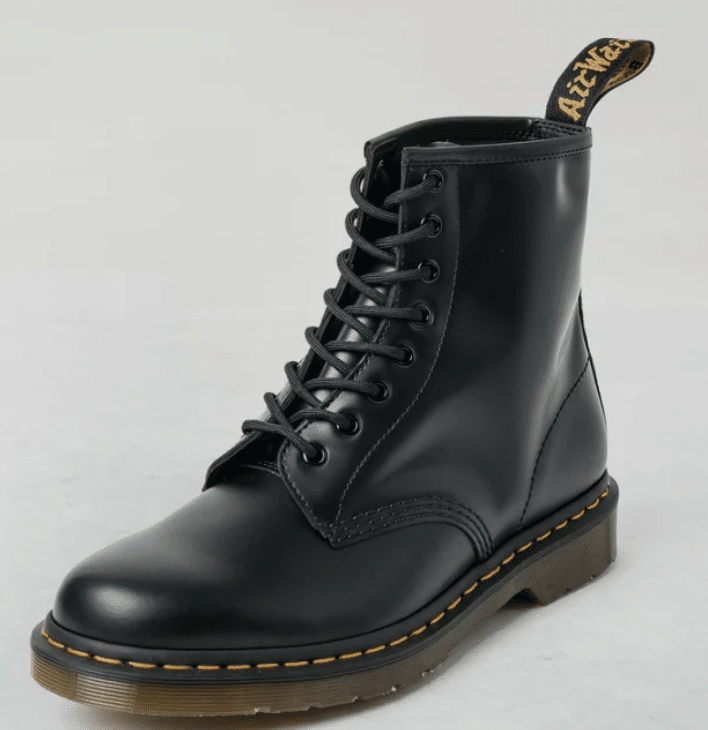
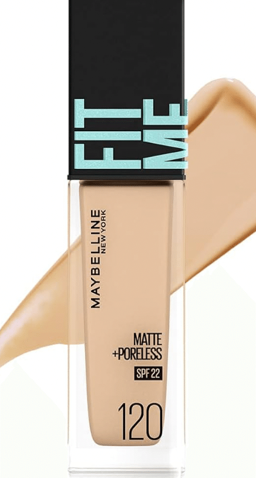
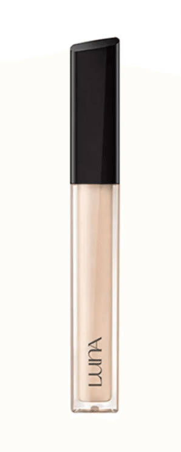

# 外見改善の基礎

## 0.初めに

田舎もんのピエロたち、ごきげんよう🤡　動産、トンキン出身、無能はここでブラウザバックだ。

仮面くんである😤　ナカもんかつコウリッチュー出身のぽまいらは、大学のために上京してきて驚いたことが無いか❓そう、同級生の外見の華やかさだ。

我々が必死こいて青チャートを回し、鉄壁を暗唱している最中、附属高出身の奴や、指定校推薦でさっさと受験というデスレースから利確して撤退して行った奴らは、暇を持て余し遊び呆けている。その中で彼らは来るべき大学デビューのために外見改善を行なっている。俺たちの時間返せや…👹🔪

その結果としてピエロたちは外見が磨かれていないまま入学式に参加→友達０→徐々にキャンパスに行かなくなる→留年🤡

こういうパターンはよくある話だ。また、友達ができたとしても、階級上昇・異性からの承認のために外見改善は必須である。

特にトンキンにおいては水商売の一般化と、SNSによるルッキズムの加速により、外見改善の難易度及び重要性は日々増して行っている。

本稿では、🤡たちになるべくお金をかけずに外見を上位30％に食い込めるレベルにする方法を現役ナンパ師下知ピエロのポーポワイが伝授する。ちな、初級編かつ初心者にも実践しやすいかどうかで内容を決めている部分もあるので、それだけ了承いただきたい。

## 1.外見に関する基本的な考え方

結論：減点回避せよ。また、整形も考慮しろ。

外見とは、何か…（ネットリ）第一印象を与え、相手に自分の中身を期待させるものである。例えばぴえん系の女の子を見たら、”ホス狂かも”とか、　”トー横にいそう”とか思うだろう。これと同じで、外見を磨く際には、相手に与える印象を考えながら行動していく必要性がある。つまり、ASD気味の君たちには一番難しいジャンルというわけだ。

君たちが一から考えても碌な結論にならないのはわかりきっているので、どのような印象を相手に与えるべきか、それをポワイが定義する。それはズバリ、**”健康的で清潔感がある”**これである。健康さとは、例えば肌の綺麗さや歯並び、歯の白さ、髪のツヤ、体型などがあり、清潔感には服にシワや毛玉が無い、白い靴が汚れていない、体臭が無い、こんなところだ。

骨を切ったり鼻中隔延長などはその先にあるし、そもそもコスパが悪すぎる。まずは君たちは、**外見におけるマイナスをゼロにする＝減点回避をする**ところから始めなければいけない。そして、そのマイナスをゼロにする為なら、整形も考えるべきだ。それにたじろぐような奴は鉤括弧いらない。

そのためのお金は惜しむべきでは無いし、歯列矯正以外であれば、全部合わせても**三桁万円”いかない”**ので、行うべきである。また、今から述べる工程をきちんと守ればそこそこ女子受けも良くなるので、是非参考にされたい。

## 2.肌

結論：遺伝ゲー。病院行け。ニキビやばいならイソトレチノイン飲め。キュレル使え。日焼け止め塗れ。

肌は結論遺伝ゲーです。ポワイも肌ガチャ大外れなため、どれだけ気を使ってもニキビが出来ます。水を飲むとか、清潔なタオル使うとか、食生活に気を使って運動するとかやっても鉤括弧意味ない。

じゃあどうすれば良いかというと、内服薬と、適切なスキンケアしか無い。

### 内服薬

内服薬に関しては、シナール（ビタミンc）とか、色々あるが、とりあえず
近くの皮膚科専門医に行って”ニキビがやばくて”と言えば、ニキビ用の内服薬・外服薬が保険適用で貰えるのでエッジ。ちなみに、新橋トラストクリニックと言う皮膚科が何も聞かずにバンバン処方してくれると言うところで夜職界隈(笑)では人気です。それにプラスして、グルタシオンという美白サプリを飲みましょう。

**血栓が出来る可能性があるというリスク**に目を潰れるのであれば、トラネキサム酸（オオサカ堂で個人輸入可）という薬もおすすめです。内服と、後述する適切なスキンケアを三ヶ月しても治らない場合は、イソトレチノインという、理論上最強の薬を使って治療に切り替えてください。肌のクリニックという高円寺にあるところが良いと思います。

また、皮脂量が多い人（男性はほぼ全員あてはまります）は、パントテン酸というサプリを飲むのも良いでしょう。イソトレチノインを飲んでいるなら、鉤括弧いりません。

### イソトレチノインについての注意点

イソトレチノインは、皮脂を枯らす薬なので、ニキビ対策においては鉤括弧完璧なのですが、唇が非常に乾燥する、催奇形性があるので、**妊活をしている方は絶対に飲まないで下さい**。また、しかるべき機関で、医者の指示をもとに摂取してください。

### 適切なスキンケア

まず、肌には清潔にして保湿という大原則があります。その上でニキビが出来ないようにするには、どうしたら良いのかという話なのですが、結論としては、

クレンジング→優しい洗顔料→無印導入化粧水→美容液（朝はビタミンc、夜はナイアシンアミド）→（できればアゼライン酸）→キュレルの乳液

これで大丈夫です。別途お医者さんから薬を出してもらった時は、普段のスキンケアの流れを説明して、指示にしたがってください。

クレンジングは、メンズメイク（後述）を落とす上で必須なのと、男性の方が女性に比べて皮脂量が多いので、メイクしない日でも使ってください。無印のジェルタイプのやつがおすすめです。洗顔料は変なスクラブとか入ってない奴なら割りとなんでも良いですが、おすすめはキュレルの奴です。**キュレルは常に正しい**ので。美容液に関しては、つべこべ言わずにiherbとかで一番売れてる奴買ってください。アゼライン酸についてですが、そもそもアゼライン酸は皮脂量を減らしてくれる＝ニキビの根本原因を減らすというかなりエッジ物質です。The ordinaryとうブランドから、単体で出ているのでそれを買うか、大きめの皮膚科には大体アゼライン酸が売っているので、それを買って下さい。ニキビ対策という観点からだと、レチノールを塗る必要性は、**医者から出されない限り**無いです。乳液は**必ずキュレルのものを使う**こと。以上。

後、**外出の際は日焼け止めを必ずしてください👹
**めんどくさくても、紫外線は肌への一番のダメージです。日焼け止めを買う時のポイントですが、ノンコメドジェニックという、毛穴に詰まらないものを買ってください。おすすめは、キュレル「潤浸保湿 UVエッセンス」です。

別にキュレルの回し者でもなんでもありませんが、キュレルはハズレが無いので、最初に買うアイテムとしては良い選択です。

ちなみに、清潔感を出すために、ボディクリームとハンドクリームも買いましょう。安いやつで良いです。ニベアとかで⭕️

## 3.歯と髭

結論：ホワイトニングして髭の医療脱毛してください。金銭的に余裕あるなら、歯列矯正してください。

面倒臭いですし、高いですが、この**ホワイトニングと髭脱毛というこの二つをするだけで大分清潔感が出ます。**ホワイトニングに関しては、訳わからん歯磨き粉とかシートを情弱みたいに使うんじゃなくて、クリニック行ってください。
歯に関しては夜職の間でのパス回しが酷くてエッジクリニックがわかりません👹
ただ、有名なナンパ師のNSJという方がまとめていたNoteがあるので、リンク貼っときます。

髭脱毛はドクターコバという銀座で10万円払えば髭脱毛受け放題なクリニックがあるので、そこに行ってください。ちなめちゃめちゃ痛いです。

後、前述したイソトレチノイン飲んでると髭脱毛は出来ないので、それだけ気をつけてください。５回くらい受ければ大分薄くなってくるので、メンズメイク（後述）で隠せます。

あと、髭を剃る時は安いやつで良いので、電子カミソリ使いましょう。そっちの方が肌への負担が小さいです。また、頬とかに生えている産毛をI字シェーバーで剃ると、肌のトーンが一個アップしてエッジです。

## 4.髪型

結論：韓国寄せしましょう

皆さんが髪を切りに行くときは、よくわからない床屋みたいなところで、😐”なんかいい感じにお願いします”、服を買う時は、ユニクロか、ジャーナルスタンダードとかで😐”あのマネキン一式ください”と言っていることはわかっています。今すぐやめましょう。モブヤマトでしか無いので。

とは言え、メン地下寄せとかするほどの勇気が禁止家庭出身のみなさんにあるとも思えません😅

そこで、全体的な外見を韓国寄せしましょう。そもそも〜寄せというのは、ナンパ界隈の用語で、何かの対象がしている服装や髪型に近づけるという意味です。ここでいう韓国寄せとは、韓国アイドルみたいな感じでは無く、韓国の一般人がしているような感じです。韓国王道寄せとかもうちょっとニッチな用語だと言ったりします。

現在（2025/02/11）だと、毛流れセンターパート＋ダウンパーマが依然として強い人気を誇っているので、なんだかんだいっておすすめです。三ヶ月くらい伸ばしてから美容室に行くと、いい感じにしてくれると思います。おすすめの美容師は、ZEST lillという新宿にある美容室の、久保田さんという方です。鉤括弧完璧な韓国寄せをしてくれます。下知で上手いです。

ちなみに**天然パーマの髪質ガチャ外れ民は、縮毛矯正を必ずすること。**基本的に現代のトレンドは直毛なので、くるくる系のパーマはかけるべきではありません。

爽やかですが、どうでしょうか。仕事先でも受けが良さそうです。

本来であれば、面長用の髪型とか色々あるんですが、セットが難しいのと、今回の趣旨が清潔感と健康感なので、これ一択でいいかなーと。所詮種類物みたいなみなさんはどこかで見たことある髪型しか出来ないと思いますし😅
後、**これなら就活やらインターンで引っかからない**、ちょうど良いラインなんじゃ無いでしょうか。

### ヘアケアについて

髪はお風呂（ちゃんと毎日入ってね）に入ったら毎回ドライヤーで乾かすのと、ドライヤーする前に、ヘアミルク・ヘアオイルを使いましょう。どちらも適当なやつで大丈夫です。どっちか一方だけしか金銭的に買う余裕がない時は、安めのヘアオイル買って下さい。

### ヘアセット

まあ、ぶっちゃけパーマかけてるのでアイロンとかしなくても適当にやってくれればそれなりになりますが、カットする時美容師さんに教わってきて下さい。ちなみに、ドライヤーが一番大事なんですが、下の動画（神動画）を参考にして下さい。

ワックスは、オーシャントーキョーの薄緑のクリームタイプとかでいいと思います。

## 5.服装

結論：韓国寄せしましょう。スチーマーを買って皺を伸ばしましょう。身長を盛りましょう。

韓国王道寄せしてください。もうこれに関しては、言葉でぐちぐちいうよりお手本を見た方が早いです。やたらとファッションの理論を唱えたがる人がいますが、**根本的にはファッションはパターン暗記**です。あなたがパリコレに行きたいなら独自の哲学を持っておく必要がありますが、モテ観点ではそのようなものは一切必要ありません。ルシファーが暗記数学で東大数学108点取れるのと一緒です。ルシファーは数学者にはなれないかもしれませんが、東大数学では王になれるのです。

以下、おすすめのインフルエンサーです。何人かフォローするとおすすめ欄が似たようなインフルエンサーで埋まるので、後は我々が青チャートを四周くらいしたように、まんまるすれば大丈夫です。

韓国ブランドASCLO。ここは着る難易度が低いし、値段も安いのでおすすめです

超有名インフルエンサー、sei。ig)gwxxoin

韓国のインフルエンサー、Fromtome ig) fromtome\_min

後、身長を盛りましょう。身長も盛る方法はいくつかありますが、厚底の靴を履くのと、シークレットインソールを入れるのが最も一般的かなと思います。以下、おすすめの商品です。

ドクターマーチン8ホール

超有名身長盛りスニーカーP31。韓国寄せにも対応

コンバースの厚底

まあ、色々書きましたが、アウトソールで３cm盛れるやつが基準ですね。（アスペッペの皆さん、靴屋に定規を持っていかないでください💦）

インソールに関しては、Amazonとかで売ってるやつを適当に買いましょう。

## 6.眉毛・メイク

結論：眉毛サロンに行って、メンズメイクを習得しろ

眉毛から書きます。眉毛は、最初は必ず眉毛サロンに行ってください。どうせどこでも同じ施術内容なので、別にサロンにこだわる必要はありません。ただ、少し伸ばし気味で行くと、理想の眉毛にしてもらえます。それの写真を撮って、今度からは自分で処理しましょう。**アートメイクは失敗する確率がメチャメチャ高いので、絶対にやらないでください。**

### メイクについて

メイクは非常に大事です。まず、メイクにはベースメイクとその他のメイクがあります。ベースメイクは、簡単にいうと肌をキレイに見せるなど、マイナスを０にするメイクで、その他が０からプラスにするメイクです。

いちいち説明すると、あまりにも長くなり、書くのが面倒なので、

ベースメイクの基本

下地の基本

ファンデーションの基本

ファンデーションの塗り方

コンシーラーの基本

フェイスパウダーの基本

シェーディングの基本

ハイライトの基本

鼻のシェーディングの基本

アイシャドウの基本

涙袋の基本

これが完全解なので、これ見て下さい。ただ、面倒臭いというわがまま🤡たちは、

オールインワン的なやつ

オールインワン的なやつ２

この三つを見て下さい。（完全版を見ることをおすすめします）

### メイク用具について

仮面が使っている（日本で使ってた）メイク用具を教えます。まんまるしてくれても良いし、違うやつ買ってくれても良いです。

ファンデーション用ブラシ

ちふれの下地。下地は基本的に緑がおすすめです。

メイベリンのフィットミーファンデーション。若干高いですが、驚異的なカバー力を誇ります。トーンは自分の肌色よりちょっと暗い色を選びましょう。

Lunaのロングラスティングコンシーラー。正直コンシーラーにあんまりこだわりは無いです

Kateのピンポイントカラースナイパーコンシーラー。青髭、クマ用。髭は脱毛してないと隠せない。

can makeのシェーディングパウダー01番。定番。色は自分の肌にできる影に近い色を選んでね。

i’m meme アイムマルチスティックデュアル。ノーズシャドウ用。最初のうちはkateを使いこなすの、難しいと思うので、これで練習するのもありだと思います。

慣れてきたらこれ。KATE ケイト デザイニングアイブロウ3D パウダーアイブロウ ノーズシャドウ。使いやすいです。

メンベリン　インスタントコンシーラー。明るめの色を選んでこれをハイライト代わりに使うの、おすすめです。やたらとセザンヌのハイライトをおすすめしたがる人がいますが、個人的には乾燥して粉吹いてるみたいに見えるので、パウダーのハイライトは嫌いです。

すっぴんパウダーです。パウダーとか正直何使ってもあんまり変わらないので、肌に優しいやつを選びましょう。イニスフリーのやつも有名です。（あとイニスフリーは小さいので、持ち運べる）

パーフェクトマルチアイズ 03 アンティークテラコッタアイシャドウ。特にいうことなし。メンズメイクに使いやすいカラーパレットのアイシャドウです。

Kate,パーソナルリップクリーム。自分の唇の色に馴染んでくれる優れもの。色黒の人はこっち、色白の人は次に載せるニベアのやつ使って下さい。

Nivea、リッチカラーリップ。色白の人はどうしてもメイクのせると血色悪くなるので、こっち。一二回ぬって、ティッシュでオフ（唇でハムハム）しましょう。

コーセーメイクキープミスト。メイクの最後に使ってメイク崩れを予防するやつです。

## 7\. 匂いケア

結論：デオドラントを使って、Zaraの香水を使いましょう

体臭を消せる**無臭**のデオドラントを使って、Zaraの落ち着いた匂いの香水を使いましょう。割とマジで以上です。

ここまで、１から７を全て実行して、まだダメなら正直アスペすぎる可能性が高いですが、さらなる飛翔を目指したい方は、8をして下さい。

## 8.整形

結論:埋没法で二重にして、ハムラ法でクマ取りして、涙袋入れて、エラボトしろ。黒子も取れ。

正直、結論のままです。最近のトンキンで若い可愛い動産に一重の子はいますか？いませんよね。みんな整形してます。

目の整形は全部合わせても40万円くらいでできる割にかなりルックスのレベルが上がるので、必須です。

あと、黒子についてですが、実は五千円くらいで取れる割に、清潔感が上がるのでエッジ。

## 9\. 終わりに

外見は、ポテンシャルゲーです。いくら頑張っても身長が伸びることは無いし、高い金払って整形しても、対してイケメンにはなれません。ただし、努力してちょっとくらいなら、マシにすることはできます。そこで努力をしていない人たちとの差が出るのです。つまり、君たちが得意な”臥薪嘗胆”は外見・恋愛においても有効であるということです。

なんか質問あったら無料で答えるのでDMなりコメントなりして下さい。

## 10.メガネは外そう、コンタクトをつけよう（追記）

結論：どれだけ造形が良くてもメガネはプラスにはならないのでコンタクトレンズをつけて下さい。

結論の通りです。公開当時は書き忘れていたのですが、意外と指摘しないと気づかない人もいる可能性があるので書き足しました。
カラコンとか入れると地味に見た目が変わったりするのですが、この記事のレベル感だとそこまでする必要はないかなと思います。
